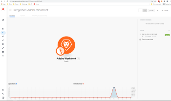

# Scenario detail

The scenario detail page is the homepage of a specific scenario. It provides access to specific information for the scenario that is represented on the page.

It also provides you access to the [Scenario editor](../../workfront-fusion/scenarios/scenario-editor.md), where you can edit the scenario.

## Access requirements

You must have the following access to use the functionality in this article:

<table cellspacing="0"> 
 <col> 
 <col> 
 <tbody> 
  <tr> 
   <td role="rowheader"><em>Adobe Workfront</em> plan*</td> 
   <td> 
<em>Pro</em> or higher
 </td> 
  </tr> <draft-comment>
   <tr data-mc-conditions=""> 
    <td role="rowheader"><em>Adobe Workfront</em> license*</td> 
    <td> 
Plan, Work
 </td> 
   </tr>
  </draft-comment>
  <tr data-mc-conditions=""> 
   <td role="rowheader"><em>Adobe Workfront</em> license*</td> 
   <td> 
Plan, Work
 </td> 
  </tr> 
  <tr> 
   <td role="rowheader"><em>Adobe Workfront Fusion</em> license**</td> 
   <td> 
<em>Workfront Fusion for Work Automation and Integration</em> 
 <draft-comment>
     
<em>Workfront Fusion for Work Automation</em> 

    </draft-comment>
<em>Workfront Fusion for Work Automation</em> 
 </td> 
  </tr> 
  <tr> 
   <td role="rowheader">Product</td> 
   <td>Your organization must purchase <em>Adobe Workfront Fusion</em> as well as <em>Adobe Workfront</em> to use functionality described in this article.</td> 
  </tr> <draft-comment>
   <tr data-mc-conditions="QuicksilverOrClassic.Draft mode"> 
    <td role="rowheader">Access level configurations*</td> 
    <td> <draft-comment>
      
You must be a <em>Workfront Fusion</em> administrator for your organization.

     </draft-comment>
You must be a <em>Workfront Fusion</em> administrator for your organization.
 <draft-comment>
      
You must be a <em>Workfront Fusion</em> administrator for your team.

     </draft-comment>
You must be a <em>Workfront Fusion</em> administrator for your team.
 </td> 
   </tr>
  </draft-comment>
  <tr data-mc-conditions="QuicksilverOrClassic.Draft mode"> 
   <td role="rowheader">Access level configurations*</td> 
   <td> 
You must be a <em>Workfront Fusion</em> administrator for your organization.
 
You must be a <em>Workfront Fusion</em> administrator for your team.
 </td> 
  </tr> 
 </tbody> 
</table>

&#42;To find out what plan, license type, or access you have, contact your *Workfront administrator*.

&#42;&#42;For information on *Adobe Workfront Fusion* licenses, see [Adobe Workfront Fusion licenses](../../workfront-fusion/get-started/license-automation-vs-integration.md)

## Open the scenario detail page:

<ol> 
 <li value="1"> 
Click the Scenario tab in the left panel, then click a scenario you would like details on.
 
Or
 
If you are working on the scenario in the <a href="../../workfront-fusion/scenarios/scenario-editor.md" class="MCXref xref">Scenario editor</a>, click the left arrow  near the upper-left corner of the window.
 </li> 
 <li value="2"> 
On the page that displays, you can review the elements listed in the table below.
 
  
 
  <table cellspacing="0"> 
   <col> 
   <col> 
   <tbody> 
    <tr> 
     <td role="rowheader">Modules diagram </td> 
     <td>This tab displays the visual representation of the scenario. The Diagram is the same as you will see in the scenario editor</td> 
    </tr> 
    <tr> 
     <td role="rowheader">History (tab) </td> 
     <td> 
Open this tab to see a history of the scenario, including any editing of the scenario. 
 
The History tab also provides the scenario execution history of each run, which includes the following:
 
      <ul> 
       <li>Status of each run (success or error)</li> 
       <li>Run duration</li> 
       <li>Number of operations</li> 
       <li>Size of data transfer</li> 
       <li>Link to detailed information</li> 
      </ul> </td> 
    </tr> 
    <tr> 
     <td role="rowheader">Incomplete executions</td> 
     <td> 
This tab provides information about any incomplete executions of the scenario. It includes the following information for each incomplete run:
 
      <ul> 
       <li>Date created</li> 
       <li>Size of data transfer</li> 
       <li>Retry</li> 
       <li>Resolved</li> 
       <li>Number of attempts</li> 
      </ul> </td> 
    </tr> 
    <tr> 
     <td role="rowheader">Activate scenario (On/Off button)</td> 
     <td>Once a scenario is created it needs to be activated in order for it to execute according to its schedule. By clicking the On/Off button near the upper-right corner, you can activate or inactivate the scenario. Once it is turned on, the scenario runs accordingly to its schedule.</td> 
    </tr> 
    <tr> 
     <td role="rowheader">Edit</td> 
     <td>Click this button in the upper-right corner to open the scenario editor, where you can work on your scenario.</td> 
    </tr> 
    <tr> 
     <td role="rowheader">Options</td> 
     <td> 
This menu provides you with extra options without having to open up the scenario editor. These include:
 
      <ul> 
       <li>Scheduling</li> 
       <li>Rename</li> 
       <li>Clone</li> 
       <li>Delete</li> 
      </ul> </td> 
    </tr> 
    <tr> 
     <td role="rowheader">Currently running</td> 
     <td>This area shows information related to the currently running execution.</td> 
    </tr> 
    <tr> 
     <td role="rowheader"> 
History (area)
 
&nbsp;
 <draft-comment>
       <MadCap:conditionalText style="color: #ff1493; font-weight: normal;" data-mc-conditions="QuicksilverOrClassic.Draft mode">
        are we not including this as it is in alloy?
       </MadCap:conditionalText>
      </draft-comment><MadCap:conditionalText style="color: #ff1493; font-weight: normal;" data-mc-conditions="QuicksilverOrClassic.Draft mode">
       are we not including this as it is in alloy?
      </MadCap:conditionalText> </td> 
     <td> 
This area shows information related to the last runs of the scenario. For every run it displays:
 
      <ul> 
       <li>Run date</li> 
       <li>Status (success or failed)</li> 
       <li>Run duration</li> <draft-comment>
        <li data-mc-conditions="QuicksilverOrClassic.Draft mode">Number of operations</li>
       </draft-comment>
       <li data-mc-conditions="QuicksilverOrClassic.Draft mode">Number of operations</li> 
       <li>Size of data transfer</li> 
       <li>Link to detailed information</li> 
      </ul> </td> 
    </tr> 
    <tr> 
     <td role="rowheader"> 
Stats
 
 <draft-comment>
        <MadCap:conditionalText style="color: #ff1493;" data-mc-conditions="QuicksilverOrClassic.Draft mode">
         are we not including this as it is in alloy?
        </MadCap:conditionalText>
       </draft-comment><MadCap:conditionalText style="color: #ff1493;" data-mc-conditions="QuicksilverOrClassic.Draft mode">
        are we not including this as it is in alloy?
       </MadCap:conditionalText> 
 </td> 
     <td>This graph allows you to view the amount of data transfer and operations used throughout the runs of the scenario in a line graph.</td> 
    </tr> <draft-comment>
     <tr data-mc-conditions="QuicksilverOrClassic.Draft mode"> 
      <td role="rowheader">&nbsp;</td> 
      <td>&nbsp;</td> 
     </tr>
    </draft-comment>
    <tr data-mc-conditions="QuicksilverOrClassic.Draft mode"> 
     <td role="rowheader">&nbsp;</td> 
     <td>&nbsp;</td> 
    </tr> 
   </tbody> 
  </table> </li> 
</ol>

