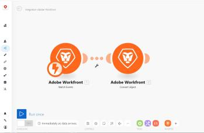

# Scenario editor {#scenario-editor}

The scenario editor makes it easy to create and edit scenarios in a visual way.

## Access requirements {#access-requirements}

You must have the following access to use the functionality in this article:

<table style="width: 100%;margin-left: 0;margin-right: auto;mc-table-style: url('../../Resources/TableStyles/TableStyle-List-options-in-steps.css');" class="TableStyle-TableStyle-List-options-in-steps" cellspacing="0"> 
 <col class="TableStyle-TableStyle-List-options-in-steps-Column-Column1"> 
 <col class="TableStyle-TableStyle-List-options-in-steps-Column-Column2"> 
 <tbody> 
  <tr class="TableStyle-TableStyle-List-options-in-steps-Body-LightGray"> 
   <td class="TableStyle-TableStyle-List-options-in-steps-BodyE-Column1-LightGray" role="rowheader">Adobe Workfront plan*</td> 
   <td class="TableStyle-TableStyle-List-options-in-steps-BodyD-Column2-LightGray"> 
Pro or higher
 </td> 
  </tr> 
  <tr class="TableStyle-TableStyle-List-options-in-steps-Body-MediumGray"> 
   <td class="TableStyle-TableStyle-List-options-in-steps-BodyE-Column1-MediumGray" role="rowheader">Adobe Workfront Fusion license**</td> 
   <td class="TableStyle-TableStyle-List-options-in-steps-BodyD-Column2-MediumGray"> 
Workfront Fusion for Work Automation and Integration 
 
Workfront Fusion for Work Automation 
 </td> 
  </tr> 
  <tr class="TableStyle-TableStyle-List-options-in-steps-Body-LightGray"> 
   <td class="TableStyle-TableStyle-List-options-in-steps-BodyB-Column1-LightGray" role="rowheader">Product</td> 
   <td class="TableStyle-TableStyle-List-options-in-steps-BodyA-Column2-LightGray">Your organization must purchase Adobe Workfront Fusion as well as Adobe Workfront to use functionality described in this article.</td> 
  </tr> 
 </tbody> 
</table>

&#42;To find out what plan, license type, or access you have, contact your *`Workfront administrator`*.

## Open the scenario editor: {#open-the-scenario-editor}

1. Click `Scenarios`  in the left panel.

1.  If you want to create a scenario, click `Create a new scenario` in the upper-right corner of the page.

   Or

   If you want to edit an existing scenario, click the scenario.

1.  (Conditional) If you are creating a new scenario, under `What services do you want to integrate`, select apps you want to work with in the scenario, then click `Continue`.

   Or

   Click `Skip` if you would rather choose the apps from within the scenario editor.

   In the scenario editor that displays, you can do everything listed in the table below. For more information, see [Create a scenario](create-a-scenario.md).

1.  When you finish editing a scenario (or at any time while you are editing), click the Save icon. 

   >[!NOTE]
   >
   >After saving your scenario, a new version will be available under the three-dot menu in case you need to access it in the future. Previously saved scenario versions are only available for 60 days.

## Available scenario editor actions {#available-scenario-editor-actions}

1.  `<col class="TableStyle-TableStyle-List-options-in-steps-Column-Column1">` `<col class="TableStyle-TableStyle-List-options-in-steps-Column-Column2">` `<tbody>  <tr class="TableStyle-TableStyle-List-options-in-steps-Body-LightGray">   <td class="TableStyle-TableStyle-List-options-in-steps-BodyE-Column1-LightGray" role="rowheader">Add the first module</td>   <td class="TableStyle-TableStyle-List-options-in-steps-BodyD-Column2-LightGray"> 
Click the question mark icon. 
 
 Then find and click the app or service that you want to start with. If you selected any apps in step 2, they appear here for easy access (and in the Favorites section at the bottom of the screen).
 </td>  </tr>  <tr class="TableStyle-TableStyle-List-options-in-steps-Body-MediumGray">   <td class="TableStyle-TableStyle-List-options-in-steps-BodyE-Column1-MediumGray" role="rowheader">Add a module</td>   <td class="TableStyle-TableStyle-List-options-in-steps-BodyD-Column2-MediumGray">Hover over a module, click the plus icon that appears to the right, then click the module you want in the menu that appears.</td>  </tr>  <tr class="TableStyle-TableStyle-List-options-in-steps-Body-LightGray">   <td class="TableStyle-TableStyle-List-options-in-steps-BodyE-Column1-LightGray" role="rowheader">Specify when and how often the scenario will execute</td>   <td class="TableStyle-TableStyle-List-options-in-steps-BodyD-Column2-LightGray"> 
Click the clock icon. 
 
  
 
For more information, see <a href="schedule-a-scenario.md" class="MCXref xref">Schedule a scenario</a>.
 </td>  </tr>  <tr class="TableStyle-TableStyle-List-options-in-steps-Body-MediumGray">   <td class="TableStyle-TableStyle-List-options-in-steps-BodyE-Column1-MediumGray" role="rowheader">Set up a route</td>   <td class="TableStyle-TableStyle-List-options-in-steps-BodyD-Column2-MediumGray"> 
Click the wrench icon  between the two modules and use any of the following options:
    <ul>     <li>Set up a filter: Control which bundles are used at certain points in the scenario. For more information, see <a href="add-a-filter-to-a-scenario.md" class="MCXref xref">Add a filter to a scenario</a>.</li>     <li>Unlink: Removes a route.</li>     <li>Add a router: Adds a router between modules. </li>     <li>Add a module: Adds a new module between modules.</li>     <li>Add a note: Adds a note to the route.</li>    </ul> </td>  </tr>  <tr class="TableStyle-TableStyle-List-options-in-steps-Body-LightGray">   <td class="TableStyle-TableStyle-List-options-in-steps-BodyE-Column1-LightGray" role="rowheader">Remove a module</td>   <td class="TableStyle-TableStyle-List-options-in-steps-BodyD-Column2-LightGray">Right-click the module, then click Delete module.</td>  </tr>  <tr class="TableStyle-TableStyle-List-options-in-steps-Body-MediumGray">   <td class="TableStyle-TableStyle-List-options-in-steps-BodyE-Column1-MediumGray" role="rowheader">View a log of events that occurs is a scenario</td>   <td class="TableStyle-TableStyle-List-options-in-steps-BodyD-Column2-MediumGray"> 
Run a scenario. When the scenario finishes running, the log appears in the lower-right corner of the Scenario Editor. 
 
  
 
Depending on the scenario, the log can contain information about the difficulty of each phase and any errors encountered during the execution of the scenario.
 </td>  </tr>  <tr class="TableStyle-TableStyle-List-options-in-steps-Body-LightGray">   <td class="TableStyle-TableStyle-List-options-in-steps-BodyE-Column1-LightGray" role="rowheader">Configure the scenario settings</td>   <td class="TableStyle-TableStyle-List-options-in-steps-BodyD-Column2-LightGray">Click the Scenario settings icon.  These settings are intended primarily for advanced users.</td>  </tr>  <tr class="TableStyle-TableStyle-List-options-in-steps-Body-MediumGray">   <td class="TableStyle-TableStyle-List-options-in-steps-BodyE-Column1-MediumGray" role="rowheader">Type or view notes about the scenario</td>   <td class="TableStyle-TableStyle-List-options-in-steps-BodyD-Column2-MediumGray">Click the Notes icon. </td>  </tr>  <tr class="TableStyle-TableStyle-List-options-in-steps-Body-LightGray">   <td class="TableStyle-TableStyle-List-options-in-steps-BodyE-Column1-LightGray" role="rowheader">Auto-align the layout of the modules </td>   <td class="TableStyle-TableStyle-List-options-in-steps-BodyD-Column2-LightGray">Click the Auto-align icon. </td>  </tr>  <tr class="TableStyle-TableStyle-List-options-in-steps-Body-MediumGray">   <td class="TableStyle-TableStyle-List-options-in-steps-BodyE-Column1-MediumGray" role="rowheader">View an animation showing how data flows through the scenario</td>   <td class="TableStyle-TableStyle-List-options-in-steps-BodyD-Column2-MediumGray">Click the Explain Flow icon. </td>  </tr>  <tr class="TableStyle-TableStyle-List-options-in-steps-Body-LightGray">   <td class="TableStyle-TableStyle-List-options-in-steps-BodyE-Column1-LightGray" role="rowheader">Export the scenario to your computer as a blueprint</td>   <td class="TableStyle-TableStyle-List-options-in-steps-BodyD-Column2-LightGray">Click the More menu , then click Export Blueprint.</td>  </tr>  <tr class="TableStyle-TableStyle-List-options-in-steps-Body-MediumGray">   <td class="TableStyle-TableStyle-List-options-in-steps-BodyE-Column1-MediumGray" role="rowheader">Import a scenario blueprint from your computer</td>   <td class="TableStyle-TableStyle-List-options-in-steps-BodyD-Column2-MediumGray">Click the More menu , then click Import Blueprint.</td>  </tr>  <tr class="TableStyle-TableStyle-List-options-in-steps-Body-LightGray">   <td class="TableStyle-TableStyle-List-options-in-steps-BodyE-Column1-LightGray" role="rowheader">Restore a previous version of the scenario</td>   <td class="TableStyle-TableStyle-List-options-in-steps-BodyD-Column2-LightGray">See the article <a href="restore-a-scenario-version.md" class="MCXref xref">Restore a scenario version</a>.</td>  </tr>  <tr class="TableStyle-TableStyle-List-options-in-steps-Body-MediumGray">   <td class="TableStyle-TableStyle-List-options-in-steps-BodyE-Column1-MediumGray" role="rowheader">Configure Flow Control settings</td>   <td class="TableStyle-TableStyle-List-options-in-steps-BodyD-Column2-MediumGray"> 
Click the Flow Control icon.  You can set a task to repeat a given number of times, convert an array into a series of bundles, and merge several bundles into one single bundle. For more information, see <a href="flow-control.md" class="MCXref xref">Flow control</a>.
 </td>  </tr>  <tr class="TableStyle-TableStyle-List-options-in-steps-Body-LightGray">   <td class="TableStyle-TableStyle-List-options-in-steps-BodyE-Column1-LightGray" role="rowheader">Enhance the scenario using advanced tools</td>   <td class="TableStyle-TableStyle-List-options-in-steps-BodyD-Column2-LightGray">Click the Tools icon.  You can create triggers, actions, aggregators, and transformers. For more information, see <a href="tools-modules.md" class="MCXref xref">Tools</a>.</td>  </tr>  <tr class="TableStyle-TableStyle-List-options-in-steps-Body-MediumGray">   <td class="TableStyle-TableStyle-List-options-in-steps-BodyE-Column1-MediumGray" role="rowheader">User text parsing tools</td>   <td class="TableStyle-TableStyle-List-options-in-steps-BodyD-Column2-MediumGray">Click the Text parser icon.  You can retrieve elements from HTML code, find and extract string elements matching a search pattern, search and replace text, and "scrape" data from a website. For more information, see <a href="tools-modules.md" class="MCXref xref">Tools</a>.</td>  </tr>  <tr class="TableStyle-TableStyle-List-options-in-steps-Body-LightGray">   <td class="TableStyle-TableStyle-List-options-in-steps-BodyE-Column1-LightGray" role="rowheader">Access your most commonly used apps and services</td>   <td class="TableStyle-TableStyle-List-options-in-steps-BodyD-Column2-LightGray"> Click an icon in the Favorites section at the bottom of the screen. Icons display in this section automatically as you add apps and services to your scenario. You can also click the Add icon  to add apps and services to this area manually.</td>  </tr>  <tr class="TableStyle-TableStyle-List-options-in-steps-Body-MediumGray">   <td class="TableStyle-TableStyle-List-options-in-steps-BodyB-Column1-MediumGray" role="rowheader">Test-run the scenario</td>   <td class="TableStyle-TableStyle-List-options-in-steps-BodyA-Column2-MediumGray">Click Run once to verify that the scenario runs as you expect before you activate it. Once activated, the scenario will execute according to its schedule. If everything does not run as expected, you can visit our error handling section to learn how to handle errors.</td>  </tr> </tbody>` 

