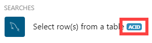
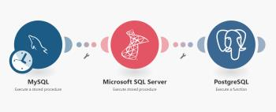

# Scenario execution, cycles, and phases {#scenario-execution-cycles-and-phases}

*`Adobe Workfront Fusion`* is a transactional system, similar to relational databases. Each scenario execution starts with the initialization phase, continues with at least one cycle composed of the operation and commit/rollback phases, and ends with the finalization phase:
`<blockquote>  <p>initialization</p>  <p>cycle #1<p>operation (reading or writing)</p><p>commit or rollback</p></p>  <p>cycle #2<p>operation (reading or writing)</p><p>commit or rollback</p></p>  <p>...</p>  <p>cycle #N<p>operation (reading or writing)</p><p>commit or rollback</p></p>  <p>finalization</p> </blockquote>` 

## Access requirements {#access-requirements}

You must have the following access to use the functionality in this article:

<table style="width: 100%;margin-left: 0;margin-right: auto;mc-table-style: url('../../Resources/TableStyles/TableStyle-List-options-in-steps.css');" class="TableStyle-TableStyle-List-options-in-steps" cellspacing="0"> 
 <col class="TableStyle-TableStyle-List-options-in-steps-Column-Column1"> 
 <col class="TableStyle-TableStyle-List-options-in-steps-Column-Column2"> 
 <tbody> 
  <tr class="TableStyle-TableStyle-List-options-in-steps-Body-LightGray"> 
   <td class="TableStyle-TableStyle-List-options-in-steps-BodyE-Column1-LightGray" role="rowheader"><span class="mc-variable WFVariables.FullProdNameWF variable varname">Adobe Workfront</span> plan*</td> 
   <td class="TableStyle-TableStyle-List-options-in-steps-BodyD-Column2-LightGray"> <p><span class="mc-variable WFVariables.WFPlan-Pro variable varname">Pro</span> or higher</p> </td> 
  </tr> 
  <tr class="TableStyle-TableStyle-List-options-in-steps-Body-MediumGray"> 
   <td class="TableStyle-TableStyle-List-options-in-steps-BodyE-Column1-MediumGray" role="rowheader"><span class="mc-variable WFVariables.FullProdNameWFF variable varname">Adobe Workfront Fusion</span> license**</td> 
   <td class="TableStyle-TableStyle-List-options-in-steps-BodyD-Column2-MediumGray"> <p><span class="mc-variable WFVariables.WFFusionIntegration variable varname">Workfront Fusion for Work Automation and Integration</span> </p> <p data-mc-conditions="SnippetConditions.HIDE"><span class="mc-variable WFVariables.WFFusionAutomation variable varname">Workfront Fusion for Work Automation</span> </p> </td> 
  </tr> 
  <tr class="TableStyle-TableStyle-List-options-in-steps-Body-LightGray"> 
   <td class="TableStyle-TableStyle-List-options-in-steps-BodyB-Column1-LightGray" role="rowheader">Product</td> 
   <td class="TableStyle-TableStyle-List-options-in-steps-BodyA-Column2-LightGray">Your organization must purchase <span class="mc-variable WFVariables.FullProdNameWFF variable varname">Adobe Workfront Fusion</span> as well as <span class="mc-variable WFVariables.FullProdNameWF variable varname">Adobe Workfront</span> to use functionality described in this article.</td> 
  </tr> 
 </tbody> 
</table>

&#42;To find out what plan, license type, or access you have, contact your *`Workfront administrator`*.


## Initialization {#initialization}

During the initialization phase, all necessary connections (connection to a database, email service, and so on) are created. They are also checked if each module is capable of performing their intended operations.


## Cycles {#cycles}

Each cycle represents an undividable unit of work composed of a series of operations. It is possible to set the maximum number of cycles in the scenario settings panel. The default number is 1.


For more information, see [Scenario settings panel](scenario-settings-panel.md).


## Operation {#operation}

During the operation phase reading and/or writing operation is performed:


* The reading operation consists of obtaining data from a service that is then processed by other modules according to a predefined scenario. For example, the Dropbox > Watch files module returns new bundles (files) created since the last scenario execution.
* The writing operation consists of sending data to a given service for further processing. For example, the Dropbox > Upload a file module uploads a file to a Dropbox folder.


## Commit {#commit}

If the operation phase is successful for all modules, the commit phase begins during which all operations performed by the modules are committed. This means that *`Workfront Fusion`* sends information to all the services involved in the operation phase about its success.


## Rollback {#rollback}

If an error occurs during the operation or commit phase on any module, the phase is aborted and the rollback phase is started, making all operations during the given cycle void. Some modules do not support rollback and operations performed by these modules cannot be taken back. For more information see the [ACID modules](#acid) section.


## Finalization {#finalization}

During the finalization phase, open connections (for example, FTP connections, database connections, and so on) are closed and the scenario is completed.


## ACID modules {#acid-modules}

All *`Workfront Fusion`* modules that support rollback (also known as transactionality) are marked with the ACID tag.





Modules not marked with this tag cannot be reverted back to their initial state when errors occur in other modules. A typical example of a non-ACID module is the Email > Send an Email action. Once the email is sent you cannot undo the sending.


## Examples {#examples}


### Transfer of bundles between databases {#transfer-of-bundles-between-databases}

The following example shows how to connect three ACID modules. The aim of the below scenario is to get new rows from a MySQL database, insert (transfer) them into a MSSQL database and then insert the IDs of the rows from the MSSQL database into a PostgreSQL database.





When the scenario starts, the initialization phase is performed first. *`Workfront Fusion`* verifies connections to the MySQL, MSSQL and PostgreSQL databases one at a time. It everything goes well and the connections are successful, *`Workfront Fusion`* moves on to the operation phase. If an error occurs, the finalization phase starts instead of the operation phase and the scenario is terminated.


Next comes the operation phase. A preset procedure selects (reads) the table rows (bundles) from MySQL. Those rows are then passed to the next module that writes them to a selected table in the MSSQL database. If everything is in order, the last PostgresSQL procedure is called to insert the row IDs returned by the preceding module into the table.


If the operation phase is completed successfully, the commit phase begins. *`Workfront Fusion`* calls the SQL COMMIT command for each database and the write operations are committed.


However, if the operation or commit phase fails due to an error (for example, connection failure), *`Workfront Fusion`* calls rollback. During the rollback phase, *`Workfront Fusion`* goes through all modules one after another and executes the SQL 

```
ROLLBACK
```

command for each module to revert each database back to its initial state.


Finally, during the finalization phase, each module closes its connection to the database.
