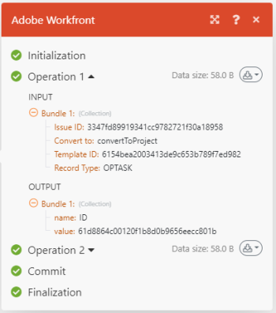

# Scenario execution flow

This article explains how a scenario executes and how data flows through it. It also explains where you can find information about your processed data and how to read it.

## Access requirements

You must have the following access to use the functionality in this article:

<table cellspacing="0"> 
 <col> 
 <col> 
 <tbody> 
  <tr> 
   <td role="rowheader"><em>Adobe Workfront</em> plan*</td> 
   <td> 
<em>Pro</em> or higher
 </td> 
  </tr> <draft-comment>
   <tr data-mc-conditions=""> 
    <td role="rowheader"><em>Adobe Workfront</em> license*</td> 
    <td> 
Plan, Work
 </td> 
   </tr>
  </draft-comment>
  <tr data-mc-conditions=""> 
   <td role="rowheader"><em>Adobe Workfront</em> license*</td> 
   <td> 
Plan, Work
 </td> 
  </tr> 
  <tr> 
   <td role="rowheader"><em>Adobe Workfront Fusion</em> license**</td> 
   <td> 
<em>Workfront Fusion for Work Automation and Integration</em> 
 <draft-comment>
     
<em>Workfront Fusion for Work Automation</em> 

    </draft-comment>
<em>Workfront Fusion for Work Automation</em> 
 </td> 
  </tr> 
  <tr> 
   <td role="rowheader">Product</td> 
   <td>Your organization must purchase <em>Adobe Workfront Fusion</em> as well as <em>Adobe Workfront</em> to use functionality described in this article.</td> 
  </tr> <draft-comment>
   <tr data-mc-conditions="QuicksilverOrClassic.Draft mode"> 
    <td role="rowheader">Access level configurations*</td> 
    <td> <draft-comment>
      
You must be a <em>Workfront Fusion</em> administrator for your organization.

     </draft-comment>
You must be a <em>Workfront Fusion</em> administrator for your organization.
 <draft-comment>
      
You must be a <em>Workfront Fusion</em> administrator for your team.

     </draft-comment>
You must be a <em>Workfront Fusion</em> administrator for your team.
 </td> 
   </tr>
  </draft-comment>
  <tr data-mc-conditions="QuicksilverOrClassic.Draft mode"> 
   <td role="rowheader">Access level configurations*</td> 
   <td> 
You must be a <em>Workfront Fusion</em> administrator for your organization.
 
You must be a <em>Workfront Fusion</em> administrator for your team.
 </td> 
  </tr> 
 </tbody> 
</table>

&#42;To find out what plan, license type, or access you have, contact your *Workfront administrator*.

&#42;&#42;For information on *Adobe Workfront Fusion* licenses, see [Adobe Workfront Fusion licenses](../../workfront-fusion/get-started/license-automation-vs-integration.md)

## Scenario execution flow

After a scenario is set up correctly and activated, it executes according to its defined schedule.

As the scenario begins, the first module responds to an event it has been set to watch for. If it returns any bundles (data), they pass on to the next module and the scenario continues, passing the bundles through each successive module, one by one.

If the bundles process correctly throughout all of the modules, the scenario is marked as a success in the scenario detail area, as explained in [Scenario detail](../../workfront-fusion/scenarios/scenario-detail.md).

* For more information on setting up a scenario, see [Basic scenario settings](../../workfront-fusion/scenarios/basic-scenario-settings.md).
* For more information on activating a scenario, see [Activate or deactivate a scenario](../../workfront-fusion/scenarios/activate-or-inactivate-scenario.md).
* For more information on scheduling a scenario, see [Schedule a scenario](../../workfront-fusion/scenarios/schedule-a-scenario.md).
* For more information on modules, see [Types of modules](../../workfront-fusion/modules/module-types.md).

### Example: *Workfront Fusion for Work Automation*

` `**Example: **`` In a scenario that watches for incoming requests in *Workfront* and then converts them to Workfront projects, data would flow as follows.

The scenario's first step, performed by the first module, is to watch for requests. Each request that comes in is considered one bundle. If the module runs without finding any bundles, the scenario ends after the first module.

If the first module returns a bundle, the bundle passes through the rest of the scenario. In this example, the rest of the scenario consists of the second and last module, which converts the request to a project.

### Example: *Workfront Fusion for Work Automation and Integration*

` `**Example: **`` In a scenario that downloads documents from *Adobe Workfront* and sends them to a folder in Dropbox, data would flow as follows.

The scenario's first step, performed by the first module, is to watch for bundles (documents). In this example, the module watches for bundles in *Workfront*. If it does not return a bundle, the scenario ends after the first module.

If a bundle is returned, the bundle passes through the rest of the scenario. In this example, the rest of the scenario consists of the second and last module, which uploads the bundle to the Dropbox folder.

If the first module returns multiple bundles, the first bundle is uploaded to Dropbox before the second bundle is uploaded. Then the second bundle uploads, then the third, and so on.

## Information about processed bundles

For each module, the bundle goes through a 4-step process before going on to the next module or reaching its final destination. The 4-step process is Initalization, Operation, Commit/Rollback, and Finalization. This is called transaction processing and it helps to explain how data was processed in a module.

Once a scenario run is complete, each module displays an icon showing the number of operations performed. You can click this icon to display the detailed information about the processed bundles, in the format described above. You can see which modules settings were used and which bundles were returned by which module.

A module received input information such as:

* Converted image
* Selected folder where the image shall be uploaded to
* Original name of the Facebook image

After processing, the module returned this output information:

* Image ID assigned by Dropbox
* Full path where in Dropbox *Workfront Fusion* uploaded the file

The above information is captured for each bundle separately, as marked by the drop down boxes Operation 1 and Operation 2 in the image.

For more information on transaction processing see [Scenario execution, cycles, and phases](../../workfront-fusion/scenarios/scenario-execution-cycles-phases.md).

## Error occurred while executing a scenario

An error might occur during the scenario run. For example, if you delete the Dropbox folder that you have set as the target folder in the module setting, the scenario terminates with an error message. For more information about how to handle errors, see [Error processing](../../workfront-fusion/errors/error-processing.md).
