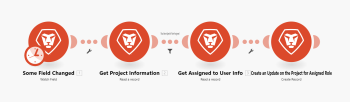
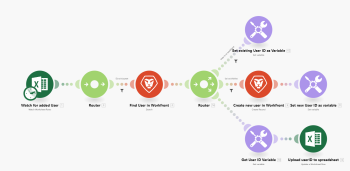

# *Adobe Workfront Fusion* scenario overview

*Adobe Workfront Fusion* requires an *Adobe Workfront Fusion* license in addition to an *Adobe Workfront* license.

>[!IMPORTANT]
>
>*Workfront Fusion* scenarios should not be confused with *Workfront Scenario Planner* scenarios. For information about *Workfront Scenario Planner* scenarios, see [The Adobe Workfront Scenario Planner overview](../../scenario-planner/scenario-planner-overview.md).

The role of *Adobe Workfront Fusion* is to seamlessly connect your apps and web services and automate your processes so that you can concentrate on new tasks rather than repeating the same tasks again and again. It works by linking actions within and between apps and services to create a scenario that transfers and transforms your data automatically. The scenario you create watches for data in an app or service and processes that data to provide the result you want.

A scenario is comprised of a series of modules that indicate how data should be transformed within an app or transferred between apps and web services.

## Example: Automating processes within *Adobe Workfront*

>[!NOTE]
>
>This functionality is available for the following licenses:
>
>* *Workfront Fusion for Work Automation* 
>* *Workfront Fusion for Work Automation and Integration* 
>

*Workfront Fusion* enables you to automate simple or complex workflows within Workfront, saving time and ensuring that the process is executed consistently.

In this example, the scenario triggers when a specified field changes in a Task or Issue in *Workfront*. When triggered, the scenario gets information in the related project and creates a tailored update for a person assigned to a specific role on the project.

## Example: Connecting Workfront to another app or web service

>[!NOTE]
>
>This functionality is available for the following license:
>
>* *Workfront Fusion for Work Automation and Integration* 
>

Workfront Fusion can also connect to other apps and web services. You can access, import, manipulate, or export data from other applications, integrating them with *Workfront* or with each other. Many applications have dedicated *Workfront Fusion* connectors. If there is no dedicated connector for the application you want to access, you can use *Workfront Fusion*'s HTTP or SOAP modules to connect to the application through its API.

In this example, the scenario triggers when a user is added to an Excel spreadsheet. The scenario checks whether the user is in *Workfront*. If not, the scenario creates the user in *Workfront* and adds their *Workfront* user ID back to the spreadsheet.

For a list of dedicated connectors, see [Apps and their modules](../../workfront-fusion/apps-and-their-modules/apps-and-their-modules.md).

>[!IMPORTANT]
>
>*Adobe Workfront Fusion* can connect to almost any web service. If the app you want to work with does not have a dedicated *Workfront Fusion* connector, you can use the following modules to connect directly to the web service:
>
>* [HTTP modules](http-modules.md) 
>* [SOAP module](../../workfront-fusion/apps-and-their-modules/soap-module.md) 
>* [JSON modules](../../workfront-fusion/apps-and-their-modules/json-modules.md) 
>

