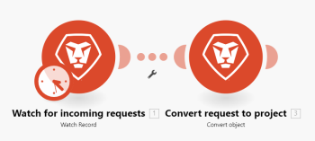

# Scenario settings panel {#scenario-settings-panel}


## Access requirements {#access-requirements}

You must have the following access to use the functionality in this article:

<table style="width: 100%;margin-left: 0;margin-right: auto;mc-table-style: url('../../Resources/TableStyles/TableStyle-List-options-in-steps.css');" class="TableStyle-TableStyle-List-options-in-steps" cellspacing="0"> 
 <col class="TableStyle-TableStyle-List-options-in-steps-Column-Column1"> 
 <col class="TableStyle-TableStyle-List-options-in-steps-Column-Column2"> 
 <tbody> 
  <tr class="TableStyle-TableStyle-List-options-in-steps-Body-LightGray"> 
   <td class="TableStyle-TableStyle-List-options-in-steps-BodyE-Column1-LightGray" role="rowheader"><span class="mc-variable WFVariables.FullProdNameWF variable varname">Adobe Workfront</span> plan*</td> 
   <td class="TableStyle-TableStyle-List-options-in-steps-BodyD-Column2-LightGray"> <p><span class="mc-variable WFVariables.WFPlan-Pro variable varname">Pro</span> or higher</p> </td> 
  </tr> 
  <tr class="TableStyle-TableStyle-List-options-in-steps-Body-MediumGray"> 
   <td class="TableStyle-TableStyle-List-options-in-steps-BodyE-Column1-MediumGray" role="rowheader"><span class="mc-variable WFVariables.FullProdNameWFF variable varname">Adobe Workfront Fusion</span> license**</td> 
   <td class="TableStyle-TableStyle-List-options-in-steps-BodyD-Column2-MediumGray"> <p><span class="mc-variable WFVariables.WFFusionIntegration variable varname">Workfront Fusion for Work Automation and Integration</span> </p> <p data-mc-conditions="SnippetConditions.HIDE"><span class="mc-variable WFVariables.WFFusionAutomation variable varname">Workfront Fusion for Work Automation</span> </p> </td> 
  </tr> 
  <tr class="TableStyle-TableStyle-List-options-in-steps-Body-LightGray"> 
   <td class="TableStyle-TableStyle-List-options-in-steps-BodyB-Column1-LightGray" role="rowheader">Product</td> 
   <td class="TableStyle-TableStyle-List-options-in-steps-BodyA-Column2-LightGray">Your organization must purchase <span class="mc-variable WFVariables.FullProdNameWFF variable varname">Adobe Workfront Fusion</span> as well as <span class="mc-variable WFVariables.FullProdNameWF variable varname">Adobe Workfront</span> to use functionality described in this article.</td> 
  </tr> 
 </tbody> 
</table>

&#42;To find out what plan, license type, or access you have, contact your *`Workfront administrator`*.


## Open the scenario settings {#open-the-scenario-settings}


1. Open the scenario editor, as explained in [Scenario editor](scenario-editor.md).
1.  Click the gear icon near the lower-left corner of the page.


   


   In the Scenario settings panel that displays, you can configure various advanced settings for the scenario.


## Allow storing incomplete executions {#allow-storing-incomplete-executions}

This option determines how *`Adobe Workfront Fusion`* proceeds if an error occurs during the execution of a scenario. With this option enabled, the scenario is paused and moved to [View and resolve incomplete executions](view-and-resolve-incomplete-executions.md). This gives you the possibility to fix the issue and continue executing from where the scenario was stopped. If this option is disabled, the scenario run stops and a rollback phase is started.


## Sequential processing {#sequential-processing}

This option determines how *`Workfront Fusion`* proceeds if an error occurs and the execution of a scenario is moved to the [View and resolve incomplete executions](view-and-resolve-incomplete-executions.md). If the Sequential processing option is enabled, *`Workfront Fusion`* stops processing the task sequence altogether until all incomplete executions are resolved. If the Sequential processing option is disabled, the scenario continues to run according to its schedule, accompanied by repeated attempts to rerun the incomplete executions.


For more information on scheduling, see [Schedule a scenario](schedule-a-scenario.md).


## Data is confidential {#data-is-confidential}

Once a scenario has been executed, you can by default display information about which data was processed by modules in the scenario. If you do not want this information to be stored, enable the Data is confidential option.


For more information about displaying information, see [Scenario execution flow](scenario-execution-flow.md).


>[!IMPORTANT] {type="important"}
>
>If you enable this option, it is difficult to solve errors that may occur during the execution of a scenario.


## Enable data loss {#enable-data-loss}

This option has to do with enabling data loss if *`Workfront Fusion`* fails to save a bundle to the queue of [View and resolve incomplete executions](view-and-resolve-incomplete-executions.md) (for example, due to a lack of free space). With this option enabled, the data is lost in order to prevent interruptions in the overall scenario execution. This is useful for scenarios where the highest priority is continuous execution and the incoming erroneous data is not that important.


Beyond that, when executing a scenario, a module can sometimes encounter a file that is larger than the maximum allowed size. In this case, *`Workfront Fusion`* proceeds in accordance with the setting of the Enable data loss option and a warning message is shown.


For more information about maximum file size, see [About mapping files](about-mapping-files.md).


For more information on warnings, see [Error processing](error-processing.md).


## Auto commit {#auto-commit}

The Auto commit settings applies to transactions and defines the way to process a scenario. If the Auto commit option is on, the commit phase on each module starts immediately after completing the operation phase. With the Auto commit option disabled, no commit occurs until operations are executed for all modules (this is the default mode).


For more information on transactions, see [Scenario execution, cycles, and phases](scenario-execution-cycles-phases.md).


## Maximum number of cycles {#maximum-number-of-cycles}

Setting more cycles can be useful when you want to prevent connection interruption to a third-party service and assure that all records are processed within the one scenario run.


*  If the scenario starts with a polling trigger, the setting defines the maximum number of cycles allowed during the scenario execution.


  For more information on polling triggers, see [Polling triggers](module-types.md#polling) in [Types of modules](module-types.md).

*  If the scenario starts with an instant trigger, the setting is ignored and all the pending events are processed during a single scenario execution, one event per one cycle.


  For more information on instant triggers, see [Instant triggers](module-types.md#instant) in [Types of modules](module-types.md).

* If the scenario does not start with a trigger (instant/polling), the specified maximum number of cycles is always performed.


` `**Examples: **`` Dropbox > Watch files retrieves files added to a folder and the Google Sheets > Add a Row module inserts the file name and file size to a new row in the sheet.





>[!NOTE]
>
>A more cycles setting is applied only when you schedule your scenario execution. When you use the Run once button, cycle settings are taken into account.


### Max number of cycles is set to 1 (default) {#max-number-of-cycles-is-set-to-default}


The Maximum number of returned files in the Dropbox > Watch files module is set to 

```
10
```

.


If 100 files are added to the Dropbox folder and the Maximum number of returned files field is set to 10, then 90 files are left unprocessed after one scenario run. The next 10 files are processed in the next scheduled scenario execution.


###  Max number of cycles is set to 10 {#max-number-of-cycles-is-set-to}

The Maximum number of returned files in the Dropbox > Watch files module is set to 

```
10
```

.


If 100 files are added to the Dropbox folder and the Maximum number of returned files option is set to 10, then 10 files are processed during the first cycle, the next 10 files in the second cycle, the next 10 files in the third cycle and so on, until all files are processed.


All files are processed within 1 scenario run.


You can see the already-run cycles in the Scenario details:


For more information about this page, see [Scenario detail](scenario-detail.md).


## Number of consecutive errors {#number-of-consecutive-errors}

Defines the maximum number of consecutive execution attempts before the execution of a scenario is deactivated (excluding DataError, DuplicateDataError and ConnectionError).


For more information on errors, see [Error processing](error-processing.md).


>[!NOTE]
>
>If a scenario starts with an instant trigger, the setting is ignored and the scenario is deactivated immediately once the first error has occurred.


