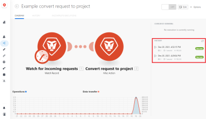

# View a scenario's execution history

You can display information about all the runs for a scenario, or you can search all executions of the scenario for specific data.

A scenario's execution history displays all of a scenario's executions for the last 30 days.

## Access requirements

You must have the following access to use the functionality in this article:

<table cellspacing="0"> 
 <col> 
 <col> 
 <tbody> 
  <tr> 
   <td role="rowheader"><em>Adobe Workfront</em> plan*</td> 
   <td> 
<em>Pro</em> or higher
 </td> 
  </tr> <draft-comment>
   <tr data-mc-conditions=""> 
    <td role="rowheader"><em>Adobe Workfront</em> license*</td> 
    <td> 
Plan, Work
 </td> 
   </tr>
  </draft-comment>
  <tr data-mc-conditions=""> 
   <td role="rowheader"><em>Adobe Workfront</em> license*</td> 
   <td> 
Plan, Work
 </td> 
  </tr> 
  <tr> 
   <td role="rowheader"><em>Adobe Workfront Fusion</em> license**</td> 
   <td> 
<em>Workfront Fusion for Work Automation and Integration</em> 
 <draft-comment>
     
<em>Workfront Fusion for Work Automation</em> 

    </draft-comment>
<em>Workfront Fusion for Work Automation</em> 
 </td> 
  </tr> 
  <tr> 
   <td role="rowheader">Product</td> 
   <td>Your organization must purchase <em>Adobe Workfront Fusion</em> as well as <em>Adobe Workfront</em> to use functionality described in this article.</td> 
  </tr> <draft-comment>
   <tr data-mc-conditions="QuicksilverOrClassic.Draft mode"> 
    <td role="rowheader">Access level configurations*</td> 
    <td> <draft-comment>
      
You must be a <em>Workfront Fusion</em> administrator for your organization.

     </draft-comment>
You must be a <em>Workfront Fusion</em> administrator for your organization.
 <draft-comment>
      
You must be a <em>Workfront Fusion</em> administrator for your team.

     </draft-comment>
You must be a <em>Workfront Fusion</em> administrator for your team.
 </td> 
   </tr>
  </draft-comment>
  <tr data-mc-conditions="QuicksilverOrClassic.Draft mode"> 
   <td role="rowheader">Access level configurations*</td> 
   <td> 
You must be a <em>Workfront Fusion</em> administrator for your organization.
 
You must be a <em>Workfront Fusion</em> administrator for your team.
 </td> 
  </tr> 
 </tbody> 
</table>

&#42;To find out what plan, license type, or access you have, contact your *Workfront administrator*.

&#42;&#42;For information on *Adobe Workfront Fusion* licenses, see [Adobe Workfront Fusion licenses](../../workfront-fusion/get-started/license-automation-vs-integration.md)

## View all executions of a scenario

### View scenario execution history on the Scenario Detail page

<ol> 
 <li value="1"> 
Click the Scenario tab in the left panel, then click the scenario.
 
Or
 
If you are working on the scenario in the Scenario editor, click the left arrow  near the upper-left corner of the window.
 </li> 
 <li value="2"> 
View the information in the list on the right.
 
  
 
C
 
You can also click to see a full-page view of this information. The full-page view allows you to filter the history to view specific executions.
 
The following details are listed for every execution of the scenario:
 
  <ul> 
   <li>Date when the run was Started</li> 
   <li>Status (success or failed)</li> 
   <li>Run Duration</li> 
   <li>Number of Operations </li> 
   <li>Size of Data Transfer</li> 
   <li>Link to Details</li> 
  </ul> </li> 
</ol>

### View scenario execution history on the History tab

The History tab shows more detail than is available on the Scenario detail page. You can also filter and sort the executions on the History tab.

<ol> 
 <li value="1"> 
Click the Scenario tab in the left panel, then click the scenario.
 
Or
 
If you are working on the scenario in the Scenario editor, click the left arrow  near the upper-left corner of the window.
 </li> 
 <li value="2"> 
Click the History tab near the upper-left corner of the page
 </li> 
 <li value="3"> 
(Optional) For detailed information about a selected scenario run, including which bundles were processed, click the Details link. 
 
For more information on processing bundles, see <a href="../../workfront-fusion/scenarios/scenario-execution-flow.md" class="MCXref xref">Scenario execution flow</a>.
 <note type="note">
   The details link is visible only if the execution has details available. 
  </note> </li> 
</ol>

## Filter the scenario execution history

You can filter the execution history to view only executions with the specified values.

<ol> 
 <li value="1"> 
Open the full-page history for a scenario as described in <a href="#view2" class="MCXref xref">View scenario execution history on the History tab</a> in this article.
 </li> 
 <li value="2"> 
Click the filter icon  in the header of the column you want to filter by.
 </li> 
 <li value="3"> 
In the filter dialog, enter the values that you want to filter by.
 </li> 
 <li value="4"> 
Click <b>Save</b>.
 </li> 
</ol>

The filter icon is orange in columns with a currently active filter.

## Sort the scenario execution history

You can sort the scenario execution history.

1. Open the full-page history for a scenario as described in [View scenario execution history on the History tab](#view2) in this article.
1. Click the Sort icon in the header of the column you want to filter by.
1. Optional: To reverse the order of the sort, click the Sort icon again.

## Search all executions of a scenario for specific data

<ol> 
 <li value="1"> 
Click the Scenario icon  in the left panel, then click the scenario.
 
Or
 
If you are working on the scenario in the Scenario editor, click the left arrow  near the upper-left corner of the window.
 </li> 
 <li value="2"> 
Click the History tab near the upper-left corner of the screen.
 </li> 
 <li value="3"> 
Click Fulltext search in the upper-right corner of the screen.
 </li> 
 <li value="4"> 
Enter the search term.
 
Example: </b>"><b>Example: </b>If you want to find the execution that created a specific project, enter the project ID into the Fulltext search bar.
 </li> 
 <li value="5"> 
(Optional) Click on a result of the fulltext search to examine the scenario module output bundle that contains the information.
 </li> 
</ol>

