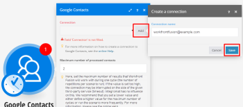

# Sync Airtable and Google contacts

One of the many great features of Workfront Fusion is the ability to interconnect services. For example, you can use the steps below to connect Airtable to Google Contacts and synchronize a list of contacts between these services.

## First: Add Google contacts

<ol> 
 <li value="1">Create a new scenario in your dashboard.</li> 
 <li value="2">Add the Google Contacts Watch contacts module. </li> 
 <li value="3"> 
In this module, to the right of the Connection field, click Add.
 
When you are prompted to name your connection, you can enter whatever name you want. We recommend using a name, such as your Google email, that reminds you which Google account is associated with the connection.
 
  
 </li> 
 <li value="4">Click Save.</li> 
 <li value="5">In the window that displays, select the Google account you want to use and approve access for Workfront Fusion.</li> 
</ol>

## Second: Add Airtable

1. Add the Airtable module `Create a record`.
1. Add a connection to Airtable in the same way you did with the Google Contacts module.
1. Enter your Airtable email, password, and API token, then click `Save`.

   You can retrieve token in the `API token` field in your Airtable account.

   If you haven't used Airtable's API before, you won' have an API token, but it's easy to generate one. To do so, click the `Generate` token link.

## Third: Configure the scenario

After the account has been linked to Workfront Fusion, you can continue setting up your scenario.

1. Select a table that will store your contacts.
1. In the fields that display, click an option to fill them.

   For example, in the `Name` field, you can use the Google Contacts `Full Name` field. Since Google Contacts allows you to store multiple emails for a single contact, we will select only the first one.

1. Click `Airtable Email`.
1. In the box that displays, find and expand the `Emails` field, then click `Email`.

1. Fill in the `Airtable Phone` field the same way.
1. Click `OK`.

   The integration is now ready and you can run the scenario. If you have some contacts in Google Contacts and if everything has been processed without errors, you will see that the Watch contacts module has generated some bundles and that the Create a record module has successfully created new records out of the bundles generated by the Watch contacts module. You can then go to your Airtable table and verify that the data is there.

