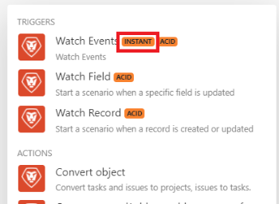
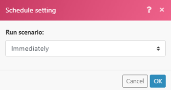

# Instant triggers (webhooks)

Many services provide webhooks to deliver instant notifications whenever a certain change occurs in the service. To process these notifications, we recommend that you use instant triggers. You can recognize these easily in Adobe Workfront Fusion because of their tag:

If the service does not provide webhooks, you need to use polling triggers to periodically poll the service.

## Access requirements

You must have the following access to use the functionality in this article:

<table cellspacing="0"> 
 <col> 
 <col> 
 <tbody> 
  <tr> 
   <td role="rowheader">Adobe Workfront plan*</td> 
   <td> 
Pro or higher
 </td> 
  </tr> Adobe Workfront license* Plan, Work 
  <tr> 
   <td role="rowheader">Adobe Workfront Fusion license**</td> 
   <td> 
Workfront Fusion for Work Automation and Integration 
  </td> 
  </tr> 
  <tr> 
   <td role="rowheader">Product</td> 
   <td>Your organization must purchase Adobe Workfront Fusion as well as Adobe Workfront to use functionality described in this article.</td> 
  </tr> <!--
   Access level configurations* You must be a Workfront Fusion administrator for your organization. You must be a Workfront Fusion administrator for your team.
  --> 
 </tbody> 
</table>

&#42;To find out what plan, license type, or access you have, contact your Workfront administrator.

&#42;&#42;For information on Adobe Workfront Fusion licenses, see [Adobe Workfront Fusion licenses](../../workfront-fusion/get-started/license-automation-vs-integration.md)

## View a webhook's queue

All messages from incoming webhooks are stored in the webhook's queue.

<ol> 
 <li value="1">Click Webhooks in the menu on left.</li> 
 <li value="2">Find the Webhook for which you want to view the queue.</li> 
 <li value="3"> 
Click the button with a truck icon and the number of received webhooks.
 
  
 <note type="note">
   Incoming webhook data is always stored in the queue regardless of how you have set the option Data is confidential (described in 
   <a href="../../workfront-fusion/scenarios/scenario-settings-panel.md" class="MCXref xref">Scenario settings panel</a>). As soon as the data is processed in a scenario, it is permanently deleted from the system.
  </note> </li> 
</ol>

## Schedule instant triggers

If your scenario contains an instant trigger, you can schedule the scenario to run immediately:

In this case your scenario will run immediately whenWorkfront Fusion receives new data from the service. After the scenario executes, the total amount of pending webhooks waiting in the queue is counted and the scenario performs as many cycles as there are pending webhooks, processing one webhook per cycle. For more information, see [Scenario execution, cycles, and phases](../../workfront-fusion/scenarios/scenario-execution-cycles-phases.md).

>[!NOTE]
>
>* A cycle is not the same as a scenario run. There can be multiple cycles within 1 scenario run. 
>* When you execute a scenario with an instant trigger scheduled to be immediate, the following exceptions apply:>
>  * The interval between two executions is not subject to the Minimum interval according to the pricing plan.
>
>    For example, once the scenario finishes its execution, the webhook's queue is checked again. If there are any pending webhooks, the scenario executes immediately again, processing all the pending webhooks once again.
>  
>  * The Maximum number of cycles scenario setting is ignored and set to 100, which means that no more than 100 pending webhooks will be processed during a single scenario execution (at the rate of 1 event per one cycle).
>

If you use any other schedule setting than Immediately, the scenario executes at the intervals you specify. As several webhooks can be gathered in the queue during the interval, it is recommended to set the [Maximum number of cycles](../../workfront-fusion/scenarios/scenario-settings-panel.md#maximum) to a higher value than the default 1 to process more webhooks in one scenario run:

<ol> 
 <li value="1">Click the Scenario settings icon  at the bottom of your scenario.</li> 
 <li value="2"> 
In the Scenario settings box that appears, type a number in the Max number of cycles box to indicate the number of webhooks from the queue that you want to run each time you execute the scenario. 
 </li> 
</ol>

## Rate limits

The current rate limit is 5 webhooks per second. If the limit is exceeded, 429 status code is returned.

## Expiration of inactive webhooks

A webhook that has not been assigned to any scenario for more than 120 hours is removed.

## Error handling

When there is an error in your scenario with an instant trigger, the scenario:

* Stops immediately - when the scenario is set to run Immediately.
* Stops after 3 unsuccessful attempts (3 errors) - when the scenario is set to run as scheduled.

If an error occurs during the scenario execution, the webhook is placed back into the queue during the instant trigger's rollback phase. In such a situation, you have the possibility to fix the scenario and rerun it again. For more information, see [Rollback](../../workfront-fusion/scenarios/scenario-execution-cycles-phases.md#rollback) in the article [Scenario execution, cycles, and phases](../../workfront-fusion/scenarios/scenario-execution-cycles-phases.md).

If there is a Webhook response module in your scenario, the error is sent to the Webhook response. The Webhook response module is always executed last (in the case where the Auto commit option in the Scenario settings is not enabled). For more information, see [Responding to webhooks](../../workfront-fusion/apps-and-their-modules/webhooks-updated.md#respondi) in the article [Webhooks](../../workfront-fusion/apps-and-their-modules/webhooks-updated.md).

## Custom webhooks

You can create your own webhooks. For more information, see [Webhooks](../../workfront-fusion/apps-and-their-modules/webhooks-updated.md).
