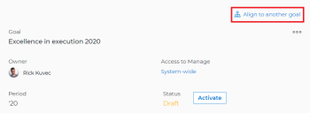
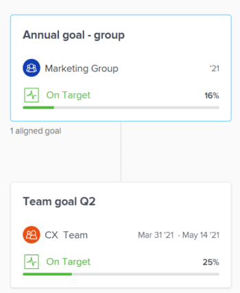

# Align goals by connecting them in *Adobe Workfront Goals*

If you are an individual contributor who has a personal goal, you may want to align it to your team's goals in order to effectively display the progress of your own goal in the larger context of your organization's strategy.

When everyone in your organization has their goals aligned to your organization's goals, they can clearly see how their individual contributions and team efforts help to move the needle forward on larger, company-level priorities. For more information about the best practices for aligning goals, see [Goal alignment overview in Adobe Workfront Goals](../../workfront-goals/goal-alignment/goal-alignment-overview.md).

There are two approaches to connecting goals in&nbsp;*Adobe Workfront Goals*:

* You can create alignment between goals by connecting goals to one another. This is a bottom-up approach to aligning goals.

* You can manually align two goals or you can convert results and activities of an existing goal to another goal.&nbsp;The converted result or activity becomes the child goal of the original goal. This is a top-down approach to aligning goals.

This article describes how you can align goals to one another by connecting them. For information about aligning goals by converting results and activities to goals, see [Align goals by converting results and activities to goals](../../workfront-goals/goal-alignment/align-goals-by-converting-results-activities.md).

## Access requirements

You must have the following:

<table cellspacing="0"> 
 <col> 
 <col> 
 <tbody> 
  <tr> 
   <td role="rowheader"><em>Adobe Workfront</em> plan*</td> 
   <td> 
<em>Pro</em> or higher
 </td> 
  </tr> 
  <tr> 
   <td role="rowheader"><em>Adobe Workfront</em> license*</td> 
   <td> 
<em>Request</em> or higher
 
For more information, see <a href="../../administration-and-setup/add-users/access-levels-and-object-permissions/wf-licenses.md" class="MCXref xref">Adobe Workfront licenses overview</a>.
 </td> 
  </tr> 
  <tr> 
   <td role="rowheader">Product</td> 
   <td> 
You must purchase an additional license for the <em>Adobe Workfront Goals</em> to access functionality described in this article. 
 
For information, see <a href="../../workfront-goals/goal-management/access-needed-for-wf-goals.md" class="MCXref xref">Requirements to use Adobe Workfront Goals</a>. 
 </td> 
  </tr> 
  <tr> 
   <td role="rowheader">Access level configurations*</td> 
   <td> 
Edit access to Goals
 
Note:  
If you still don't have access, ask your <em>Workfront administrator</em> if they set additional restrictions in your access level. For information on how a <em>Workfront administrator</em> can change your access level, see:
 
     <ul> 
      <li> 
<a href="../../administration-and-setup/add-users/configure-and-grant-access/create-modify-access-levels.md" class="MCXref xref">Create or modify custom access levels</a> 
 </li> 
      <li> 
<a href="../../administration-and-setup/add-users/configure-and-grant-access/grant-access-goals.md" class="MCXref xref">Grant access to Adobe Workfront Goals</a> 
 </li> 
     </ul> 
 </td> 
  </tr> <draft-comment>
   <tr data-mc-conditions=""> 
    <td role="rowheader">Object permissions</td> 
    <td> 
     
 
      
Manage permissions to the goal
 
      
For information about sharing goals, see <a href="../../workfront-goals/workfront-goals-settings/share-a-goal.md" class="MCXref xref">Share a goal in Adobe Workfront Goals</a>. 
 
     
 </td> 
   </tr>
  </draft-comment>
  <tr data-mc-conditions=""> 
   <td role="rowheader">Object permissions</td> 
   <td> 
    
 
     
Manage permissions to the goal
 
     
For information about sharing goals, see <a href="../../workfront-goals/workfront-goals-settings/share-a-goal.md" class="MCXref xref">Share a goal in Adobe Workfront Goals</a>. 
 
    
 </td> 
  </tr> 
 </tbody> 
</table>

&#42;To find out what plan, license type, or access you have, contact your *Workfront administrator*.

## Prerequisites

You must have the following before you can start:

* A Layout Template that includes the Goals area in the Main&nbsp;Menu.

>[!IMPORTANT]
>
>A goal cannot have more than a total of 50 activities, results, or aligned goals.

## Align two goals to one another

<ol> 
 <li value="1"> 
Create two goals that you want to align. For information about creating goals, see <a href="../../workfront-goals/goal-management/create-goals.md" class="MCXref xref">Create goals in Adobe Workfront Goals</a>.
 </li> 
 <li value="2"> 
(Optional)&nbsp;Activate the goals that you want to align.&nbsp;You can align goals that have a Draft, Active, or Inactive status. For information about activating goals, see <a href="../../workfront-goals/goal-management/activate-goals.md" class="MCXref xref">Activate goals in Adobe Workfront Goals</a>.
 </li> 
 <li value="3"> 
Go to the goal that you want to align (child goal) to another goal (parent goal) and click its name to open the Goal&nbsp;Details panel.&nbsp;
 
For example, if you want Goal 2 to influence the progress of Goal 1, you must go to Goal 2. 
 </li> 
 <li value="4"> 
Click Align to another goal in the upper-right corner of the right panel. 
 
  
 </li> 
 <li value="5"> 
Start typing the name of an existing goal or the name of an owner in the Align to another goal field, then select it when it appears in the list. Only goals that are from the same or future periods display in the list. 
 </li> 
 <li value="6"> 
Click&nbsp;Save. 
 
The goal you started with (Goal 2) is now the child goal of the goal you aligned it with (Goal 1).  The aligned goals display connected in the <em>Goal Alignment section</em> with Goal 2 as secondary to&nbsp;Goal 1. 
 
  
 </li> 
 <li value="7"> 
(Optional) To view the goals in the <em>Goal Alignment section</em>, do one of the following:&nbsp;
 
  <ul> 
   <li>Click the <em>Goal Alignment</em> section in the left panel and find the goals by applying the correct filter. For information about filtering information in&nbsp;<em>Workfront Goals</em>, see <a href="../../workfront-goals/goal-management/filter-information-wf-goals.md" class="MCXref xref">Filter information in Adobe Workfront Goals</a>.</li> 
   <li> 
Click the <em>Goal List</em>, <em>Check-in</em>, or <em>Pulse</em> sections in the left panel and find one of the goals, then click the Alignment icon  next to the goal name to go directly to the goal in the <em>Goal Alignment section</em>. 
 </li> 
  </ul> 
For information about the <em>Goal Alignment section</em>, see <a href="../../workfront-goals/goal-alignment/navigate-goal-alignment-chart.md" class="MCXref xref">Navigate the Goal&nbsp;Alignment section in Adobe Workfront Goals</a>. 
 </li> 
 <li value="8"> 
(Optional)&nbsp;Add activities and results to either goal to indicate their progress. For information about adding activities and results, see the following articles:
 
  <ul> 
   <li><a href="../../workfront-goals/results-and-activities/add-activities-to-goals.md" class="MCXref xref">Add activities to goals in&nbsp;Adobe Workfront Goals</a> </li> 
   <li><a href="../../workfront-goals/results-and-activities/add-results-to-goals.md" class="MCXref xref">Add results to goals in Adobe Workfront Goals</a> </li> 
  </ul> </li> 
 <li value="9">(Optional)&nbsp;Remove the alignment between two goals, when you consider that no longer is relevant to your organization's overall strategy For information about removing alignment between goals, see <a href="../../workfront-goals/goal-alignment/remove-goal-alignment.md" class="MCXref xref">Remove goal alignment in&nbsp;Adobe Workfront Goals</a>.</li> 
</ol>

