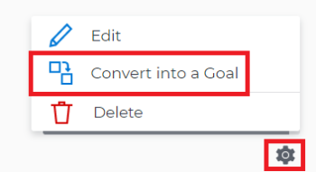

# Align goals by converting results and activities to goals

You can manually align two goals or you can convert the results and activities of an existing goal to another goal.&nbsp;The converted result or activity becomes the child goal of the original goal. For information about manually aligning two goals, see [Align goals by connecting them in Adobe Workfront Goals](../../workfront-goals/goal-alignment/align-goals-by-connecting-them.md).

## Access requirements

You must have the following:

<table cellspacing="0"> 
 <col> 
 <col> 
 <tbody> 
  <tr> 
   <td role="rowheader">Adobe Workfront plan*</td> 
   <td> 
Pro or higher
 </td> 
  </tr> 
  <tr> 
   <td role="rowheader">Adobe Workfront license*</td> 
   <td> 
Request or higher
 
For more information, see <a href="../../administration-and-setup/add-users/access-levels-and-object-permissions/wf-licenses.md" class="MCXref xref">Adobe Workfront licenses overview</a>.
 </td> 
  </tr> 
  <tr> 
   <td role="rowheader">Product</td> 
   <td> 
You must purchase an additional license for the Adobe Workfront Goals to access functionality described in this article. 
 
For information, see <a href="../../workfront-goals/goal-management/access-needed-for-wf-goals.md" class="MCXref xref">Requirements to use Adobe Workfront Goals</a>. 
 </td> 
  </tr> 
  <tr> 
   <td role="rowheader">Access level configurations*</td> 
   <td> 
Edit access to Goals or higher
 
Note:  
If you still don't have access, ask your Workfront administrator if they set additional restrictions in your access level. For information on how a Workfront administrator can change your access level, see:
 
     <ul> 
      <li> 
<a href="../../administration-and-setup/add-users/configure-and-grant-access/create-modify-access-levels.md" class="MCXref xref">Create or modify custom access levels</a> 
 </li> 
      <li> 
<a href="../../administration-and-setup/add-users/configure-and-grant-access/grant-access-goals.md" class="MCXref xref">Grant access to Adobe Workfront Goals</a> 
 </li> 
     </ul> 
 </td> 
  </tr> Object permissions Manage permissions to the goal For information about sharing goals, see Share a goal in Adobe Workfront Goals. 
 </tbody> 
</table>

&#42;To find out what plan, license type, or access you have, contact your `Workfront administrator`.

## Prerequisites

You must have the following before you can start:

* A Layout Template that includes the Goals area in the Main&nbsp;Menu.
* An existing goal with existing results and activities.

  For information about creating goals, see [Create goals in Adobe Workfront Goals](../../workfront-goals/goal-management/create-goals.md).

>[!IMPORTANT]
>
>A goal cannot have more than a total of 50 activities, results, or aligned goals.

## Considerations when converting results and activities into goals

Sometimes, a result or an activity may have a larger scope than anticipated and it would make more sense that they would become goals. You can convert results and activities of an existing goal to a new goal.&nbsp;This is a bottom-up approach to aligning goals.

Consider the following when converting results and activities to goals:

* The converted result or activity becomes the child goal of the original goal, and the two goals become aligned.
* The converted result or activity is removed from the original goal and added as a result or activity to the newly created goal. 
* The newly created goal becomes the single progress indicator for the original goal, if there are no additional results or activities on the original goal.

## Convert a result or activity to a goal

<ol> 
 <li value="1">Go to a goal that has a result or an activity that you want to convert to a goal.</li> 
 <li value="2">Click the name of the goal to open the Goal&nbsp;Details panel.</li> 
 <li value="3">Expand the Results or Activities right-pointing arrows to see a list of results or activities for the goal. </li> 
 <li value="4"> 
Click the gear icon  to the right of the result or activity name that you want to convert, then click Convert into a Goal. 
 
  
 </li> 
 <li value="5">(Optional) Remove the name of the original activity or result owner from the Goal Owner field and replace it with another user, team, group, or your organization's name. By default, Workfront selects the owner of the result or the activity as the goal owner. </li> 
 <li value="6">Click&nbsp;Convert. The activity or result displays as an aligned goal in the Goal&nbsp;Details panel of the original goal and the original activity or result is removed from the original goal and transferred to the second goal. By default, the new goal has the same name as the original converted result or activity. </li> 
 <li value="7">(Optional) Click the name of the new goal to open the Goal Details panel and edit the name of the goal. For information about editing any information for an existing goal, see <a href="../../workfront-goals/goal-management/edit-goals.md" class="MCXref xref">Edit goals in Adobe Workfront Goals</a>. </li> 
</ol>

