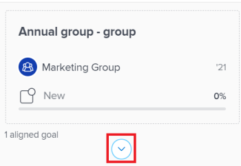
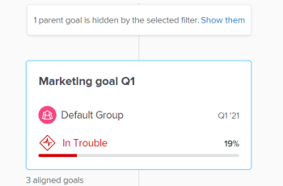
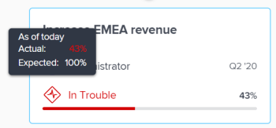

# Navigate the `Goal Alignment` section in `Adobe Workfront Goals`

Use the `Goal Alignment section` to display a holistic view of goal alignment across the entire organization in a flowchart. Aligned goals display on cards that interconnect in a hierarchical tree.

For information about goal alignment and how to achieve it, also see the following articles:

* [Goal alignment overview in Adobe Workfront Goals](../../workfront-goals/goal-alignment/goal-alignment-overview.md) 
* [Align goals by connecting them in Adobe Workfront Goals](../../workfront-goals/goal-alignment/align-goals-by-connecting-them.md)

## Access requirements

You must have the following to perform the activities described in this article:

<table cellspacing="0"> 
 <col> 
 <col> 
 <tbody> 
  <tr> 
   <td role="rowheader">Adobe Workfront plan*</td> 
   <td> 
Pro or higher
 </td> 
  </tr> 
  <tr> 
   <td role="rowheader">Adobe Workfrontlicense*</td> 
   <td> 
Request or higher
 
For more information, see <a href="../../administration-and-setup/add-users/access-levels-and-object-permissions/wf-licenses.md" class="MCXref xref">Adobe Workfront licenses overview</a>.
 </td> 
  </tr> 
  <tr> 
   <td role="rowheader">Product</td> 
   <td> 
You must purchase an additional license for the Adobe Workfront Goals to access functionality described in this article. 
 
For information, see <a href="../../workfront-goals/goal-management/access-needed-for-wf-goals.md" class="MCXref xref">Requirements to use Adobe Workfront Goals</a>. 
 </td> 
  </tr> 
  <tr> 
   <td role="rowheader">Access level*</td> 
   <td> 
Edit access to Goals
 
Note:   
If you still don't have access, ask your Workfront administrator if they set additional restrictions in your access level. For information on how a Workfront administrator can change your access level, see:
 
     <ul> 
      <li> 
<a href="../../administration-and-setup/add-users/configure-and-grant-access/create-modify-access-levels.md" class="MCXref xref">Create or modify custom access levels</a> 
 </li> 
      <li> 
<a href="../../administration-and-setup/add-users/configure-and-grant-access/grant-access-goals.md" class="MCXref xref">Grant access to Adobe Workfront Goals</a> 
 </li> 
     </ul> 
 </td> 
  </tr> Object permissions View or higher permissions to goals For information about sharing goals, see Share a goal in Adobe Workfront Goals. 
 </tbody> 
</table>

&#42;To find out what plan, license type, or access you have, contact your `Workfront administrator`.

## Prerequisites

You must have the following before you can start:

* A Layout Template that includes the Goals area in the Main&nbsp;Menu.

## Navigate the `Goal Alignment section`

<ol> 
 <li value="1"> 
Use the filters in the upper-right corner of the alignment chart to select only goals that are important to you. For information about using filters in Workfront Goals, see <a href="../../workfront-goals/goal-management/filter-information-wf-goals.md" class="MCXref xref">Filter information in Adobe Workfront Goals</a>. 
 
The goals that match your filters display in the alignment chart on cards.
 
  
 
   
The following information displays on a goal card:
 
   <table cellspacing="0"> 
    <col> 
    <col> 
    <tbody> 
     <tr> 
      <td role="rowheader">Time period dates </td> 
      <td> 
This is the period for which the goal is open.&nbsp;The goal must be achieved by the end date of the period. Workfront Goals calculates progress on the goal based on the duration of the goal's period and the current date.
 </td> 
     </tr> 
     <tr> 
      <td role="rowheader">Progress indicators</td> 
      <td>The number of progress indicators for the goal.&nbsp;Progress indicators can be aligned goals, results, or activities. </td> 
     </tr> 
     <tr> 
      <td role="rowheader">Owner name</td> 
      <td>The name of the user, team, group, or the organization designated as the goal&nbsp;Owner. </td> 
     </tr> 
     <tr> 
      <td role="rowheader">Goal name</td> 
      <td>The name of the goal. </td> 
     </tr> 
     <tr> 
      <td role="rowheader">Goal Progress bar and Progress</td> 
      <td> 
The goal progress indicates how much of the goal has currently been achieved.&nbsp;This is an automatic calculation of the average of the progress of all aligned goals, results, and activities for the goal based on the time elapsed since the start of the goal's time period. For information about calculating progress on goals, see <a href="../../workfront-goals/goal-management/calculate-goal-progress.md" class="MCXref xref">Calculate goal progress in Adobe Workfront Goals</a>. 
 
       
 
        
The actual progress of the goal by the current date.&nbsp;The following progress values and colors indicate how likely the goal is to being achieved on time: 
 
        <ul> 
         <li>On Target (green indicator): the goal is on time and will be achieved on time.</li> 
         <li> At Risk (yellow indicator):&nbsp;the goal runs behind and might not be achieved on time.</li> 
         <li> In&nbsp;Trouble (red indicator): the goal is in danger of not being achieved on time. </li> 
        </ul> 
       
 </td> 
     </tr> <!--
      Updated on date The date when the goal was last updated
     --> 
     <tr> 
      <td role="rowheader">Status</td> 
      <td>Goals in all statuses display in the Goal Alignment section.  </td> 
     </tr> 
    </tbody> 
   </table> 
  
 
Goals that are aligned to other goals display the number of aligned goals under the goal card. 
 
  
 </li> 
 <li value="2"> 
Click the downward-pointing arrow icon under a goal to further expand and view the children goals.
 
  
 <note type="tip">
   Goals that have children goals aligned to them display the number of aligned goals under their respective cards. 
  </note> </li> 
 <li value="3"> 
(Conditional) If the current filter excludes some of the goals that participate in an alignment, a warning message displays to indicate that not all goals display.
 
  
 </li> 
 <li value="4"> 
Click&nbsp;Show them to display the goals currently eliminated by the filter.
 
Notice the following changes in the alignment chart: 
 
  <ul> 
   <li> 
Connected goals previously eliminated by the filter now display in the alignment chart. 
 </li> 
   <li> 
The filter in the upper-right corner is outlined in yellow to indicate that it is currently not applied. 
 
  
 
A Reapply filter link displays to the left of the filter name.
 </li> 
  </ul> </li> 
 <li value="5"> 
(Optional)&nbsp;Click Reapply filter to return to the original results and display the goal hierarchy.
 </li> 
 <li value="6"> 
(Optional) Hover over the progress indicator to understand where the goal progress should be for the current day. 
 
  
 
The following information displays:
 
  <table cellspacing="0"> 
   <col> 
   <col> 
   <tbody> 
    <tr> 
     <td role="rowheader">As of today</td> 
     <td>The progress status is always current. </td> 
    </tr> 
    <tr> 
     <td role="rowheader">Actual </td> 
     <td>The actual progress (a percentage) of the goal by the current date as calculated by taking into account all the progress indicators on the goal. Goal progress indicators are aligned goals, activities, and results. </td> 
    </tr> 
    <tr> 
     <td role="rowheader">Expected</td> 
     <td> 
The expected progress (a percentage) of the goal by the current date assuming that you will achieve the goal on time.
 </td> 
    </tr> 
   </tbody> 
  </table> </li> 
 <li value="7"> 
Click a goal card to open the Goal&nbsp;Details panel and edit information about or check in on the goal. For information about editing existing goals, see <a href="../../workfront-goals/goal-management/edit-goals.md" class="MCXref xref">Edit goals in Adobe Workfront Goals</a>. For information about checking in on goals, see <a href="../../workfront-goals/goal-review-and-workfront-goals-sections/check-in-goals.md" class="MCXref xref">Check in on goals in Adobe Workfront Goals</a>.
 </li> 
 <li value="8"> 
Click the the upward-pointing arrow of the current-level goal to return to the previous level in the hierarchy of the chart.
 
Or
 
(Optional)&nbsp;Click Exit goal hierarchy to display the cards of all the goals that match the current filter, without displaying their connection to each other. 
 
&nbsp;
 </li> 
</ol>

<!--
In the Preview environment, do the following: Use the filters in the upper-right corner of the alignment chart to select only goals that are important to you. For information about using filters in Workfront Goals, see Filter information in Adobe Workfront Goals (Conditional) If the current filter excludes some of the goals that participate in an alignment, a warning message displays to indicate that not all goals are displayed: < new screen shot> Click Show them to display the goals currently eliminated by the filter. Notice the following changes in the alignment chart: Connected goals previously eliminated by the filter now display in the alignment chart. The filter in the upper-right corner is outlined in yellow to indicate that it is currently not applied. A Reapply filter link displays to the left of the filter name (Optional) Click Reapply filter to return to the original results and display the goal hierarchy . (Optional) Click Exit goal hierarchy to display the cards of all the goals that match the current filter, without displaying their connection to each other. In the Production environment, do the following: (Optional) Click the Company tab to view goals that are assigned to your organization and their aligned goals. Goals that are aligned to other goals display with additional stacked cards behind the top goal card. (Optional) Select a different period from the upper-right drop-down menu. The default is the current quarter. You can only select one time period at a time to view goals that are due during that period. Select from quarters or yearly periods for the current year and up to two more years. (Optional) Start typing the name of an owner who is designated as a goal owner in the Search for owner's name field, the select it when it appears in the list. Goals assigned to the owner you indicate and their aligned goals display in the Goal Alignment section. The goals that match your filter and tab selection display in the alignment chart.
-->

&nbsp;
