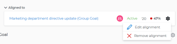

# Remove goal alignment in  *`Adobe Workfront Goals`* {#remove-goal-alignment-in-adobe-workfront-goals}

You can remove the alignment between two goals if it no longer makes sense for them to be connected.

For information about aligning goals, see the following articles:

* [Align goals by connecting them in Adobe Workfront Goals](align-goals-by-connecting-them.md) 
* [Align goals by converting results and activities to goals](align-goals-by-converting-results-activities.md) 

## Access requirements {#access-requirements}

You must have the following:

<table style="width: 100%;margin-left: 0;margin-right: auto;mc-table-style: url('../../Resources/TableStyles/TableStyle-List-options-in-steps.css');" class="TableStyle-TableStyle-List-options-in-steps" cellspacing="0"> 
 <col class="TableStyle-TableStyle-List-options-in-steps-Column-Column1"> 
 <col class="TableStyle-TableStyle-List-options-in-steps-Column-Column2"> 
 <tbody> 
  <tr class="TableStyle-TableStyle-List-options-in-steps-Body-LightGray"> 
   <td class="TableStyle-TableStyle-List-options-in-steps-BodyE-Column1-LightGray" role="rowheader">Adobe Workfront plan*</td> 
   <td class="TableStyle-TableStyle-List-options-in-steps-BodyD-Column2-LightGray"> 
Pro or higher
 </td> 
  </tr> 
  <tr class="TableStyle-TableStyle-List-options-in-steps-Body-MediumGray"> 
   <td class="TableStyle-TableStyle-List-options-in-steps-BodyE-Column1-MediumGray" role="rowheader">Adobe Workfront license*</td> 
   <td class="TableStyle-TableStyle-List-options-in-steps-BodyD-Column2-MediumGray"> 
Request or higher
 
For more information, see <a href="wf-licenses.md" class="MCXref xref">Adobe Workfront licenses overview</a>.
 </td> 
  </tr> 
  <tr class="TableStyle-TableStyle-List-options-in-steps-Body-LightGray"> 
   <td class="TableStyle-TableStyle-List-options-in-steps-BodyE-Column1-LightGray" role="rowheader">Product</td> 
   <td class="TableStyle-TableStyle-List-options-in-steps-BodyD-Column2-LightGray"> 
You must purchase an additional license for the Adobe Workfront Goals to access functionality described in this article. 
 
For information, see <a href="access-needed-for-wf-goals.md" class="MCXref xref">Requirements to use Adobe Workfront Goals</a>. 
 </td> 
  </tr> 
  <tr class="TableStyle-TableStyle-List-options-in-steps-Body-MediumGray"> 
   <td class="TableStyle-TableStyle-List-options-in-steps-BodyE-Column1-MediumGray" role="rowheader">Access level configurations*</td> 
   <td class="TableStyle-TableStyle-List-options-in-steps-BodyD-Column2-MediumGray"> 
Edit access to Goals or higher
 
Note:  
If you still don't have access, ask your Workfront administrator if they set additional restrictions in your access level. For information on how a Workfront administrator can change your access level, see:
 
     <ul> 
      <li> 
<a href="create-modify-access-levels.md" class="MCXref xref">Create or modify custom access levels</a> 
 </li> 
      <li> 
<a href="grant-access-goals.md" class="MCXref xref">Grant access to Adobe Workfront Goals</a> 
 </li> 
     </ul> 
 </td> 
  </tr> 
  <tr class="TableStyle-TableStyle-List-options-in-steps-Body-LightGray" data-mc-conditions=""> 
   <td class="TableStyle-TableStyle-List-options-in-steps-BodyB-Column1-LightGray" role="rowheader">Object permissions</td> 
   <td class="TableStyle-TableStyle-List-options-in-steps-BodyA-Column2-LightGray"> 
    
 
     
Manage permissions to the goal
 
     
For information about sharing goals, see <a href="share-a-goal.md" class="MCXref xref">Share a goal in Adobe Workfront Goals</a>. 
 
    
 </td> 
  </tr> 
 </tbody> 
</table>

&#42;To find out what plan, license type, or access you have, contact your *`Workfront administrator`*.

## Prerequisites {#prerequisites}

You must have the following before you can start:

*  A Layout Template that includes the Goals area in the Main&nbsp;Menu. 

##  Considerations about removing goal alignment {#considerations-about-removing-goal-alignment}

Consider the following when removing alignment between two goals:

* The parent goal must have another goal, activity, or result associated with it to be able to stay Active.
* You cannot remove an aligned child goal from a parent goal if it is the only progress indicator of the parent goal. 
* The child goal becomes a standalone goal when you remove its alignment to the parent goal. 

## Remove goal alignment {#remove-goal-alignment}

1. Go to a child goal aligned to a parent goal. 
1. Click the goal name to open the `Goal Details` panel. 
1.  `Click the `gear icon`  next to the parent goal.` 

   

   The goal becomes a standalone goal and its progress no longer influences the progress of the original parent goal. 

1.  (Optional) Click `Undo` in the lower-left corner of the screen if you want to revert this change and keep the goals aligned. 
1.  (Optional)&nbsp;Add activities and results to either goals to indicate their progress. For information about adding activities and results, see the following articles:

    
    
    * [Add activities to goals in Adobe Workfront Goals](add-activities-to-goals.md) 
    * [Add results to goals in Adobe Workfront Goals](add-results-to-goals.md) 
    
    

