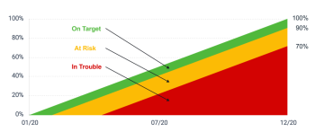

# Calculate goal progress in *`Adobe Workfront Goals`* {#calculate-goal-progress-in-adobe-workfront-goals}


Your organization must have the following to use the functionality described in this article: 


*  A *`Pro`* or higher [ *`Adobe Workfront`* plan](https://www.workfront.com/plans). 
*  An *`Adobe Workfront Goals`* license in addition to a *`Workfront`* license.


  Contact your *`Workfront`* account manager to learn about a *`Workfront Goals`* license. 


  *`Workfront Goals`* is available only in *`the new Adobe Workfront experience`*. 


For additional information about access to *`Workfront Goals`*, see [Requirements to use Adobe Workfront Goals](access-needed-for-wf-goals.md).
*`Adobe Workfront`* calculates goal progress automatically, based on the progress of its progress indicators. 


## Prerequisites {#prerequisites}

You must have the following before you can start:


*  A Layout Template that includes the Goals area in the Main&nbsp;Menu.


## Overview of goal progress and threshold  
{#overview-of-goal-progress-and-threshold}

After you activate a goal, *`Workfront Goals`* starts calculating its progress and displays the following progress indicators: 


* [Actual percent complete](#actual) 
* [Expected percent complete](#expected) 
* [Progress](#progress) 


### Actual percent complete {#actual-percent-complete}

*`Workfront Goals`* automatically calculates the actual percent complete of a goal based on the percent complete average of the goal progress indicators.&nbsp;


The following items are considered progress indicators for goals: 


*  Results


  For information about adding results to goals, see [Add results to goals in Adobe Workfront Goals](add-results-to-goals.md).

*  Activities


  For information about adding activities including projects to goals, see [Add activities to goals in Adobe Workfront Goals](add-activities-to-goals.md). 

*  Aligned children goals


  For information about parent and children goals, see [Align goals by connecting them in Adobe Workfront Goals](align-goals-by-connecting-them.md).


  *`Workfront Goals`* calculates the actual percent complete using the following formula:


  ```
  Actual percent complete of goal = SUM(Percent complete of goal progress indicators)* 100 / Number of progress indicators
  ```


  For example, if a goal has a Result that is 20% complete, a Manual Progress Bar that is 30% complete, a project that is 10% complete and a children goal that is 40% complete, the goal percent complete is 25%. 


### Expected percent complete {#expected-percent-complete}

*`Workfront Goals`* automatically calculates the expected percent complete of a goal based on the total number of days in the duration of the goal as well as on the number of days that have passed since the goal start date. 


*`Workfront Goals`* calculates the expected percent complete using the following formula:


```
Expected percent complete of goal = Number of days since the goal start date * 100/ Number of days in the goal duration
```


For example, if a goal is due to complete in 90 days, and today is the 45th day of that duration, then the Expected percent complete is 50%. 


### Progress  {#progress}

*`Workfront Goals`* calculates a progress percentage and assigns a progress label to goals, based on what&nbsp;percentage from the Expected percent complete has been achieved at the current moment in time. The color of the goal percent complete bar changes to indicate the progress of the goal. 


*`Workfront Goals`* calculates the progress percentage of a goal using the following formula:


```
Goal progress percentage = Actual percent complete * 100 / Expected percent complete
```


For example, if the Expected percent complete is 53% at the current time and the Actual percent complete is 30%, the Goal progress percent complete is 56%. *`Workfront Goals`* labels this goal with a Progress of `"In Trouble."`


The following chart illustrates the relationship between the progress labels and the progress percentage: 





The table below lists the goal progress labels and the goal progress percentages associated with each label. 


>[!TIP] {type="tip"}
>
>`Goal progress labels match *`Workfront`* project Condition name and color.` 


<table style="width: 100%;mc-table-style: url('../../Resources/TableStylesheets/Standard.css');" class="TableStyle-Standard" cellspacing="3"> 
 <col class="TableStyle-Standard-Column-Column1" style="width: 77px;"> 
 <col class="TableStyle-Standard-Column-Column1"> 
 <col class="TableStyle-Standard-Column-Column1"> 
 <col class="TableStyle-Standard-Column-Column1"> 
 <tbody> 
  <tr class="TableStyle-Standard-Body-LightGray"> 
   <td class="TableStyle-Standard-BodyE-Column1-LightGray" style="font-weight: bold;">Goal progress name</td> 
   <td class="TableStyle-Standard-BodyE-Column1-LightGray" style="font-weight: bold;">Goal progress definition</td> 
   <td class="TableStyle-Standard-BodyE-Column1-LightGray"><span class="bold">Goal progress percentage </span> </td> 
   <td class="TableStyle-Standard-BodyD-Column1-LightGray" style="font-weight: bold;">Color of percent complete bar</td> 
  </tr> 
  <tr class="TableStyle-Standard-Body-MediumGray"> 
   <td class="TableStyle-Standard-BodyE-Column1-MediumGray" style="font-weight: bold;">New</td> 
   <td class="TableStyle-Standard-BodyE-Column1-MediumGray"> <p>The goal is newly created and it is not recording progress yet. A goal progress displays as New until someone checks in on it for the first time. </p> <p>For information about checking a goal in, see <a href="check-in-goals.md" class="MCXref xref">Check in on goals in Adobe Workfront Goals</a>.</p> </td> 
   <td class="TableStyle-Standard-BodyE-Column1-MediumGray">No percentage</td> 
   <td class="TableStyle-Standard-BodyD-Column1-MediumGray">No bar</td> 
  </tr> 
  <tr class="TableStyle-Standard-Body-LightGray"> 
   <td class="TableStyle-Standard-BodyE-Column1-LightGray" style="font-weight: bold;"> <p><span>On&nbsp;Target </span> </p> </td> 
   <td class="TableStyle-Standard-BodyE-Column1-LightGray">The goal is performing as expected and there is a great likelihood that it will complete on time. </td> 
   <td class="TableStyle-Standard-BodyE-Column1-LightGray">90-100%</td> 
   <td class="TableStyle-Standard-BodyD-Column1-LightGray">Green</td> 
  </tr> 
  <tr class="TableStyle-Standard-Body-MediumGray"> 
   <td class="TableStyle-Standard-BodyE-Column1-MediumGray" style="font-weight: bold;"> <p><span>At Risk</span> </p> </td> 
   <td class="TableStyle-Standard-BodyE-Column1-MediumGray">The goal is lagging but it might still be possible to complete it on time. </td> 
   <td class="TableStyle-Standard-BodyE-Column1-MediumGray">70-89.99%</td> 
   <td class="TableStyle-Standard-BodyD-Column1-MediumGray">Yellow</td> 
  </tr> 
  <tr class="TableStyle-Standard-Body-LightGray"> 
   <td class="TableStyle-Standard-BodyB-Column1-LightGray" style="font-weight: bold;"> <p><span>In&nbsp;Trouble </span> </p> </td> 
   <td class="TableStyle-Standard-BodyB-Column1-LightGray"> <p>It is very likely that the goal will not complete on time. </p> </td> 
   <td class="TableStyle-Standard-BodyB-Column1-LightGray">0-69.99%</td> 
   <td class="TableStyle-Standard-BodyA-Column1-LightGray">Red</td> 
  </tr> 
 </tbody> 
</table>

