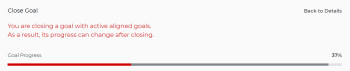

# Close and reopen goals in Adobe Workfront Goals

You can close a goal when you want to indicate the following:

* The goal is done, either because you achieved it, or because the time period elapsed.
* You are no longer working on it nor do you plan to do so in the immediate future.

## Access requirements

You must have the following:

<table cellspacing="0"> 
 <col> 
 <col> 
 <tbody> 
  <tr> 
   <td role="rowheader">Adobe Workfront plan*</td> 
   <td> 
Pro or higher
 </td> 
  </tr> 
  <tr> 
   <td role="rowheader">Adobe Workfront license*</td> 
   <td> 
Request or higher
 
For more information, see <a href="../../administration-and-setup/add-users/access-levels-and-object-permissions/wf-licenses.md" class="MCXref xref">Adobe Workfront licenses overview</a>.
 </td> 
  </tr> 
  <tr> 
   <td role="rowheader">Product</td> 
   <td> 
You must purchase an additional license for the Adobe Workfront Goals to access functionality described in this article. 
 
For information, see <a href="../../workfront-goals/goal-management/access-needed-for-wf-goals.md" class="MCXref xref">Requirements to use Adobe Workfront Goals</a>. 
 </td> 
  </tr> 
  <tr> 
   <td role="rowheader">Access level configurations*</td> 
   <td> 
Edit access to Goals or higher
 
Note:  
If you still don't have access, ask your Workfront administrator if they set additional restrictions in your access level. For information on how a Workfront administrator can change your access level, see:
 
     <ul> 
      <li> 
<a href="../../administration-and-setup/add-users/configure-and-grant-access/create-modify-access-levels.md" class="MCXref xref">Create or modify custom access levels</a> 
 </li> 
      <li> 
<a href="../../administration-and-setup/add-users/configure-and-grant-access/grant-access-goals.md" class="MCXref xref">Grant access to Adobe Workfront Goals</a> 
 </li> 
     </ul> 
 </td> 
  </tr> Object permissions Manage permissions to the goal For information about sharing goals, see Share a goal in Adobe Workfront Goals. 
 </tbody> 
</table>

&#42;To find out what plan, license type, or access you have, contact your Workfront administrator.

## Prerequisites

You must have the following before you can start:

* A Layout Template that includes the Goals area in the Main&nbsp;Menu.

## Considerations when closing goals

* `You must have access to Edit Goals in your access level before you can close and reopen goals. For information about granting access to Goals, see` ` [Grant access to Adobe Workfront Goals](../../administration-and-setup/add-users/configure-and-grant-access/grant-access-goals.md)`.
* You can close only active goals. For information about goal statuses, see [Goal status overview in Adobe Workfront Goals](../../workfront-goals/goal-management/goal-status-overview.md).

* Closing goals locks in its progress and allows you to rate how well you did in accomplishing it.

  ` `**Warning: **``When closing a goal that has active contributing goals, its progress changes after closing to indicate the progress of the contributing active goals. For information about aligning goals, see [Align goals by connecting them in Adobe Workfront Goals](../../workfront-goals/goal-alignment/align-goals-by-connecting-them.md).

* Closing a goal removes it from your Check-in page, as you will no longer be responsible for updating the progress.
* Check in on your goal to update its progress indicators before you close the goal to ensure the goal closes with an accurate progress value. If all progress indicators have been achieved then the goal percent complete should be 100% and your goal has been achieved. For information about checking in on your goals, see [Check in on goals in Adobe Workfront Goals](../../workfront-goals/goal-review-and-workfront-goals-sections/check-in-goals.md).
* Leave any final comments as an update to the goals that you close.&nbsp;For information about adding comments to goals, see [Manage goal comments in Adobe Workfront Goals](../../workfront-goals/goal-management/manage-goal-comments.md). 
* You can no longer update the progress of results and activities on a goal you close. 
* You can reopen a closed goal if you want to continue working on it. 
* If the goal has not been achieved, consider copying most of its information to the next time period (quarter or year). This is a great option for goals that are the same from one time period to the next or goals that you may still need to work on achieving in the next timeframe.&nbsp;For information about copying goals, see [Copy goals in Adobe Workfront Goals](../../workfront-goals/goal-management/copy-goals.md).

## Close goals

<ol> 
 <li value="1"> 
Click the Main&nbsp;Menu icon  > Goals in the upper-right corner of Workfront.
 
The Goal List opens. 
 </li> 
 <li value="2"> 
(Optional) Modify your filters to display only goals that are active. 
 
For information about filtering information in Workfront Goals, see <a href="../../workfront-goals/goal-management/filter-information-wf-goals.md" class="MCXref xref">Filter information in Adobe Workfront Goals</a>. 
 </li> 
 <li value="3"> 
Click an active goal.
 
The Goal Details panel displays on the right. 
 </li> 
 <li value="4">(Optional and recommended) Click the Updates tab and add an update in the Comment here field about the reason you are closing the goal, then click Post. </li> 
 <li value="5"> 
Click the More icon  to the right of the goal name, then click Close > Close Goal. 
 
This closes the goal and saves the current progress on the goal and its results and activities. 
 <note type="important"> 
   
If the goal has contributing goals that are still active, the progress of the goal continues to update based on the progress of the aligned goals.
 
   
  
 
  </note> </li> 
 <li value="6">(Optional) Modify your filters again to display only closed goals. The goals you closed display on the screen.</li> 
</ol>

## Reopen goals

You can reopen closed goals if you decided that they have become relevant again and that you need to continue updating their progress.

>[!TIP]
>
>`You can reopen closed goals from a past period.`

<ol> 
 <li value="1"> 
Click the Main&nbsp;Menu icon  > Goals in the upper-right corner of Workfront.
 
The Goal List opens. 
 </li> 
 <li value="2"> 
(Optional) Modify your filters to display only goals that are closed. 
 
For information about filtering information in Workfront Goals, see <a href="../../workfront-goals/goal-management/filter-information-wf-goals.md" class="MCXref xref">Filter information in Adobe Workfront Goals</a>. 
 
Only closed goals display in the Goal List. 
 </li> 
 <li value="3"> 
Click a closed goal.
 
This opens the Goal Details panel. 
 </li> 
 <li value="4"> 
Click the More icon  to the right of the goal name, then click Reopen>Reopen.
 
This reopens the goal in a status of Active. The progress of the goal is recalculated starting with the current date. 
 </li> 
 <li value="5">(Optional) Modify your filters again to display only active goals. The goals you opened display on the screen. </li> 
</ol>

