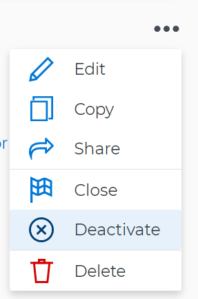

# Delete and deactivate goals in *`Adobe Workfront Goals`* {#delete-and-deactivate-goals-in-adobe-workfront-goals}

When you start working on a goal and it becomes irrelevant in your organization, we recommend deactivating it, instead of deleting it. Deactivating a goal keeps its historical information and gives you a chance to reactivate it at a later time. There are times, however, when deleting a goal might make sense, to keep your goal list accurate. 

## Access requirements {#access-requirements}

You must have the following:

<table style="width: 100%;margin-left: 0;margin-right: auto;mc-table-style: url('../../Resources/TableStyles/TableStyle-List-options-in-steps.css');" class="TableStyle-TableStyle-List-options-in-steps" cellspacing="0"> 
 <col class="TableStyle-TableStyle-List-options-in-steps-Column-Column1"> 
 <col class="TableStyle-TableStyle-List-options-in-steps-Column-Column2"> 
 <tbody> 
  <tr class="TableStyle-TableStyle-List-options-in-steps-Body-LightGray"> 
   <td class="TableStyle-TableStyle-List-options-in-steps-BodyE-Column1-LightGray" role="rowheader">Adobe Workfront plan*</td> 
   <td class="TableStyle-TableStyle-List-options-in-steps-BodyD-Column2-LightGray"> 
Pro or higher
 </td> 
  </tr> 
  <tr class="TableStyle-TableStyle-List-options-in-steps-Body-MediumGray"> 
   <td class="TableStyle-TableStyle-List-options-in-steps-BodyE-Column1-MediumGray" role="rowheader">Adobe Workfront license*</td> 
   <td class="TableStyle-TableStyle-List-options-in-steps-BodyD-Column2-MediumGray"> 
Request or higher
 
For more information, see <a href="wf-licenses.md" class="MCXref xref">Adobe Workfront licenses overview</a>.
 </td> 
  </tr> 
  <tr class="TableStyle-TableStyle-List-options-in-steps-Body-LightGray"> 
   <td class="TableStyle-TableStyle-List-options-in-steps-BodyE-Column1-LightGray" role="rowheader">Product</td> 
   <td class="TableStyle-TableStyle-List-options-in-steps-BodyD-Column2-LightGray"> 
You must purchase an additional license for the Adobe Workfront Goals to access functionality described in this article. 
 
For information, see <a href="access-needed-for-wf-goals.md" class="MCXref xref">Requirements to use Adobe Workfront Goals</a>. 
 </td> 
  </tr> 
  <tr class="TableStyle-TableStyle-List-options-in-steps-Body-MediumGray"> 
   <td class="TableStyle-TableStyle-List-options-in-steps-BodyE-Column1-MediumGray" role="rowheader">Access level configurations*</td> 
   <td class="TableStyle-TableStyle-List-options-in-steps-BodyD-Column2-MediumGray"> 
Edit access to Goals or higher
 
Note:  
If you still don't have access, ask your Workfront administrator if they set additional restrictions in your access level. For information on how a Workfront administrator can change your access level, see:
 
     <ul> 
      <li> 
<a href="create-modify-access-levels.md" class="MCXref xref">Create or modify custom access levels</a> 
 </li> 
      <li> 
<a href="grant-access-goals.md" class="MCXref xref">Grant access to Adobe Workfront Goals</a> 
 </li> 
     </ul> 
 </td> 
  </tr> 
  <tr class="TableStyle-TableStyle-List-options-in-steps-Body-LightGray" data-mc-conditions=""> 
   <td class="TableStyle-TableStyle-List-options-in-steps-BodyB-Column1-LightGray" role="rowheader">Object permissions</td> 
   <td class="TableStyle-TableStyle-List-options-in-steps-BodyA-Column2-LightGray"> 
    
 
     
Manage permissions to the goal
 
     
For information about sharing goals, see <a href="share-a-goal.md" class="MCXref xref">Share a goal in Adobe Workfront Goals</a>. 
 
    
 </td> 
  </tr> 
 </tbody> 
</table>

&#42;To find out what plan, license type, or access you have, contact your *`Workfront administrator`*.

## Prerequisites {#prerequisites}

You must have the following before you can start:

*  A Layout Template that includes the Goals area in the Main&nbsp;Menu.

## Deactivate goals {#deactivate-goals}

You can deactivate a goal that is no longer relevant and that you might want to reactivate in the future. 

* [Considerations when deactivating goals](#consider) 
* [Deactivate goals](#h3-deactivate-goals) 

### Considerations when deactivating goals {#considerations-when-deactivating-goals}

Remember the following when deactivating goals: 

*  You can only deactivate goals in an Active status. For information about activating a goal, see [Activate goals in Adobe Workfront Goals](activate-goals.md).

  >[!TIP] {type="tip"}
  >
  >You cannot deactivate goals in a Draft status. 

* *`Workfront`* stops calculating the progress of deactivated goals. 
* Inactive goals no longer display on or are taken into account in the following areas of *`Workfront Goals`*:
    
    
    * The *`Check-in`* section. For information about the Check-in page, see [Check in on goals in Adobe Workfront Goals](check-in-goals.md). 
    
    * The Graphs section. For information about *`Workfront Goals`* graphs, see [Review graphs to understand goal progress trends in Adobe Workfront Goals](review-goal-graphs.md).
    
    
    

* You can no longer make updates on deactivated goals. 
* You can edit information about the goal and its alignment. 
* You can reactivate a previously deactivated goal. 

### Deactivate goals {#deactivate-goals-1}

1.  Go to the goal that you want to deactivate. 

   For example, go to the *`Goal List`* and click the name of a goal. 

   The Goal Details panel opens on the right. 

   >[!TIP] {type="tip"}
   >
   >You can open goals from any sections of *`Workfront Goals`*.

1.  Click the ` `More icon`  ,`then click `Deactivate`. 

   

   The goal status changes to Inactive. 

1. Click the `X` icon in the upper-right to close Goal Details. 

## Delete goals {#delete-goals}

You can delete goals that are no longer or might never be relevant. 

* [Considerations when deleting goals](#consider2) 
* [Delete goals](#h3-delete-goals) 

### Considerations when deleting goals {#considerations-when-deleting-goals}

*  You can delete goals in any status, including closed goals. 
* You cannot recover deleted goals. 
* Results and *`Manual progress bar`* activities attached to the goal are also deleted. 
* Projects associated with goals are not deleted, but their association with the goal is removed. 

### Delete goals  {#delete-goals-1}

1.  Go to the goal that you want to delete. 

   For example, go to the *`Goal List`* and click a goal. 

   The Goal Details panel opens on the right. 

1.  Click the ` `More icon` ,`then click `Delete`. 

   

1.  Click `Yes, delete`.

   The goal is removed from the *`Goal List`* and cannot be recovered. 

