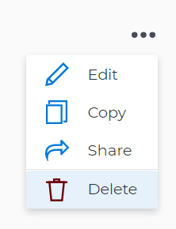

# Delete and deactivate goals in *Adobe Workfront Goals*

When you start working on a goal and it becomes irrelevant in your organization, we recommend deactivating it, instead of deleting it. Deactivating a goal keeps its historical information and gives you a chance to reactivate it at a later time. There are times, however, when deleting a goal might make sense, to keep your goal list accurate.

## Access requirements

You must have the following:

<table cellspacing="0"> 
 <col> 
 <col> 
 <tbody> 
  <tr> 
   <td role="rowheader"><em>Adobe Workfront</em> plan*</td> 
   <td> 
<em>Pro</em> or higher
 </td> 
  </tr> 
  <tr> 
   <td role="rowheader"><em>Adobe Workfront</em> license*</td> 
   <td> 
<em>Request</em> or higher
 
For more information, see <a href="../../administration-and-setup/add-users/access-levels-and-object-permissions/wf-licenses.md" class="MCXref xref">Adobe Workfront licenses overview</a>.
 </td> 
  </tr> 
  <tr> 
   <td role="rowheader">Product</td> 
   <td> 
You must purchase an additional license for the <em>Adobe Workfront Goals</em> to access functionality described in this article. 
 
For information, see <a href="../../workfront-goals/goal-management/access-needed-for-wf-goals.md" class="MCXref xref">Requirements to use Adobe Workfront Goals</a>. 
 </td> 
  </tr> 
  <tr> 
   <td role="rowheader">Access level configurations*</td> 
   <td> 
Edit access to Goals or higher
 
Note:  
If you still don't have access, ask your <em>Workfront administrator</em> if they set additional restrictions in your access level. For information on how a <em>Workfront administrator</em> can change your access level, see:
 
     <ul> 
      <li> 
<a href="../../administration-and-setup/add-users/configure-and-grant-access/create-modify-access-levels.md" class="MCXref xref">Create or modify custom access levels</a> 
 </li> 
      <li> 
<a href="../../administration-and-setup/add-users/configure-and-grant-access/grant-access-goals.md" class="MCXref xref">Grant access to Adobe Workfront Goals</a> 
 </li> 
     </ul> 
 </td> 
  </tr> <draft-comment>
   <tr data-mc-conditions=""> 
    <td role="rowheader">Object permissions</td> 
    <td> 
     
 
      
Manage permissions to the goal
 
      
For information about sharing goals, see <a href="../../workfront-goals/workfront-goals-settings/share-a-goal.md" class="MCXref xref">Share a goal in Adobe Workfront Goals</a>. 
 
     
 </td> 
   </tr>
  </draft-comment>
  <tr data-mc-conditions=""> 
   <td role="rowheader">Object permissions</td> 
   <td> 
    
 
     
Manage permissions to the goal
 
     
For information about sharing goals, see <a href="../../workfront-goals/workfront-goals-settings/share-a-goal.md" class="MCXref xref">Share a goal in Adobe Workfront Goals</a>. 
 
    
 </td> 
  </tr> 
 </tbody> 
</table>

&#42;To find out what plan, license type, or access you have, contact your *Workfront administrator*.

## Prerequisites

You must have the following before you can start:

* A Layout Template that includes the Goals area in the Main&nbsp;Menu.

## Deactivate goals

You can deactivate a goal that is no longer relevant and that you might want to reactivate in the future.

* [Considerations when deactivating goals](#consider) 
* [Deactivate goals](#h3-deactivate-goals)

### Considerations when deactivating goals

Remember the following when deactivating goals:

<ul> 
 <li> 
You can only deactivate goals in an Active status. For information about activating a goal, see <a href="../../workfront-goals/goal-management/activate-goals.md" class="MCXref xref">Activate goals in Adobe Workfront Goals</a>.
 <note type="tip">
   You cannot deactivate goals in a Draft status. 
  </note> </li> 
 <li><em>Workfront</em> stops calculating the progress of deactivated goals. </li> 
 <li>Inactive goals no longer display on or are taken into account in the following areas of <em>Workfront Goals</em>:
  <ul>
   <li>The <em>Check-in</em> section. For information about the Check-in page, see <a href="../../workfront-goals/goal-review-and-workfront-goals-sections/check-in-goals.md" class="MCXref xref">Check in on goals in Adobe Workfront Goals</a>. </li>
   <li>The Graphs section. For information about <em>Workfront Goals</em> graphs, see <a href="../../workfront-goals/goal-review-and-workfront-goals-sections/review-goal-graphs.md" class="MCXref xref">Review graphs to understand goal progress trends in Adobe Workfront Goals</a>.</li>
  </ul></li> 
 <li>You can no longer make updates on deactivated goals. </li> 
 <li>You can edit information about the goal and its alignment. </li> 
 <li>You can reactivate a previously deactivated goal. </li> 
</ul>

### Deactivate goals

<ol> 
 <li value="1"> 
Go to the goal that you want to deactivate. 
 
For example, go to the <em>Goal List</em> and click the name of a goal. 
 
The Goal Details panel opens on the right. 
 <note type="tip">
   You can open goals from any sections of 
   <em>Workfront Goals</em>.
  </note> </li> 
 <li value="2"> 
Click the More icon  , then click Deactivate. 
 
  
 
The goal status changes to Inactive. 
 </li> 
 <li value="3">Click the X icon in the upper-right to close Goal Details. </li> 
</ol>

## Delete goals

You can delete goals that are no longer or might never be relevant.

* [Considerations when deleting goals](#consider2) 
* [Delete goals](#h3-delete-goals)

### Considerations when deleting goals

* You can delete goals in any status, including closed goals. 
* You cannot recover deleted goals. 
* Results and *Manual progress bar* activities attached to the goal are also deleted. 
* Projects associated with goals are not deleted, but their association with the goal is removed.

### Delete goals

<ol> 
 <li value="1"> 
Go to the goal that you want to delete. 
 
For example, go to the <em>Goal List</em> and click a goal. 
 
The Goal Details panel opens on the right. 
 </li> 
 <li value="2"> 
Click the More icon , then click Delete. 
 
  
 </li> 
 <li value="3"> 
Click Yes, delete.
 
The goal is removed from the <em>Goal List</em> and cannot be recovered. 
 </li> 
</ol>

