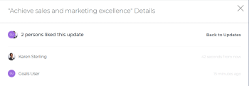
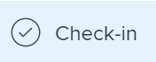

# Manage goal comments in Adobe Workfront Goals

You can add comments to all goals you can view in&nbsp;Adobe Workfront Goals.

## Access requirements

You must have the following access to perform the actions described in this article:

<table cellspacing="0"> 
 <col> 
 <col> 
 <tbody> 
  <tr> 
   <td role="rowheader">Adobe Workfront plan*</td> 
   <td> 
Pro or higher
 </td> 
  </tr> 
  <tr> 
   <td role="rowheader">Adobe Workfront license*</td> 
   <td> 
Request or higher
 
For more information, see <a href="../../administration-and-setup/add-users/access-levels-and-object-permissions/wf-licenses.md" class="MCXref xref">Adobe Workfront licenses overview</a>.
 </td> 
  </tr> 
  <tr> 
   <td role="rowheader">Product</td> 
   <td> 
You must purchase an additional license for the Adobe Workfront Goals to access functionality described in this article. 
 
For information, see <a href="../../workfront-goals/goal-management/access-needed-for-wf-goals.md" class="MCXref xref">Requirements to use Adobe Workfront Goals</a>. 
 </td> 
  </tr> 
  <tr> 
   <td role="rowheader">Access level*</td> 
   <td> 
View or higher access to&nbsp;Goals
 
Note:  
If you still don't have access, ask your Workfront administrator if they set additional restrictions in your access level. For information on how a Workfront administrator can change your access level, see:
 
     <ul> 
      <li> 
<a href="../../administration-and-setup/add-users/configure-and-grant-access/create-modify-access-levels.md" class="MCXref xref">Create or modify custom access levels</a> 
 </li> 
      <li> 
<a href="../../administration-and-setup/add-users/configure-and-grant-access/grant-access-goals.md" class="MCXref xref">Grant access to Adobe Workfront Goals</a> 
 </li> 
     </ul> 
 </td> 
  </tr> Object permissions View or higher permissions on goals For information about sharing goals, see Share a goal in Adobe Workfront Goals. 
 </tbody> 
</table>

&#42;To find out what plan, license type, or access you have, contact your Workfront administrator.

## Prerequisites

You must have the following before you can start:

* A Layout Template that includes the Goals area in the Main&nbsp;Menu.

## Locate the Comments area

You can add comments to goals in the following areas of Workfront Goals:

* The Goal Details panel
* The Check-in section 
* The Pulse section

Although the process for adding comments to goals is similar in these areas, there are differences in being able to edit, delete, or react to a comment when using one area versus another. When you enter a comment in any of these areas, the comment is visible in all areas where goal comments display.

>[!NOTE]
>
>You cannot add comments to results and activities.

## Add comments to goals in the Goal Details panel

You can add comments to goals in the Goal&nbsp;Details panel, as part of updating an individual goal.

You can edit or delete a comment that you entered in this area, or you can like comments.

<ol> 
 <li value="1"> 
 
Click the Main Menu icon   in the upper-right corner of your screen, then click Goals.
 
This opens the Workfront Goals area. 
 
 </li> 
 <li value="2">Locate the goal you want to add comments to, then click its name to open the Goal&nbsp;Details panel to the right. </li> 
 <li value="3">Click the Updates tab.</li> 
 <li value="4"> 
Type your comment in the Comment here field, then click Post. 
 </li> 
 <li value="5"> 
(Optional and conditional) Select the Comments option at the top of the list to view your comment at the top of the list. It is enabled by default and comments display here with the most recent comment first. 
 </li> 
 <li value="6"> 
(Optional) Click&nbsp;Edit to edit your comment, then click&nbsp;Save to save your changes, or Cancel to revert to the original update. 
 
  
Tip: </b>">
   <b>Tip: </b> 
   <ul> 
    <li>You can only edit comments you entered. </li> 
    <li>There is no time limit for how long after you enter a comment you are allowed to edit it.</li> 
   </ul> 
  
 </li> 
 <li value="7"> 
(Optional)&nbsp;Click&nbsp;Delete to delete your comment, then click&nbsp;Yes, Delete to confirm. 
 
  
Tip: </b>">
   <b>Tip: </b> 
   <ul> 
    <li>You can only delete comments you entered. </li> 
    <li>There is no time limit for how long after you enter a comment you are allowed to delete it.</li> 
   </ul> 
  
 </li> 
 <li value="8">(Optional) Click the Like icon  to like a comment that someone else added. The icon updates with the number of likes. </li> 
 <li value="9"> 
(Optional)&nbsp;Click the number of likes next to a comment and a list with the names of the users who liked the comment displays in the right panel. 
 
  
 </li> 
 <li value="10">(Conditional)&nbsp;Click Back to Updates to return to the Updates tab of the Goal Details panel, or click the X icon in the upper-right corner to close the right panel. </li> 
</ol>

## Add comments to goals in the Check-in section

>[!TIP]
>
>You must have access to Edit Goals in your access level to view the Check-in section.

You can add comments to goals in the Check-in section of Workfront Goals, as part of updating your list of goals. For information about updating goals by checking in on them, see [Check in on goals in Adobe Workfront Goals](../../workfront-goals/goal-review-and-workfront-goals-sections/check-in-goals.md).

You can also like goal comments that other users have added to mark your approval of them in the Check-in section.

<ol> 
 <li value="1"> 
 
Click the Main Menu icon   in the upper-right corner of your screen, then click Goals.
 
This opens the Workfront Goals area. 
 
 </li> 
 <li value="2"> 
Click the Check-in section in the left panel. 
 
  
 
Goals assigned to you or that have results and activities that are assigned to you display in this area. 
 </li> 
 <li value="3">(Optional) Click the right-pointing arrow to the left of the goal name to expand the goal, if the goal is not already expanded. </li> 
 <li value="4"> 
Type your comment in the Add a comment to this goal (optional) field, then click&nbsp;Post. 
 
Two most recent comments display by default under each goal.
 </li> 
 <li value="5"> 
Click Show all comments to display all comments on a goal. A number of total comments for the goal also displays. Comments display in the order they were entered, with the most recent first. 
 </li> 
 <li value="6">(Optional) Click the Like icon  to like a comment. The icon updates with the number of likes. </li> 
 <li value="7"> 
(Optional)&nbsp;Click the number of likes next to a comment and a list with the names of the users who liked the comment displays in the right panel. 
 
  
 </li> 
 <li value="8">(Conditional)&nbsp;Click Back to Updates to return to the Updates tab of the Goal Details panel, or click the X icon in the upper-right corner to close the right panel. </li> 
</ol>

## Add comments to goals in the Pulse section

You can add comments to goals in the Pulse section of Workfront Goals, as part of reviewing goals that might affect yours. For information about reviewing goals in the Pulse section, see [Review goals in the Adobe Workfront Goals Pulse section](../../workfront-goals/goal-review-and-workfront-goals-sections/review-goals-in-pulse.md).

You can also like goal comments that other users have added to mark your approval of them in the Pulse section.

<ol> 
 <li value="1"> 
 
Click the Main Menu icon   in the upper-right corner of your screen, then click Goals.
 
This opens the Workfront Goals area. 
 
 </li> 
 <li value="2"> 
Click the Pulse section in the left panel. 
 
  
 
All current goals display in this section., regardless of their status.
 </li> 
 <li value="3"> 
Click&nbsp;Add a comment, then type your comment in the Add a comment to this goal (optional) field.
 </li> 
 <li value="4"> 
Click&nbsp;Post. 
 
Three comments display by default under each goal.
 </li> 
 <li value="5">Click Show all updates to display all comments on a goal. A number of total comments for the goal also displays. Comments display in the order they were entered, with the most recent first. </li> 
 <li value="6">(Optional) Click the Like icon  to like a comment. The icon updates with the number of likes. </li> 
 <li value="7"> 
(Optional)&nbsp;Click the number of likes next to a comment and a list with the names of the users who liked the comment displays in the right panel. 
 
  
 </li> 
 <li value="8">(Conditional)&nbsp;Click Back to Updates to return to the Updates tab of the Goal Details panel, or click the X icon in the upper-right corner to close the right panel. </li> 
</ol>

