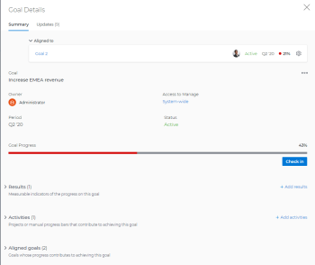
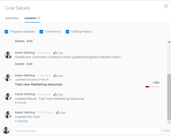
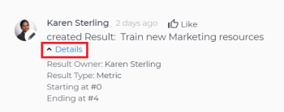

# Update goals in the Goal Details panel in&nbsp;*Adobe Workfront Goals*

You can update information for individual goals by accessing the Goal Details panel.

## Access requirements

You must have the following:

<table cellspacing="0"> 
 <col> 
 <col> 
 <tbody> 
  <tr> 
   <td role="rowheader"><em>Adobe Workfront</em> plan*</td> 
   <td> 
<em>Pro</em> or higher
 </td> 
  </tr> 
  <tr> 
   <td role="rowheader"><em>Adobe Workfront</em> license*</td> 
   <td> 
<em>Request</em> or higher
 
For more information, see <a href="../../administration-and-setup/add-users/access-levels-and-object-permissions/wf-licenses.md" class="MCXref xref">Adobe Workfront licenses overview</a>.
 </td> 
  </tr> 
  <tr> 
   <td role="rowheader">Product</td> 
   <td> 
You must purchase an additional license for the <em>Adobe Workfront Goals</em> to access functionality described in this article. 
 
For information, see <a href="../../workfront-goals/goal-management/access-needed-for-wf-goals.md" class="MCXref xref">Requirements to use Adobe Workfront Goals</a>. 
 </td> 
  </tr> 
  <tr> 
   <td role="rowheader">Access level configurations*</td> 
   <td> 
Edit access to Goals or higher
 
Note:   
If you still don't have access, ask your <em>Workfront administrator</em> if they set additional restrictions in your access level. For information on how a <em>Workfront administrator</em> can change your access level, see:
 
     <ul> 
      <li> 
<a href="../../administration-and-setup/add-users/configure-and-grant-access/create-modify-access-levels.md" class="MCXref xref">Create or modify custom access levels</a> 
 </li> 
      <li> 
<a href="../../administration-and-setup/add-users/configure-and-grant-access/grant-access-goals.md" class="MCXref xref">Grant access to Adobe Workfront Goals</a> 
 </li> 
     </ul> 
 </td> 
  </tr> <draft-comment>
   <tr data-mc-conditions=""> 
    <td role="rowheader">Object permissions</td> 
    <td> 
     
 
      
Manage permissions to the goal
 
      
For information about sharing goals, see <a href="../../workfront-goals/workfront-goals-settings/share-a-goal.md" class="MCXref xref">Share a goal in Adobe Workfront Goals</a>. 
 
     
 </td> 
   </tr>
  </draft-comment>
  <tr data-mc-conditions=""> 
   <td role="rowheader">Object permissions</td> 
   <td> 
    
 
     
Manage permissions to the goal
 
     
For information about sharing goals, see <a href="../../workfront-goals/workfront-goals-settings/share-a-goal.md" class="MCXref xref">Share a goal in Adobe Workfront Goals</a>. 
 
    
 </td> 
  </tr> 
 </tbody> 
</table>

&#42;To find out what plan, license type, or access you have, contact your *Workfront administrator*.

## Prerequisites

You must have the following before you can start:

* A Layout Template that includes the Goals area in the Main&nbsp;Menu.

## Update goals in the Goal&nbsp;Details panel

You can access an individual goal which opens the Goal Details panel of the goal from the following sections of *Workfront Goals*:

* *Goal List* 
* *Goal Alignment* 
* *Pulse* 
* *Check-in*

<ol> 
 <li value="1"> 
 
Click the Main Menu icon   in the upper-right corner of your screen, then click Goals.
 
This opens the <em>Workfront Goals</em> area. 
 
 </li> 
 <li value="2"> 
Click <em>Goal List</em>, <em>Goal Alignment</em>, <em>Pulse</em>, or <em>Check-in</em> in the left panel, then click the name of a goal. 
 
This opens the Goal&nbsp;Details panel on the right. 
 
  
 </li> 
 <li value="3">On the Summary tab, click the More icon, then click&nbsp;any of the following options: 
  <ol> 
   <li value="1">
Edit. For information about editing goals, see <a href="../../workfront-goals/goal-management/edit-goals.md" class="MCXref xref">Edit goals in Adobe Workfront Goals</a>.
</li> 
   <li value="2">
Copy. For information about copying goals, see <a href="../../workfront-goals/goal-management/copy-goals.md" class="MCXref xref">Copy goals in Adobe Workfront Goals</a>.
</li> 
   <li value="3">
Activate.&nbsp;This option is available only for drafted and inactive goals. 

For information about activating goals, see <a href="../../workfront-goals/goal-management/access-goals-in-wf-goals.md" class="MCXref xref">Access and open goals in Adobe Workfront Goals </a>. 
</li> 
   <li value="4">
Close, then click Close Goal.&nbsp;This option is available only for active goals. 

For information about closing goals, see <a href="../../workfront-goals/goal-management/close-and-reopen-goals.md" class="MCXref xref">Close and reopen goals in Adobe Workfront Goals</a>. 
</li> 
   <li value="5">
Deactivate. This option is available only for active goals. This deactivates the goal immediately. 

For information about deactivating goals, see <a href="../../workfront-goals/goal-management/delete-and-deactivate-goals.md" class="MCXref xref">Delete and deactivate goals in Adobe Workfront Goals</a>.
</li> 
   <li value="6">
Delete, then click Yes, Delete. 

For information about deleting goals, see <a href="../../workfront-goals/goal-management/delete-and-deactivate-goals.md" class="MCXref xref">Delete and deactivate goals in Adobe Workfront Goals</a>.
<note type="note">
     Deleted goals cannot be recovered.
    </note></li> 
   <li value="7">
Reopen,&nbsp;then click&nbsp;Reopen. This option is available only for closed goals that are from a current time period. 

For information about reopening goals, see <a href="../../workfront-goals/goal-management/close-and-reopen-goals.md" class="MCXref xref">Close and reopen goals in Adobe Workfront Goals</a>. 
</li> 
   <li value="8">
 (Conditional) If you clicked any of the options between steps a-i above except Delete or Reopen, click Save. 
</li> 
  </ol></li> 
 <li value="4"> 
Click&nbsp;Align to another goal in the upper-right of the Summary tab, then specify the name of a goal in the Align to another goal field that you want to align the current goal to. The current goal becomes the child of the goal you align it to. For information about child and parent goals, see <a href="../../workfront-goals/goal-alignment/align-goals-by-connecting-them.md" class="MCXref xref">Align goals by connecting them in Adobe Workfront Goals</a>. 
 </li> 
 <li value="5">Click&nbsp;Add results. Results drive the progress of your goal. For information about adding results, see <a href="../../workfront-goals/results-and-activities/add-results-to-goals.md" class="MCXref xref">Add results to goals in Adobe Workfront Goals</a>.</li> 
 <li value="6">Click Add activities. Activities drive the progress of your goal. For information about adding activities, see <a href="../../workfront-goals/results-and-activities/add-activities-to-goals.md" class="MCXref xref">Add activities to goals in&nbsp;Adobe Workfront Goals</a>. </li> 
 <li value="7"> 
Click the Updates tab. Here, you can view goal comments and review the entire editing history of the goal, activities, and results, to understand who changed what and when. 
 
  
 </li> 
 <li value="8"> 
(Optional) Deselect any of the following options if you want to not display them in the Updates tab.&nbsp;They are selected by default: 
 
  <table cellspacing="0"> 
   <col> 
   <col> 
   <tbody> 
    <tr> 
     <td role="rowheader">Progress Updates</td> 
     <td>Displays information about the history of progress updates on results and activities. </td> 
    </tr> 
    <tr> 
     <td role="rowheader">Comments</td> 
     <td>Displays comments made by users on the goal. </td> 
    </tr> 
    <tr> 
     <td role="rowheader">Editing History</td> 
     <td>Displays information about creating and updating the goal, results, and activities. </td> 
    </tr> 
   </tbody> 
  </table> </li> 
 <li value="9"> 
(Optional)&nbsp;Click Details under a progress or an editing history update to display additional information about the update. 
 
  
 </li> 
</ol>

