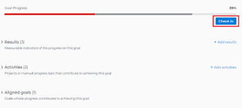
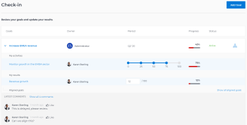

# Check in on goals in *Adobe Workfront Goals*

You must review your goals periodically and update their progress to ensure that they are not falling behind or become in danger of not being achieved. You update the progress of your goals by providing a check-in for them.

## Access requirements

You must have the following:

<table cellspacing="0"> 
 <col> 
 <col> 
 <tbody> 
  <tr> 
   <td role="rowheader"><em>Adobe Workfront</em> plan*</td> 
   <td> 
<em>Pro</em> or higher
 </td> 
  </tr> 
  <tr> 
   <td role="rowheader"><em>Adobe Workfront</em> license*</td> 
   <td> 
<em>Request</em> or higher
 
For more information, see <a href="../../administration-and-setup/add-users/access-levels-and-object-permissions/wf-licenses.md" class="MCXref xref">Adobe Workfront licenses overview</a>.
 </td> 
  </tr> 
  <tr> 
   <td role="rowheader">Product</td> 
   <td> 
You must purchase an additional license for the <em>Adobe Workfront Goals</em> to access functionality described in this article. 
 
For information, see <a href="../../workfront-goals/goal-management/access-needed-for-wf-goals.md" class="MCXref xref">Requirements to use Adobe Workfront Goals</a>. 
 </td> 
  </tr> 
  <tr> 
   <td role="rowheader">Access level configurations*</td> 
   <td> 
Edit access to Goals or higher
 
Note:  
If you still don't have access, ask your <em>Workfront administrator</em> if they set additional restrictions in your access level. For information on how a <em>Workfront administrator</em> can change your access level, see:
 
     <ul> 
      <li> 
<a href="../../administration-and-setup/add-users/configure-and-grant-access/create-modify-access-levels.md" class="MCXref xref">Create or modify custom access levels</a> 
 </li> 
      <li> 
<a href="../../administration-and-setup/add-users/configure-and-grant-access/grant-access-goals.md" class="MCXref xref">Grant access to Adobe Workfront Goals</a> 
 </li> 
     </ul> 
 </td> 
  </tr> <draft-comment>
   <tr data-mc-conditions=""> 
    <td role="rowheader">Object permissions</td> 
    <td> 
     
 
      
Manage permissions to the goal
 
      
For information about sharing goals, see <a href="../../workfront-goals/workfront-goals-settings/share-a-goal.md" class="MCXref xref">Share a goal in Adobe Workfront Goals</a>. 
 
     
 </td> 
   </tr>
  </draft-comment>
  <tr data-mc-conditions=""> 
   <td role="rowheader">Object permissions</td> 
   <td> 
    
 
     
Manage permissions to the goal
 
     
For information about sharing goals, see <a href="../../workfront-goals/workfront-goals-settings/share-a-goal.md" class="MCXref xref">Share a goal in Adobe Workfront Goals</a>. 
 
    
 </td> 
  </tr> 
 </tbody> 
</table>

&#42;To find out what plan, license type, or access you have, contact your *Workfront administrator*.

## Prerequisites

You must have the following before you can start:

* A Layout Template that includes the Goals area in the Main&nbsp;Menu.

## Considerations for checking in on goals

Consider the following when checking in on your goals:

<ul> 
 <li> 
<em>Workfront Goals</em> automatically calculates the progress of a goal when you manually update the progress of the results and activities of the goal. 
 <note type="tip">
   You cannot update progress directly on a goal. You must update the progress of activities and results which in turn update the progress of the goal. 
  </note> 
See also the following articles:&nbsp;
 
  <ul> 
   <li>For information about adding activities to goals, see <a href="../../workfront-goals/results-and-activities/add-activities-to-goals.md" class="MCXref xref">Add activities to goals in&nbsp;Adobe Workfront Goals</a>.</li> 
   <li>For information about adding results to goals, see <a href="../../workfront-goals/results-and-activities/add-results-to-goals.md" class="MCXref xref">Add results to goals in Adobe Workfront Goals</a>. </li> 
   <li>For information about how <em>Workfront Goals</em> calculates the progress on a goal, see <a href="../../workfront-goals/goal-management/calculate-goal-progress.md" class="MCXref xref">Calculate goal progress in Adobe Workfront Goals</a>. </li> 
  </ul> </li> 
 <li> 
You must create goals and activate them before you can check in on them.
 
See also the following articles:&nbsp;
 
  <ul> 
   <li>For information about creating goals, see <a href="../../workfront-goals/goal-management/create-goals.md" class="MCXref xref">Create goals in Adobe Workfront Goals</a>.</li> 
   <li> 
For information about activating goals, see the <a href="../../workfront-goals/goal-management/activate-goals.md" class="MCXref xref">Activate goals in Adobe Workfront Goals</a>.
 </li> 
  </ul> <note type="important">
   You cannot check in on goals that are drafted, closed, or inactive. 
  </note> </li> 
 <li>The first time you or someone else updates the progress of a result or activity on a goal, the goal Progress changes from&nbsp;New and <em>Workfront Goals</em> starts recording progress and progress status updates on the goal. </li> 
</ul>

## Check in on goals

You can check in on goals at the individual goal level, or you can check in on multiple goals from the *Check-in* section of *Workfront Goals*.

* [Check in on individual goals](#check) 
* [Check in on goals in the Check-in section](#update)

### Check in on individual goals

When you check in on a goal at the goal level, you can update the progress of the results and activities that are assigned to you or other users.

For information about how to update additional information about results and activities, see [Edit results and activities in Adobe Workfront Goals](../../workfront-goals/results-and-activities/edit-results-and-activities.md).

<ol> 
 <li value="1"> 
Click the Main&nbsp;Menu icon  > Goals in the upper-right corner of <em>Workfront</em>.
 
This opens the <em>Workfront Goals</em> area.
 
All goals display by default. 
 </li> 
 <li value="2"> 
(Optional)&nbsp;Click any of the following sections in the left panel to access a list of goals:
 
  <ul> 
   <li><em>Goal Alignment</em> </li> 
   <li><em>Pulse</em> </li> 
   <li> 
<em>Check-in</em> 
 </li> 
  </ul> 
Or
 
From the <em>Goal List</em>, click the name of a goal to open the Goal Details panel on the right. 
 <note type="tip">
   You must have Edit access to Goals in your Access Level to view the&nbsp;Check-in section or the Check in button. 
  </note> </li> 
 <li value="3"> 
Click Check in.
 
  
 
The progress of results and activities becomes editable.
 </li> 
 <li value="4">Update the current progress on each of the results. Depending on what type of result you selected, you can do one of the following:
  <ul style="list-style-type: circle;">
   <li>Update the quantity </li>
   <li>Update the currency amount</li>
   <li>Update the percent complete</li>
  </ul></li> 
 <li value="5"> 
Update the percent complete on the <em>Manual progress bar</em> activity. 
 <note type="tip">
   When you add projects as activities to your goals, you cannot manually update projects at the goal level. 
   <em>Workfront</em> automatically updates project progress based on the project of their tasks. When the project percent complete updates in&nbsp;
   <em>Workfront</em>, the goal progress associated with the project also updates automatically.
  </note> </li> 
 <li value="6"> 
Click Back to Summary to return to the Goal Details panel. 
 
Your goal progress updates as you update the results and activities of your goal. 
 </li> 
 <li value="7">Click the X&nbsp;icon in the upper-right corner of the Goal Details panel to close it. </li> 
</ol>

### Check in on goals in the *Check-in* section

You can use the *Check-in* section to check in on goals when you want to quickly provide updates for several goals at the same time. 

` `**Tip: **`` You can access the&nbsp;*Check-in* section from any of the following sections:

* *Goal List* 
* *Goal Alignment* 
* *Pulse*

When you check in on a goal in the *Check-in* section, you can update the progress of the results and activities that are assigned only to you. You cannot update the progress of results and activities that are assigned to other users in this section.

<ol> 
 <li value="1"> 
Click the Main&nbsp;Menu icon  > Goals in the upper-right corner of <em>Workfront</em>.
 
This opens the <em>Workfront Goals</em> area.
 
The <em>Goal List</em> section displays by default. 
 </li> 
 <li value="2"> 
Click <em>Check-in</em> in the left panel.
 
Or
 
(Conditional)&nbsp;If you are in the <em>Goal List</em>, <em>Goal Alignment</em>, or <em>Pulse</em> sections, click the Check in button in the upper-right of the screen. This opens the <em>Check-in</em> section. 
 
  
 
Goals display in a list and results and activities are listed under each goal. 
 
  
 </li> 
 <li value="3"> 
(Optional) Click Show all results,&nbsp;Show all&nbsp;activities, or Show all&nbsp;aligned goals to the far right of the goal name to display all results, activities, and aligned goals of a goal whose progress you want to update. 
 
Warning: </b>"><b>Warning: </b>You cannot directly update aligned goals, but you can update their results and activities. 
 </li> 
 <li value="4"> Update the current progress on each of the results assigned to you. Depending on what type of result you selected, you can do one of the following:
  <ul style="list-style-type: circle;">
   <li>Update the quantity </li>
   <li>Update the currency amount</li>
   <li>
Update the percent complete 
</li>
  </ul>
The result and the goal progress updated automatically and you receive a confirmation of your changes.
</li> 
 <li value="5"> 
 Update the percent complete on your <em>Manual progress bar</em> activity. 
 <note type="tip">
   When you add projects as activities to your goals, you cannot manually update projects at the goal level. 
   <em>Workfront</em> automatically updates project progress based on the project of their tasks. When the project percent complete updates in&nbsp;
   <em>Workfront</em>, the goal progress associated with the project also updates automatically.
  </note> 
The activity and the goal progress updated automatically and you receive a confirmation of your changes.
 </li> 
 <li value="6">(Optional) Add a comment for your goal, then click Post to save your comment. </li> 
</ol>

