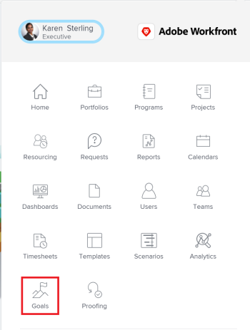
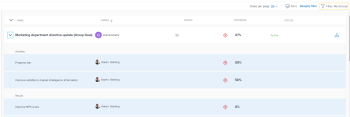

# Manage goals in the Goal List of Adobe Workfront Goals

After you or other users create goals, you can review their progress and information in the Goal List. For information about creating goals, see [Create goals in Adobe Workfront Goals](../../workfront-goals/goal-management/create-goals.md).

## Access requirements

You must have the following access to perform the actions described in this article:

<table cellspacing="0"> 
 <col> 
 <col> 
 <tbody> 
  <tr> 
   <td role="rowheader">Adobe Workfront plan*</td> 
   <td> 
Pro or higher
 </td> 
  </tr> 
  <tr> 
   <td role="rowheader">Adobe Workfront license*</td> 
   <td> 
Request or higher
 
For more information, see <a href="../../administration-and-setup/add-users/access-levels-and-object-permissions/wf-licenses.md" class="MCXref xref">Adobe Workfront licenses overview</a>.
 </td> 
  </tr> 
  <tr> 
   <td role="rowheader">Product</td> 
   <td> 
You must purchase an additional license for the Adobe Workfront Goals to access functionality described in this article. 
 
For information, see <a href="../../workfront-goals/goal-management/access-needed-for-wf-goals.md" class="MCXref xref">Requirements to use Adobe Workfront Goals</a>. 
 </td> 
  </tr> 
  <tr> 
   <td role="rowheader">Access level*</td> 
   <td> 
View or higher access to&nbsp;Goals
 
Note:  
If you still don't have access, ask your Workfront administrator if they set additional restrictions in your access level. For information on how a Workfront administrator can change your access level, see:
 
     <ul> 
      <li> 
<a href="../../administration-and-setup/add-users/configure-and-grant-access/create-modify-access-levels.md" class="MCXref xref">Create or modify custom access levels</a> 
 </li> 
      <li> 
<a href="../../administration-and-setup/add-users/configure-and-grant-access/grant-access-goals.md" class="MCXref xref">Grant access to Adobe Workfront Goals</a> 
 </li> 
     </ul> 
 </td> 
  </tr> Object permissions View or higher permissions on goals For information about sharing goals, see Share a goal in Adobe Workfront Goals. 
 </tbody> 
</table>

&#42;To find out what plan, license type, or access you have, contact your Workfront administrator.

## Prerequisites

You must have the following before you can start:

* A Layout Template that includes the Goals area in the Main&nbsp;Menu.

## Manage goals in the Goal List

You can view and manage goals in the following sections of Workfront Goals:

* Goal List 
* Goal Alignment 
* Pulse 
* Check-in

Each section displays goals in slightly different formats. Which section you use depends on the purpose you want to achieve as you are working with goals.

For more information, see [Overview of the Adobe Workfront Goals sections](../../workfront-goals/goal-review-and-workfront-goals-sections/overview-of-wf-goals-sections.md).

This article describes how to review goals in the Goal List.

Consider the following when reviewing the Goal List:

* You can view goals that you or anyone else in your organization created in the Goal List. 
* This is a combined list that displays goals, as well as results, activities, or projects associated with the goals.

To review goals in the Goal List:

<ol> 
 <li value="1"> 
Click the Main&nbsp;Menu icon  > Goals in the upper-right corner. 
 
  
 
The Goal List section displays by default. You can view goals regardless of their status, period, or owner, by default. 
 
The list of goals contains the following columns with information about each goal: 
 
  <table cellspacing="0"> 
   <col> 
   <col> 
   <tbody> 
    <tr> 
     <td role="rowheader"> 
      
 
       
Name 
 
      
 </td> 
     <td>The name of the goal, result, or activity.</td> 
    </tr> 
    <tr> 
     <td role="rowheader">Owner</td> 
     <td>The name of goal, result, or activity owner. </td> 
    </tr> 
    <tr> 
     <td role="rowheader">Period</td> 
     <td>The time period for which the goal is scheduled.</td> 
    </tr> 
    <tr> 
     <td role="rowheader">Progress </td> 
     <td> 
The progress indicator for the goal includes the following:
 
      <ul> 
       <li> 
The progress label. 
 
For information, see <a href="../../workfront-goals/goal-management/calculate-goal-progress.md" class="MCXref xref">Calculate goal progress in Adobe Workfront Goals</a>. 
 </li> 
       <li> 
The percent complete of the goal, activity, or result. 
 </li> 
      </ul> </td> 
    </tr> 
    <tr> 
     <td role="rowheader"> 
Status (includes alignment icon)
 
  
 </td> 
     <td> 
The status of the goal which can be one of the following:
 
      <ul> 
       <li>Active</li> 
       <li>Draft</li> 
       <li>Inactive</li> 
       <li>Closed</li> 
      </ul> 
For information about goal status, see <a href="../../workfront-goals/goal-management/goal-status-overview.md" class="MCXref xref">Goal status overview in Adobe Workfront Goals</a>. 
 
The alignment icon appears on goals that are aligned to other goals. For information about aligning goals, see <a href="../../workfront-goals/goal-alignment/align-goals-by-connecting-them.md" class="MCXref xref">Align goals by connecting them in Adobe Workfront Goals</a>.
 </td> 
    </tr> 
   </tbody> 
  </table> </li> 
 <li value="2"> 
Use the filters in the upper-right corner of the goal list to select only goals that are important to you. For information about using filters in Workfront Goals, see <a href="../../workfront-goals/goal-management/filter-information-wf-goals.md" class="MCXref xref">Filter information in Adobe Workfront Goals</a> 
 </li> 
 <li value="3"> 
Click any of the fields in the column headers to sort it by that field. 
 
An arrow displays to the right of the field by which the list is sorted. 
 
  
 </li> 
 <li value="4">(Optional) Click the field in the column again to sort the same column in a descending order. </li> 
 <li value="5"> 
Click&nbsp;the right-pointing arrow to the left of the goal name to expand a goal
 
Or
 
Click the right-pointing arrow  in the header of the list to expand all the goals in the list and view additional information about each goal, including any of the following:
 
  <ul> 
   <li> 
Results names, owners, and progress
 
For information about results, see <a href="../../workfront-goals/results-and-activities/add-results-to-goals.md" class="MCXref xref">Add results to goals in Adobe Workfront Goals</a>.
 </li> 
   <li> 
Activity names, owners, and progress
 
For information about activities, see <a href="../../workfront-goals/results-and-activities/add-activities-to-goals.md" class="MCXref xref">Add activities to goals in&nbsp;Adobe Workfront Goals</a>.
 </li> 
  </ul> </li> 
 <li value="6"> 
Click the name of a goal to open the Goal Details panel on the right and review more information about the goal as well as manage it. For information about reviewing individual goals, see <a href="../../workfront-goals/goal-management/update-goals-in-goal-details-panel.md" class="MCXref xref">Update goals in the Goal Details panel in&nbsp;Adobe Workfront Goals</a>.
 </li> 
 <li value="7"> 
(Optional) Expand the Goals per page drop-down menu and select from the following options to display additional goals:
 
  <ul> 
   <li> 
20. This is the default selection. 
 </li> 
   <li>50</li> 
   <li> 
100
 </li> 
  </ul> </li> 
 <li value="8"> 
Click Print to export a list of goals, results, and activities to a .pdf file. 
 
  
Tip: </b>">
   <b>Tip: </b> 
   <ul> 
    <li> 
When printing a list of goals, the file produced contains only the information displayed on the screen. Items eliminated by filtering a list of goals do not display in the .pdf file.
 </li> 
    <li> 
When you do not expand the goals in the list before printing the list, the .pdf file displays only goals without their results and activities.
 </li> 
   </ul> 
  
 
For more information, see <a href="../../workfront-goals/goal-management/print-the-goal-list.md" class="MCXref xref">Print the Goal List in Adobe Workfront Goals</a>. 
 </li> 
 <li value="9"> 
Click the Alignment icon  next to an aligned to open the goal's card in the Goal Alignment section. For more information, see <a href="../../workfront-goals/goal-alignment/navigate-goal-alignment-chart.md" class="MCXref xref">Navigate the Goal&nbsp;Alignment section in Adobe Workfront Goals</a>. 
 </li> 
</ol>

&nbsp;
