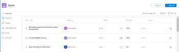
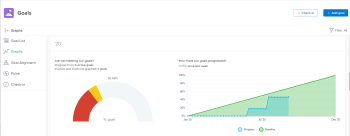
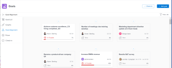

# Overview of the Adobe Workfront Goals sections

Your organization must have the following to use the functionality described in this article:

* A Pro or higher [Adobe Workfront plan](https://www.workfront.com/plans). 
* An Adobe Workfront Goals license in addition to a Workfront license.

  Contact your Workfront account manager to learn about a Workfront Goals license.

  Workfront Goals is available only in the new Adobe Workfront experience.

For additional information about access to Workfront Goals, see Requirements to use Adobe Workfront Goals.
After your Workfront administrator has granted you access to Workfront Goals, you can view goals that you or anyone else in your organization created in the Workfront Goals area.

You can access lists of goals or individual goals and manage them from several sections of Workfront Goals. Which section you use depends on the purpose you want to achieve as you are working with goals.

You can apply filters to display only the goals that are important to you in each section.

>[!TIP]
>
>Filters updated in one section are automatically applied to the Goal List, Graphs `, Goal Alignment`, and Pulse sections. This way, you can update them only once. For more information, see [Filter information in Adobe Workfront Goals](../../workfront-goals/goal-management/filter-information-wf-goals.md).

Following is a brief overview of the sections of Workfront Goals and the options available for managing goals. For more information about additional actions that you can perform within each section of Workfront Goals, we also recommend the following articles:

* [Create goals in Adobe Workfront Goals](../../workfront-goals/goal-management/create-goals.md) 
* [Check in on goals in Adobe Workfront Goals](../../workfront-goals/goal-review-and-workfront-goals-sections/check-in-goals.md) 
* [Filter information in Adobe Workfront Goals](../../workfront-goals/goal-management/filter-information-wf-goals.md) 
* [Print the Goal List in Adobe Workfront Goals](../../workfront-goals/goal-management/print-the-goal-list.md)

## Goal List

You can use the Goal List to review goals that belong to you, your teams, groups, or your organization. You can view goals in any status and from any time period.

For information about navigating the Goal List and managing goals, see [Manage goals in the Goal List of Adobe Workfront Goals](../../workfront-goals/goal-review-and-workfront-goals-sections/manage-goals-in-goal-list.md).

Use the Goal List to do the following:

<ul> 
 <li> 
View goals that belong to you, your teams, groups, or organization. 
 </li> 
 <li> 
Review goals including aligned goals, their results, and activities. 
 </li> 
 <li> 
Add new goals. 
 
For more information, see <a href="../../workfront-goals/goal-management/create-goals.md" class="MCXref xref">Create goals in Adobe Workfront Goals</a>.
 </li> 
 <li> 
Access the Goal&nbsp;Details panel and edit and update the goal, its results, or activities.
 
For more information, see <a href="../../workfront-goals/goal-management/edit-goals.md" class="MCXref xref">Edit goals in Adobe Workfront Goals</a>.
 </li> 
 <li> 
Check in on goals 
 <note type="tip">
   Clicking 
   Check in opens the Check-in section in the left panel. 
  </note> </li> 
 <li> 
Print or export a list of goals. 
 
For more information, see <a href="../../workfront-goals/goal-management/print-the-goal-list.md" class="MCXref xref">Print the Goal List in Adobe Workfront Goals</a>.
 </li> 
</ul>

## Graphs

You can use the Graphs section to gain a holistic view of the health of goals that belong to you or to your organization.&nbsp;You can view progress information of goals in any status from any time period in this section.

For information about using the Graphs section, see [Review graphs to understand goal progress trends in Adobe Workfront Goals](../../workfront-goals/goal-review-and-workfront-goals-sections/review-goal-graphs.md).

Use the Graphs section to do the following:

<ul> 
 <li>View goals that belong to you, your teams, groups, or organization. </li> 
 <li>View the number of goals with a given progress status.</li> 
 <li> 
Understand how your goals perform on a weekly basis. 
 </li> 
 <li>Add new goals. </li> 
 <li> 
Check in on goals.
 <note type="tip">
   Clicking 
   Check in opens the Check-in section in the left panel. 
  </note> </li> 
</ul>

## Goal Alignment

If your goals are aligned, you can use the Goal Alignment section to display and review all goals in your organization and their alignment to one another. Goals that are aligned display here on connected cards to illustrate their alignment to one another. Parent goals display first, and children goals are stacked behind them. You can view goals in any status and from any time period in this section.

For information about navigating the Goal Alignment section to manage goals, see [Navigate the Goal Alignment section in Adobe Workfront Goals](../../workfront-goals/goal-alignment/navigate-goal-alignment-chart.md).

For information about aligning goals, see the following articles:

* [Align goals by connecting them in Adobe Workfront Goals](../../workfront-goals/goal-alignment/align-goals-by-connecting-them.md) 
* [Align goals by converting results and activities to goals](../../workfront-goals/goal-alignment/align-goals-by-converting-results-activities.md)

Use the Goal Alignment section to do the following:

* View goals that belong to you or your organization. 
* Display goal hierarchy and view aligned children goals. 
* Access the Goal&nbsp;Details panel and update the goal, its results, or activities.

## Pulse

You can use the Pulse section to review and request updates to goals that might influence the progress of your goals. These could be your own goals, or goals that belong to your teams, groups, or your organization. You can view goals in any status and from any time period in this section.

>[!TIP]
>
>Only goals that have been checked in on at least once display in the Pulse section.

For information about reviewing goals using the Pulse section, see [Review goals in the Adobe Workfront Goals Pulse section](../../workfront-goals/goal-review-and-workfront-goals-sections/review-goals-in-pulse.md).

Use the Pulse section to do the following:

<ul> 
 <li> 
View goals that belong to your teams, groups, or organization. 
 </li> 
 <li>Review goal progress and updates, including aligned goals, their results, and activities. </li> 
 <li>Make or ask for updates to a goal by adding a comment. </li> 
 <li>Access the Goal&nbsp;Details panel and edit and update the goal, its results, or activities.</li> 
 <li> 
Add new goals. 
 </li> 
 <li> 
Check in on goals.
 <note type="tip">
   Clicking Check in opens the Check-in section in the left panel. 
  </note> </li> 
</ul>

## Check-in

`You must have access to Edit Goals in your access level before you can access the Check- in section. For information about granting access to Goals, see` ` [Grant access to Adobe Workfront Goals](../../administration-and-setup/add-users/configure-and-grant-access/grant-access-goals.md)`.

You can use the Check-in section to update active goals and any results and activities that you are the owner of. You can primarily view only goals in an Active status in this section. Children goals aligned to active parents also display in the Check-in section, regardless of their status.

>[!IMPORTANT]
>
>* A goal displays in the Check-in section only if it is assigned to you or if it has a result or activity that is assigned to you. 
>* If a goal assigned to you is the child goal of a parent that is not assigned to you and your goal (the child goal) is closed, inactive, or a draft, the parent goal does not display in your&nbsp;Check-in section. 
>

For information about managing goals in the Goal List, see [Manage goals in the Goal List of Adobe Workfront Goals](../../workfront-goals/goal-review-and-workfront-goals-sections/manage-goals-in-goal-list.md).

Use the Check-in section to do the following:

<ul> 
 <li> 
Review goal progress and updates, including aligned goals, their results, and activities. 
 </li> 
 <li> 
Update the progress on the results and activities that are assigned to you. For information about updating goals by checking in on them, see <a href="../../workfront-goals/goal-review-and-workfront-goals-sections/check-in-goals.md" class="MCXref xref">Check in on goals in Adobe Workfront Goals</a>. 
 <note type="important">
   You can check in only on the results and activities assigned to you in the Check-in section, and not those that are assigned to other entities.
  </note> </li> 
 <li>Add a comment to a goal, then click&nbsp;Post to make or ask for updates to a goal. </li> 
 <li>Access the Goal&nbsp;Details panel and edit and update the goal, its results, or activities.</li> 
 <li>Add new goals. </li> 
</ul>

<!--
Settings Note: This section has been removed from the Preview environment. For information about setting up notifications for goals, see Notifications: Goals. You can select what kind of email notifications you should receive from Workfront Goals in the Settings section. You can receive email notifications about goal, result, or activity assignments, as well as when someone comments on or likes one of your actions. For information about email notifications from Workfront Goals, see Enable Adobe Workfront Goals notifications.
-->

