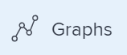

# Review graphs to understand goal progress trends in `Adobe Workfront Goals`

You can view the overall health of your goals and their progress trend in time in the Graphs section of `Adobe Workfront Goals`. The charts in this section do not break down the progress of each goal, but instead give you a holistic snapshot of all goals' progress status as well as their progress trend in time during a specified period.

>[!IMPORTANT]
>
>You can see a total count for your goals in the Graphs section for a selected period of time. However, `Workfront Goals` takes into account only goals with a status of Active and Closed when calculating the overall goal progress status and percent complete.

## Access requirements

You must have the following access to perform the actions described in this article:

<table cellspacing="0"> 
 <col> 
 <col> 
 <tbody> 
  <tr> 
   <td role="rowheader">Adobe Workfront plan*</td> 
   <td> 
Pro or higher
 </td> 
  </tr> 
  <tr> 
   <td role="rowheader">Adobe Workfront license*</td> 
   <td> 
Request or higher
 
For more information, see <a href="../../administration-and-setup/add-users/access-levels-and-object-permissions/wf-licenses.md" class="MCXref xref">Adobe Workfront licenses overview</a>.
 </td> 
  </tr> 
  <tr> 
   <td role="rowheader">Product</td> 
   <td> 
You must purchase an additional license for the Adobe Workfront Goals to access functionality described in this article. 
 
For information, see <a href="../../workfront-goals/goal-management/access-needed-for-wf-goals.md" class="MCXref xref">Requirements to use Adobe Workfront Goals</a>. 
 </td> 
  </tr> 
  <tr> 
   <td role="rowheader">Access level*</td> 
   <td> 
View or higher access to&nbsp;Goals
 
Note:  
If you still don't have access, ask your Workfront administrator if they set additional restrictions in your access level. For information on how a Workfront administrator can change your access level, see:
 
     <ul> 
      <li> 
<a href="../../administration-and-setup/add-users/configure-and-grant-access/create-modify-access-levels.md" class="MCXref xref">Create or modify custom access levels</a> 
 </li> 
      <li> 
<a href="../../administration-and-setup/add-users/configure-and-grant-access/grant-access-goals.md" class="MCXref xref">Grant access to Adobe Workfront Goals</a> 
 </li> 
     </ul> 
 </td> 
  </tr> Object permissions View or higher permissions on goals For information about sharing goals, see Share a goal in Adobe Workfront Goals. 
 </tbody> 
</table>

&#42;To find out what plan, license type, or access you have, contact your `Workfront administrator`.

## Prerequisites

You must have the following before you can start:

* A Layout Template that includes the Goals area in the Main&nbsp;Menu.

## Types of graphs in `Workfront Goals`

The following charts are available in the Graphs section or `Workfront Goals`: 

<table cellspacing="0"> 
 <col> 
 <col> 
 <tbody> 
  <tr> 
   <td role="rowheader">The Goal&nbsp;Health Chart</td> 
   <td> 
A gauge chart that displays the following:
 
    <ul> 
     <li>A total number of goals for the selected period of time. Goals with any status are taken into account. </li> 
     <li>The progress status of goals with a status of Active and Closed.</li> 
    </ul> 
For information about how Workfront Goals calculates progress status, see <a href="../../workfront-goals/goal-management/calculate-goal-progress.md" class="MCXref xref">Calculate goal progress in Adobe Workfront Goals</a>.
 </td> 
  </tr> 
  <tr> 
   <td role="rowheader">The Goal Progress Chart</td> 
   <td> 
A line chart that displays updates made to goals in weekly increments during the goal's duration. The goal progress chart displays the following:
 
    <ul> 
     <li>An average expected and actual percent complete of all&nbsp;active and closed goals in the selected period.&nbsp;The percent complete progress is broken down into weekly increments marked by nodes. </li> 
     <li>The overall average percentage of progress for active and&nbsp;closed goals since the previous week. </li> 
    </ul> 
Tip: The goal progress chart might not display any information when updates are made on the goals outside of the time period selected. 
 </td> 
  </tr> 
 </tbody> 
</table>

## Review goal progress in graphs

<ol> 
 <li value="1"> 
 
Click the Main Menu icon   in the upper-right corner of your screen, then click Goals.
 
This opens the Workfront Goals area. 
 
 </li> 
 <li value="2"> 
Click Graphs in the left panel. 
 
  
 
The Graphs section displays. 
 
By default, the goals displayed in the Graphs section are limited by the following criteria:&nbsp;
 
  <ul> 
   <li>The filters applied to the Graphs area. </li> 
   <li> 
Goals that are in a status of Active and Draft. 
 </li> 
  </ul> </li> 
 <li value="3"> 
(Optional) Select the type of information you want to display by updating the filters in the upper-right corner of the Graphs section. 
 
For more information about filtering goals, see <a href="../../workfront-goals/goal-management/filter-information-wf-goals.md" class="MCXref xref">Filter information in Adobe Workfront Goals</a>.
 <note type="tip">
   If you selected to display more than one time period, a health chart (gauge) as well as a progress chart (line) displays for each time period. 
  </note> </li> 
 <li value="4"> 
Review the information in the table below when you review the Goal Health Chart.
 
  
 
  <table cellspacing="0"> 
   <col> 
   <col> 
   <tbody> 
    <tr> 
     <td role="rowheader">Total number of goals</td> 
     <td>The number at the bottom of the chart indicates the number of all goals in the selected period, in all statuses you selected.</td> 
    </tr> 
    <tr> 
     <td role="rowheader">Average percent complete</td> 
     <td>At the top of the chart, this number indicates the average percent complete of active and closed goals in the selected time period.</td> 
    </tr> 
    <tr> 
     <td role="rowheader">Goals and their progress</td> 
     <td>The number of goals for each progress status segment, when you hover over the segments of the chart. Only goals in a status of Active or Closed are counted in the segments. </td> 
    </tr> 
   </tbody> 
  </table> </li> 
 <li value="5"> 
Review the information in the table below when you review the Goal&nbsp;Progress Chart. 
 
  
 
  <table cellspacing="0"> 
   <col> 
   <col> 
   <tbody> 
    <tr> 
     <td role="rowheader">Baseline progress</td> 
     <td>The green slope line indicates the expected overall percent complete average of active and closed goals for the selected time period. All goals within a period are expected to complete, so the baseline progress is always 100% at the end of the period. </td> 
    </tr> 
    <tr> 
     <td role="rowheader">Actual progress</td> 
     <td> 
The blue line indicates the actual overall percent complete average of active and closed goals for the selected time period in weekly increments. Each week during the duration of the goal is marked by a node in the line. 
 </td> 
    </tr> 
   </tbody> 
  </table> </li> 
 <li value="6"> 
Hover a week node in the goal progress chart and review the following:
 
  <ul> 
   <li>Week date: The month, day, and year of the selected week.</li> 
   <li>Progress:&nbsp;An average of the actual percent complete of all goals for the selected week.</li> 
   <li>Baseline: An average of the expected percent complete of all goals for the selected week.</li> 
  </ul> </li> 
 <li value="7"> 
(Optional)&nbsp;Click Progress at the bottom of the progress chart to remove the actual overall progress line
 
Or
 
Click Baseline at the bottom of the progress chart to remove the expected progress from the chart. 
 </li> 
</ol>

<!--
(Optional) Click one of the following tabs to view goals filtered by their owners: Personal Goals where you are designated as the owner or that have a result or activity that you own. My Teams Goals where any of your teams is designated as the Owner. Tip: If you are not assigned to any teams, no results display when you select the My Teams filter. My Groups Goals where any of your groups is designated as the Owner. Company Goals where your organization is the owner. This is the organization associated with your Workfront instance, as described in Configure basic information for your system. Tip: In Adobe Workfront Goals, the Company filter displays the goals for which your organization is selected as the owner. You cannot search for companies using this field. Only your organization who is the owner of your Workfront instance is selected by default. All Goals owned by you, your teams, your groups, your company, or anyone in your organization.
-->

&nbsp;
