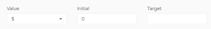

# Add results to goals in `Adobe Workfront Goals`

Results measure the progress of a goal. Without associating results, activities, or aligned goals to a goal, you cannot activate the goal and you cannot record progress on it.

## Access requirements

You must have the following:

<table cellspacing="0"> 
 <col> 
 <col> 
 <tbody> 
  <tr> 
   <td role="rowheader">Adobe Workfront plan*</td> 
   <td> 
Pro or higher
 </td> 
  </tr> 
  <tr> 
   <td role="rowheader">Adobe Workfront license*</td> 
   <td> 
Request or higher
 
For more information, see <a href="../../administration-and-setup/add-users/access-levels-and-object-permissions/wf-licenses.md" class="MCXref xref">Adobe Workfront licenses overview</a>.
 </td> 
  </tr> 
  <tr> 
   <td role="rowheader">Product</td> 
   <td> 
You must purchase an additional license for the Adobe Workfront Goals to access functionality described in this article. 
 
For information, see <a href="../../workfront-goals/goal-management/access-needed-for-wf-goals.md" class="MCXref xref">Requirements to use Adobe Workfront Goals</a>. 
 </td> 
  </tr> 
  <tr> 
   <td role="rowheader">Access level configurations*</td> 
   <td> 
Edit access to Goals or higher
 
Note:  
If you still don't have access, ask your Workfront administrator if they set additional restrictions in your access level. For information on how a Workfront administrator can change your access level, see:
 
     <ul> 
      <li> 
<a href="../../administration-and-setup/add-users/configure-and-grant-access/create-modify-access-levels.md" class="MCXref xref">Create or modify custom access levels</a> 
 </li> 
      <li> 
<a href="../../administration-and-setup/add-users/configure-and-grant-access/grant-access-goals.md" class="MCXref xref">Grant access to Adobe Workfront Goals</a> 
 </li> 
     </ul> 
 </td> 
  </tr> Object permissions Manage permissions to the goal For information about sharing goals, see Share a goal in Adobe Workfront Goals. 
 </tbody> 
</table>

&#42;To find out what plan, license type, or access you have, contact your `Workfront administrator`.

## Prerequisites

You must have the following before you can start:

* A Layout Template that includes the Goals area in the Main&nbsp;Menu.
* An existing goal.

  For information about creating goals, see [Create goals in Adobe Workfront Goals](../../workfront-goals/goal-management/create-goals.md).

>[!IMPORTANT]
>
>A goal cannot have more than a total of 50 activities, results, or aligned goals.

## Add a result to a goal

<ol> 
 <li value="1">Go to the goal for which you want to add a result and click the name to open the Goal&nbsp;Details panel.</li> 
 <li value="2"> 
Click Add results.
 
  
 </li> 
 <li value="3">Start typing the result you want to achieve in the Result field. This is the name of the result and it displays wherever the goal displays. </li> 
 <li value="4"> 
(Optional) If you want to set the Result Owner as someone other than yourself, click your name in the Owner field and start typing the name of the user that you want to assign as the owner of the result, then click it when it appears in the drop-down list.
 <note type="note">
   You cannot assign a team or group as a result owner.
  </note> </li> 
 <li value="5"> 
In the Value drop-down menu, select the type of value that you want to measure your success by. 
 
  
 
Select from the following options:
 
  <table cellspacing="0"> 
   <col> 
   <col> 
   <tbody> 
    <tr> 
     <td role="rowheader">#</td> 
     <td>Number value</td> 
    </tr> 
    <tr> 
     <td role="rowheader">%</td> 
     <td>Percentage value</td> 
    </tr> 
    <tr> 
     <td role="rowheader">$, CN¥, DKK, KR, Mex$, R, R$, zł, £ , ¥ , € , ₹, ฿, MYR, ₪ </td> 
     <td>Currency values</td> 
    </tr> 
   </tbody> 
  </table> 
 
For example, if you want to increase profit to 8%, and profit is currently at 4%, you can select % as the Measured Value. 
 <note type="tip">
    The result Type is always Metric and cannot be edited. 
   </note> 
 </li> 
 <li value="6"> 
In the Initial field, indicate the value that the result has in the beginning, before any progress on it has been recorded. For example, if you want to increase profit to 8%, and profit is currently at 4%, you can enter 4 as the Starting At value. 
 </li> 
 <li value="7">In the Target field, indicate the value that the result aims to achieve. For example, if you want to increase profit to 8%, and profit is currently at 4%, you can enter 8 as the Ending At value.</li> 
 <li value="8"> 
Click Save.
 
The result is saved for the selected goal. The progress of the goal automatically updates when you update the progress of a result. 
 </li> 
</ol>

