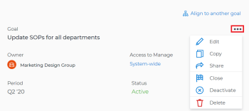
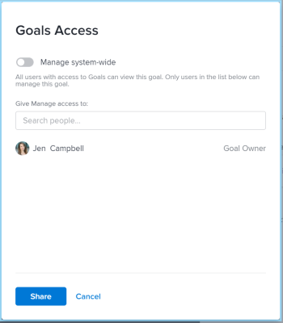

# Share a goal in Adobe Workfront Goals

When you share a goal you give Manage permissions to a goal to someone who did not create it.

## Access requirements

You must have the following:

<table cellspacing="0"> 
 <col> 
 <col> 
 <tbody> 
  <tr> 
   <td role="rowheader">Adobe Workfront plan*</td> 
   <td> 
Pro or higher
 </td> 
  </tr> 
  <tr> 
   <td role="rowheader">Adobe Workfront license*</td> 
   <td> 
Request or higher
 
For more information, see <a href="../../administration-and-setup/add-users/access-levels-and-object-permissions/wf-licenses.md" class="MCXref xref">Adobe Workfront licenses overview</a>.
 </td> 
  </tr> 
  <tr> 
   <td role="rowheader">Product</td> 
   <td> 
You must purchase an additional license for the Adobe Workfront Goals to access functionality described in this article. 
 
For information, see <a href="../../workfront-goals/goal-management/access-needed-for-wf-goals.md" class="MCXref xref">Requirements to use Adobe Workfront Goals</a>. 
 </td> 
  </tr> 
  <tr> 
   <td role="rowheader">Access level configurations*</td> 
   <td> 
Edit access to Goals or higher
 
Note:  
If you still don't have access, ask your Workfront administrator if they set additional restrictions in your access level. For information on how a Workfront administrator can change your access level, see:
 
     <ul> 
      <li> 
<a href="../../administration-and-setup/add-users/configure-and-grant-access/create-modify-access-levels.md" class="MCXref xref">Create or modify custom access levels</a> 
 </li> 
      <li> 
<a href="../../administration-and-setup/add-users/configure-and-grant-access/grant-access-goals.md" class="MCXref xref">Grant access to Adobe Workfront Goals</a> 
 </li> 
     </ul> 
 </td> 
  </tr> Object permissions Manage permissions to the goal For information about sharing goals, see Share a goal in Adobe Workfront Goals. 
 </tbody> 
</table>

&#42;To find out what plan, license type, or access you have, contact your Workfront administrator.

## Prerequisites

Before you begin, you must have the following:

* A Layout Template that includes the Goals area in the Main&nbsp;Menu.

## Considerations about sharing goals

* Users can have the following permissions to a goal:

<table cellspacing="0"> 
 <col> 
 </col> 
 <col> 
 </col> 
 <tbody> 
  <tr> 
   <td role="rowheader">View</td> 
   <td>In this case, users have permissions to view the goal, but they cannot edit information for the goal, they cannot add or edit information for results, or activities, update status, or delete the goal. By default, all users with access to Goals can view all goals in the system. Users can copy the goal, if they have Edit access to Goals in their access level. </td> 
  </tr> 
  <tr> 
   <td role="rowheader">Manage</td> 
   <td> 
Users can edit all information for the goal, including for the results, or activities, including delete them. Only goal creators or users who are specifically given&nbsp;Manage permissions to a goal can manage a goal. 
 </td> 
  </tr> 
 </tbody> 
</table>

* You can share the following types of goals with others:

  * A goal you created 
  * A goal created by someone else to which you were given permissions to Manage.

* If you have Manage permissions to a goal, you can change the permissions on the goal for the goal creator. By default, they have&nbsp;Manage permissions when they create the goal, but you can change them to View.

## Share a goal

<ol> 
 <li value="1"> 
Click the Main Menu icon  in the upper-right corner of Workfront, then click Goals.
 
The Goal List displays. 
 </li> 
 <li value="2"> 
Click the name of a goal in the list. The Goal&nbsp;Details panel opens. 
 <note type="tip">
   You can click the name of a list from any section in the Goals area to open the Goal&nbsp;Details panel. 
  </note> </li> 
 <li value="3"> 
Click the More icon next to the goal name, then click&nbsp;Share. 
 
  
 
The Goal&nbsp;Access box displays.
 
  
 </li> 
 <li value="4"> 
Do one of the following:
 
  <ul> 
   <li> 
Select the Manage system-wide setting to give Manage permissions to everyone in the system who has Edit access to Goals in their access level. This is deselected by default for all new goals. 
 </li> 
   <li> 
Start typing the name of a user that you want to give Manage permissions to in the Give Manage access to box. Select the name when it appears in the list. 
 <note type="tip">
     You can only share a goal with other users. You cannot share goals with groups, teams, or companies. 
    </note> </li> 
  </ul> </li> 
 <li value="5"> 
Click Share. 
 
The goal is shared with the users you specified. A "System-wide" label or the name of the users who have Manage permissions to the goal display in the Access to Manage field in the Goal Details panel. 
 </li> 
</ol>

## Goal permission options

The following table lists the permissions that you can grant when sharing a goal. For more information about the access users get based on their license, see [Grant access to Adobe Workfront Goals](../../administration-and-setup/add-users/configure-and-grant-access/grant-access-goals.md). 

<table border="1" cellspacing="15" cellpadding="1"> 
 <col> 
 </col> 
 <col> 
 </col> 
 <col> 
 </col> 
 <thead> 
  <tr> 
   <th> 
Actions 
 </th> 
   <th> 
Manage 
 </th> 
   <th> 
View 
 </th> 
  </tr> 
 </thead> 
 <tbody> 
  <tr> 
   <td> 
View goal
 </td> 
   <td> 
✓
 </td> 
   <td> 
✓
 </td> 
  </tr> 
  <tr> 
   <td> 
View results or activities
 </td> 
   <td> 
✓
 </td> 
   <td> 
✓
 </td> 
  </tr> 
  <tr> 
   <td>Copy goal* </td> 
   <td>✓ </td> 
   <td>✓</td> 
  </tr> Convert results or activities into other goals* ✓ ✓ 
  <tr> 
   <td>View projects added as activities** </td> 
   <td>✓</td> 
   <td>✓</td> 
  </tr> 
  <tr> 
   <td>Edit goal</td> 
   <td>✓</td> 
   <td> </td> 
  </tr> 
  <tr> 
   <td>Edit results or activities</td> 
   <td>✓</td> 
   <td>&nbsp;</td> 
  </tr> 
  <tr> 
   <td>Add results or activities for the goal</td> 
   <td>✓</td> 
   <td>&nbsp;</td> 
  </tr> 
  <tr> 
   <td>Associate a project as an activity to the goal**</td> 
   <td>✓</td> 
   <td>&nbsp;</td> 
  </tr> 
  <tr> 
   <td> 
Delete goal
 </td> 
   <td> 
✓
 </td> 
   <td> 
&nbsp;
 </td> 
  </tr> 
  <tr> 
   <td> 
Delete results or activities
 </td> 
   <td> 
✓
 </td> 
   <td> 
&nbsp;
 </td> 
  </tr> 
  <tr> 
   <td>Disconnect projects from the goal</td> 
   <td>✓</td> 
   <td>&nbsp;</td> 
  </tr> 
 </tbody> 
</table>

&#42; You must have Edit access to Goals in your access level to be able to convert results and activities to goals.

&#42;&#42; You must have access to View Projects and View permission to the projects added or that you want to add to the goal to view them.

For information about project access level, see [Grant access to projects](../../administration-and-setup/add-users/configure-and-grant-access/grant-access-projects.md).

For information about project permissions, see [Share a project in Adobe Workfront](../../workfront-basics/grant-and-request-access-to-objects/share-a-project.md).

&nbsp;
