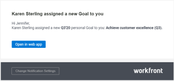

# Enable *`Adobe Workfront Goals`* notifications {#enable-adobe-workfront-goals-notifications}

*`Adobe Workfront Goals`* comes with a set of predefined event notifications that you can enable for your account. These event notifications trigger email communication every time the condition defined by the event is met. 

For information about what notifications you can enable for *`Workfront Goals`*, see [Notifications: Goals](notifications-goals.md). 

For information about managing notifications in  *`Adobe Workfront`*, see [Activate or deactivate your own event notifications](activate-or-deactivate-your-own-event-notifications.md). 

## Example of *`Workfront Goals`* email notification {#example-of-workfront-goals-email-notification}

When the event defined by the notification you enabled occurs, you receive an email describing the event. The following is an example of email notifying you that you are assigned as the Owner of a new goal: 

