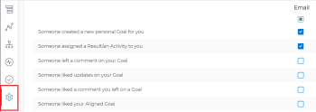

# Enable *Adobe Workfront Goals* notifications

*Adobe Workfront Goals* comes with a set of predefined event notifications that you can enable for your account. These event notifications trigger email communication every time the condition defined by the event is met.

For information about what notifications you can enable for *Workfront Goals*, see [Notifications: Goals](../../workfront-basics/using-notifications/notifications-goals.md).

For information about managing notifications in&nbsp;*Adobe Workfront*, see [Activate or deactivate your own event notifications](../../workfront-basics/using-notifications/activate-or-deactivate-your-own-event-notifications.md).

<!--

<h2>Access requirements</h2>

You must have the following access to perform the actions described in this article:

<table cellspacing="0">
<col>
<col>
<tbody>
<tr>
<td role="rowheader"><em>Adobe Workfront</em> plan*</td>
<td> 
<em>Pro</em> or higher
 </td>
</tr>
<tr>
<td role="rowheader"><em>Adobe Workfront</em> license*</td>
<td> 
<em>Request</em> or higher
 
For more information, see <a href="../../administration-and-setup/add-users/access-levels-and-object-permissions/wf-licenses.md" class="MCXref xref">Adobe Workfront licenses overview</a>.
 </td>
</tr>
<tr>
<td role="rowheader">Product</td>
<td> 
You must purchase an additional license for the <em>Adobe Workfront Goals</em> to access functionality described in this article. 
 
For information, see <a href="../../workfront-goals/goal-management/access-needed-for-wf-goals.md" class="MCXref xref">Requirements to use Adobe Workfront Goals</a>. 
 </td>
</tr>
<tr>
<td role="rowheader">Access level*</td>
<td> 
View or higher access to&nbsp;Goals
 <note type="note">

If you still don't have access, ask your <em>Workfront administrator</em> if they set additional restrictions in your access level. For information on how a <em>Workfront administrator</em> can change your access level, see:

<ul>
<li> 
<a href="../../administration-and-setup/add-users/configure-and-grant-access/create-modify-access-levels.md" class="MCXref xref">Create or modify custom access levels</a> 
 </li>
<li> 
<a href="../../administration-and-setup/add-users/configure-and-grant-access/grant-access-goals.md" class="MCXref xref">Grant access to Adobe Workfront Goals</a> 
 </li>
</ul>
</note> </td>
</tr> <draft-comment>
<tr data-mc-conditions="">
<td role="rowheader">Object permissions</td>
<td>

View or higher permissions on goals

For information about sharing goals, see <a href="../../workfront-goals/workfront-goals-settings/share-a-goal.md" class="MCXref xref">Share a goal in Adobe Workfront Goals</a>. 

 </td>
</tr>
</draft-comment>
<tr data-mc-conditions="">
<td role="rowheader">Object permissions</td>
<td>

View or higher permissions on goals

For information about sharing goals, see <a href="../../workfront-goals/workfront-goals-settings/share-a-goal.md" class="MCXref xref">Share a goal in Adobe Workfront Goals</a>. 

 </td>
</tr>
</tbody>
</table>

*To find out what plan, license type, or access you have, contact your <em>Workfront administrator</em>.

<h2>Prerequisites: </h2>

You must have the following before you can start:

<ul>
<li> 
A Layout Template that includes the Goals area in the Main&nbsp;Menu.
 </li>
</ul>
<h2>Understand <em>Workfront Goals</em> notifications settings</h2>

Consider the following when configuring and receiving <em>Workfront Goals</em> notifications:

<ul>
<li>They are personal notifications which means that each user can manage their own notifications.</li>
<li>The <em>Workfront administrator</em> does not need to enable event notifications before each user can select which ones they want to receive. </li>
<li>They trigger as soon as the defined events happen on goals, activities, or results and cannot be part of a daily digest. </li>
<li>They trigger regardless of the status of the goal. </li>
<li>They do not trigger when you are the initiator of the event described in the notification setting. </li>
</ul>
<h2>Configure email notifications for <em>Workfront Goals</em></h2>
<ol>
<li value="1"> 
Log in to <em>Workfront</em> and ensure that your <em>Workfront administrator</em> gave you access to&nbsp;<em>Workfront Goals</em>.
 
For information about access to&nbsp;<em>Workfront Goals</em>, see <a href="../../workfront-goals/goal-management/access-needed-for-wf-goals.md" class="MCXref xref">Requirements to use Adobe Workfront Goals</a>.
 </li>
<li value="2"> 
 
Click the Main Menu icon   in the upper-right corner of your screen, then click Goals.
 
This opens the <em>Workfront Goals</em> area. 
 
 </li>
<li value="3"> 
Click Goal Settings in the left panel.
 
  
 </li>
<li value="4"> 
Select any of the check boxes below to enable notifications for the following events:

<table cellspacing="15">
<col>
<thead>
<tr>
<th>Notification </th>
</tr>
</thead>
<tbody>
<tr>
<td> 
Someone created a new personal Goal for you.
 
This is enabled by default.
 <note type="tip">
A personal goal is a goal where you are designated as the owner.
</note> </td>
</tr>
<tr>
<td> 
Someone assigned a Result/ an Activity to you.
 
This is enabled by default. 
 </td>
</tr>
<tr>
<td>Someone left a comment on your Goal </td>
</tr>
<tr>
<td>Someone liked updates on your Goal</td>
</tr>
<tr>
<td>Someone liked a comment you left on a Goal</td>
</tr>
<tr>
<td>Someone liked your Aligned Goal</td>
</tr>
</tbody>
</table> </li>
<li value="5"> 
Click Save Settings. 
 </li>
</ol>

-->

## Access requirements

You must have the following access to perform the actions described in this article:

<table cellspacing="0"> 
 <col> 
 <col> 
 <tbody> 
  <tr> 
   <td role="rowheader"><em>Adobe Workfront</em> plan*</td> 
   <td> 
<em>Pro</em> or higher
 </td> 
  </tr> 
  <tr> 
   <td role="rowheader"><em>Adobe Workfront</em> license*</td> 
   <td> 
<em>Request</em> or higher
 
For more information, see <a href="../../administration-and-setup/add-users/access-levels-and-object-permissions/wf-licenses.md" class="MCXref xref">Adobe Workfront licenses overview</a>.
 </td> 
  </tr> 
  <tr> 
   <td role="rowheader">Product</td> 
   <td> 
You must purchase an additional license for the <em>Adobe Workfront Goals</em> to access functionality described in this article. 
 
For information, see <a href="../../workfront-goals/goal-management/access-needed-for-wf-goals.md" class="MCXref xref">Requirements to use Adobe Workfront Goals</a>. 
 </td> 
  </tr> 
  <tr> 
   <td role="rowheader">Access level*</td> 
   <td> 
View or higher access to&nbsp;Goals
 
Note:  
If you still don't have access, ask your <em>Workfront administrator</em> if they set additional restrictions in your access level. For information on how a <em>Workfront administrator</em> can change your access level, see:
 
     <ul> 
      <li> 
<a href="../../administration-and-setup/add-users/configure-and-grant-access/create-modify-access-levels.md" class="MCXref xref">Create or modify custom access levels</a> 
 </li> 
      <li> 
<a href="../../administration-and-setup/add-users/configure-and-grant-access/grant-access-goals.md" class="MCXref xref">Grant access to Adobe Workfront Goals</a> 
 </li> 
     </ul> 
 </td> 
  </tr> 
  <tr data-mc-conditions=""> 
   <td role="rowheader">Object permissions</td> 
   <td> 
    
 
     
View or higher permissions on goals
 
     
For information about sharing goals, see <a href="../../workfront-goals/workfront-goals-settings/share-a-goal.md" class="MCXref xref">Share a goal in Adobe Workfront Goals</a>. 
 
    
 </td> 
  </tr> 
 </tbody> 
</table>

&#42;To find out what plan, license type, or access you have, contact your *Workfront administrator*.

## Prerequisites:

You must have the following before you can start:

* A Layout Template that includes the Goals area in the Main&nbsp;Menu.

## Understand *Workfront Goals* notifications settings

Consider the following when configuring and receiving *Workfront Goals* notifications:

* They are personal notifications which means that each user can manage their own notifications.
* The *Workfront administrator* does not need to enable event notifications before each user can select which ones they want to receive. 
* They trigger as soon as the defined events happen on goals, activities, or results and cannot be part of a daily digest. 
* They trigger regardless of the status of the goal. 
* They do not trigger when you are the initiator of the event described in the notification setting.

## Configure email notifications for *Workfront Goals*

<ol> 
 <li value="1"> 
Log in to <em>Workfront</em> and ensure that your <em>Workfront administrator</em> gave you access to&nbsp;<em>Workfront Goals</em>.
 
For information about access to&nbsp;<em>Workfront Goals</em>, see <a href="../../workfront-goals/goal-management/access-needed-for-wf-goals.md" class="MCXref xref">Requirements to use Adobe Workfront Goals</a>.
 </li> 
 <li value="2"> 
 
Click the Main Menu icon   in the upper-right corner of your screen, then click Goals.
 
This opens the <em>Workfront Goals</em> area. 
 
 </li> 
 <li value="3"> 
Click Goal Settings in the left panel.
 
  
 </li> 
 <li value="4"> 
Select any of the check boxes below to enable notifications for the following events:
 
  <table cellspacing="15"> 
   <col> 
   <thead> 
    <tr> 
     <th>Notification </th> 
    </tr> 
   </thead> 
   <tbody> 
    <tr> 
     <td> 
Someone created a new personal Goal for you.
 
This is enabled by default.
 <note type="tip">
       A personal goal is a goal where you are designated as the owner.
      </note> </td> 
    </tr> 
    <tr> 
     <td> 
Someone assigned a Result/ an Activity to you.
 
This is enabled by default. 
 </td> 
    </tr> 
    <tr> 
     <td>Someone left a comment on your Goal </td> 
    </tr> 
    <tr> 
     <td>Someone liked updates on your Goal</td> 
    </tr> 
    <tr> 
     <td>Someone liked a comment you left on a Goal</td> 
    </tr> 
    <tr> 
     <td>Someone liked your Aligned Goal</td> 
    </tr> 
   </tbody> 
  </table> </li> 
 <li value="5"> 
Click Save Settings. 
 </li> 
</ol>

## Example of *Workfront Goals* email notification

When the event defined by the notification you enabled occurs, you receive an email describing the event. The following is an example of email notifying you that you are assigned as the Owner of a new goal:

