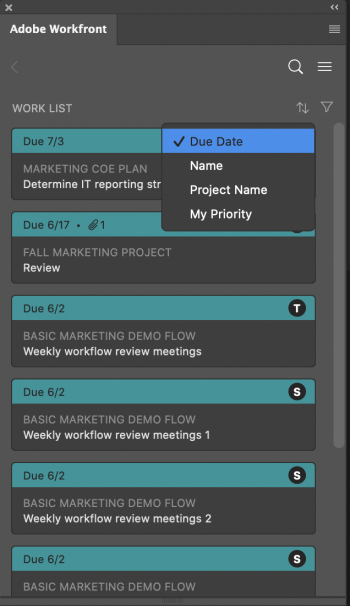
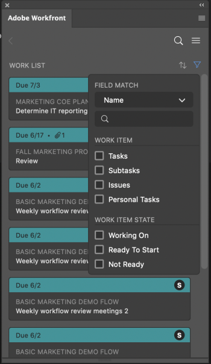

# Find your work in Adobe Photoshop {#find-your-work-in-adobe-photoshop}

Find the work assigned to you in *`Adobe Workfront`* without leaving Adobe Photoshop.

## Access requirements {#access-requirements}

You must have the following access to perform the steps in this article:

<table style="width: 100%;margin-left: 0;margin-right: auto;mc-table-style: url('../../Resources/TableStyles/TableStyle-List-options-in-steps.css');" class="TableStyle-TableStyle-List-options-in-steps" cellspacing="0"> 
 <col class="TableStyle-TableStyle-List-options-in-steps-Column-Column1"> 
 <col class="TableStyle-TableStyle-List-options-in-steps-Column-Column2"> 
 <tbody> 
  <tr class="TableStyle-TableStyle-List-options-in-steps-Body-LightGray"> 
   <td class="TableStyle-TableStyle-List-options-in-steps-BodyE-Column1-LightGray" role="rowheader">Adobe Workfront plan*</td> 
   <td class="TableStyle-TableStyle-List-options-in-steps-BodyD-Column2-LightGray"> 
Pro or higher
 </td> 
  </tr> 
  <tr class="TableStyle-TableStyle-List-options-in-steps-Body-MediumGray" data-mc-conditions=""> 
   <td class="TableStyle-TableStyle-List-options-in-steps-BodyE-Column1-MediumGray" role="rowheader">Adobe Workfront license*</td> 
   <td class="TableStyle-TableStyle-List-options-in-steps-BodyD-Column2-MediumGray"> 
Work or Plan
 </td> 
  </tr> 
  <tr class="TableStyle-TableStyle-List-options-in-steps-Body-LightGray"> 
   <td class="TableStyle-TableStyle-List-options-in-steps-BodyB-Column1-LightGray" role="rowheader">Product</td> 
   <td class="TableStyle-TableStyle-List-options-in-steps-BodyA-Column2-LightGray">You must have an Adobe Creative Cloud license in addition to a Workfront license.</td> 
  </tr> 
 </tbody> 
</table>

&#42;To find out what plan, license type, or access you have, contact your *`Workfront administrator`*.

## Prerequisites {#prerequisites}

*  You must install the *`Workfront`* for Adobe Photoshop plugin before you can find your work in Adobe Photoshop.

  For instructions, see [Install Workfront for Adobe Photoshop](wf-cc-install.md).

## Use the Work List to access important information {#use-the-work-list-to-access-important-information}

The Work List allows you to view all of the tasks and issues assigned to you in one place. You can use the Sort by option to group items together and then use the Filter to focus in on work that needs to be completed. 

###  Group similar work items together with the Sort By option  {#group-similar-work-items-together-with-the-sort-by-option}

Use the Sort by option to group similar items in the Work List. You can sort by:

<table style="width: 65%;"> 
 <col> 
 <col> 
 <tbody> 
  <tr> 
   <td> 
    <ul> 
     <li>Due Date</li> 
     <li>Name</li> 
     <li>Project Name</li> 
     <li>My Priority</li> 
    </ul> </td> 
   <td>  </td> 
  </tr> 
 </tbody> 
</table>

### Narrow your focus with filters {#narrow-your-focus-with-filters}

Use the Filter to narrow your focus to specific work items. There are a couple of ways to use the filter:

&nbsp;

<table style="width: 65%;"> 
 <col> 
 <col> 
 <tbody> 
  <tr> 
   <td> 
The first is filtering based solely on work item type or attributes:
 
    <ul> 
     <li>Work item: Tasks, Subtasks, Issues, or Personal tasks</li> 
     <li>Work item state: Working On, Ready to Start, or Not Ready</li> 
    </ul> 
The second is filtering using work item and work item state together. For example, you can select Tasks and Ready to Start to find all of the tasks in your work list that are ready for work.
 
You can also use Field Match to search for a specific item within your filter set. 
 </td> 
   <td>  </td> 
  </tr> 
 </tbody> 
</table>

## Search for your work {#search-for-your-work}

Use the Search bar to locate projects, tasks, issues, and documents you need. 

<table style="width: 65%;"> 
 <col> 
 <col> 
 <tbody> 
  <tr> 
   <td> 
    <ul> 
     <li>See recent items: You can view up to 5 of your most recent work items accessed through Workfront or the Photoshop plugin.</li> 
     <li>Locate pinned items: You can access projects, tasks, issues, and documents you've pinned in the new Adobe Workfront experience.</li> 
     <li>Find your favorites: You can see any project, task, issue, or document you saved as a favorite.</li> 
    </ul> </td> 
   <td>  </td> 
  </tr> 
 </tbody> 
</table>

## Use the Menu to navigate projects {#use-the-menu-to-navigate-projects}

You can use the Menu icon to navigate to parent items in a project.

