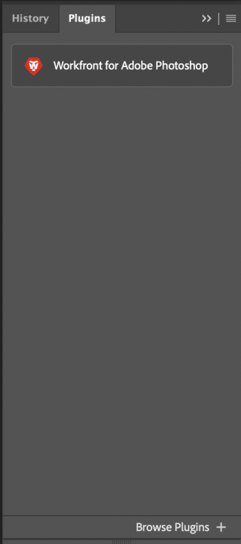

# Install *Workfront* for Adobe Photoshop

You can install the *Workfront* for Adobe Photoshop plugin from the Adobe Marketplace.

## Access requirements

You must have the following access to perform the steps in this article:

<table cellspacing="0"> 
 <col> 
 <col> 
 <tbody> 
  <tr> 
   <td role="rowheader"><em>Adobe Workfront</em> plan*</td> 
   <td> 
<em>Pro</em> or higher
 </td> 
  </tr> <draft-comment>
   <tr data-mc-conditions=""> 
    <td role="rowheader"><em>Adobe Workfront</em> license*</td> 
    <td> 
<em>Work</em> or <em>Plan</em>
 </td> 
   </tr>
  </draft-comment>
  <tr data-mc-conditions=""> 
   <td role="rowheader"><em>Adobe Workfront</em> license*</td> 
   <td> 
<em>Work</em> or <em>Plan</em>
 </td> 
  </tr> 
  <tr> 
   <td role="rowheader">Product</td> 
   <td>You must have an Adobe Creative Cloud license in addition to a <em>Workfront</em> license.</td> 
  </tr> 
 </tbody> 
</table>

&#42;To find out what plan, license type, or access you have, contact your *Workfront administrator*.

## Prerequisites

* You must install the Adobe Photoshop app before you install the *Workfront* plugin.

## Install the *Workfront* for Adobe Photoshop plugin

<ol> 
 <li value="1"> 
Open the Adobe Creative Cloud app.
 </li> 
 <li value="2"> 
Click the Marketplace tab near the top of the window.
 </li> 
 <li value="3"> 
In the Search All Plugins box, type <i>Workfront</i>, then press Enter.
 
  
 </li> 
 <li value="4"> 
When <em>Workfront</em> for Adobe Photoshop plugin appears in the search results, click Get.
 </li> 
 <li value="5"> 
Read the information in the dialog box, then click OK.
 </li> 
 <li value="6"> 
Once the plugin in installed, open Adobe Photoshop and locate the <em>Workfront</em> plugin in the plugin panel.
 
  
 </li> 
 <li value="7"> 
Continue to the following section for information on how to log in to the plugin.
 </li> 
</ol>

<!--
<h2 data-mc-conditions="QuicksilverOrClassic.Draft mode">Find and install the plugin</h2>
-->

## Find and install the plugin

<!--
<ol data-mc-conditions="QuicksilverOrClassic.Draft mode">
<li value="1"> 
Download the file provided in <a href="https://drive.google.com/drive/folders/1EehEGJEQESlwP0uXepF3-0GFZGl2psJN?usp=sharing">Adobe Plugin Beta folder</a>.

<ol>
<li value="1"> 
Right click on the Workfront Plugin .ccx file, then click Download. You can check the .ccx file download progress in the bottom tray of the browser.
 </li>
<li value="2"> 
Once the download is complete, double-click on the file in your tray. The Creative Cloud console automatically opens.
 </li>
</ol> </li>
<li value="2"> 
In the Couldn't verify plugin pop-up window, click Install locally.
 <note type="note">
Because this an early access plugin and not yet officially supported on the Marketplace, you must opt to install locally.
</note> </li>
<li value="3"> 
Read the information in the dialog box, then click OK.
 </li>
<li value="4"> 
Open Photoshop, and continue to the <a href="#log" class="MCXref xref">Log In to Workfront for Adobe Photoshop</a> section below.
 </li>
</ol>
-->

<ol data-mc-conditions="QuicksilverOrClassic.Draft mode"> 
 <li value="1"> 
Download the file provided in <a href="https://drive.google.com/drive/folders/1EehEGJEQESlwP0uXepF3-0GFZGl2psJN?usp=sharing">Adobe Plugin Beta folder</a>.
 
  <ol> 
   <li value="1"> 
Right click on the Workfront Plugin .ccx file, then click Download. You can check the .ccx file download progress in the bottom tray of the browser.
 </li> 
   <li value="2"> 
Once the download is complete, double-click on the file in your tray. The Creative Cloud console automatically opens.
 </li> 
  </ol> </li> 
 <li value="2"> 
In the Couldn't verify plugin pop-up window, click Install locally.
 <note type="note">
   Because this an early access plugin and not yet officially supported on the Marketplace, you must opt to install locally.
  </note> </li> 
 <li value="3"> 
Read the information in the dialog box, then click OK.
 </li> 
 <li value="4"> 
Open Photoshop, and continue to the <a href="#log" class="MCXref xref">Log In to Workfront for Adobe Photoshop</a> section below.
 </li> 
</ol>

## Log In to Workfront for Adobe Photoshop

<ol> 
 <li value="1"> 
From the Plugins menu at the top of the screen, select Plugin Panel.
 </li> 
 <li value="2">Select <em>Workfront</em> for Adobe Photoshop.</li> 
 <li value="3"> 
Enter your domain, then click Log in. A browser page opens.
 <note type="tip">
   To find your domain, open a browser, navigate to your 
   <em>Workfront</em> instance, and copy the first part of the URL:
    
   
  </note> </li> 
 <li value="4"> 
In the browser, enter your <em>Workfront</em> credentials, then click Log in. If your company uses a single sign-on (SSO), you'll be directed to your SSO provider's page to log in. 
 <note type="note">
   You may not be prompted to enter your 
   <em>Workfront</em> credentials if you logged in recently.
  </note> <draft-comment>
   
 
    
Follow the prompts to log in to <em>Workfront</em>.
 <note type="note"> 
     <ul> 
      <li> 
Workfront connects to Adobe Creative Cloud using OAuth 2.0, a secure standard used by most web-based integrations for the authentication and authorization of users.
 </li> 
      <li> 
When you are prompted to enter the <em>[domain or host]</em> of your <em>Workfront</em> account, type it using this format: <em>yourCompany'sDomain.my.workfront.com</em>. Your company's domain is usually the name of your company. 
 </li> 
     </ul> 
    </note> 
   

  </draft-comment>
  
 
   
Follow the prompts to log in to <em>Workfront</em>.
 <note type="note"> 
    <ul> 
     <li> 
Workfront connects to Adobe Creative Cloud using OAuth 2.0, a secure standard used by most web-based integrations for the authentication and authorization of users.
 </li> 
     <li> 
When you are prompted to enter the <em>[domain or host]</em> of your <em>Workfront</em> account, type it using this format: <em>yourCompany'sDomain.my.workfront.com</em>. Your company's domain is usually the name of your company. 
 </li> 
    </ul> 
   </note> 
  
 </li> 
 <li value="5"> 
Click Allow Access to finish logging in.
 </li> 
 <li value="6"> 
Go back to Adobe Photoshop to see your work.
 </li> 
</ol>

