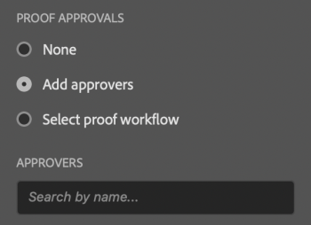
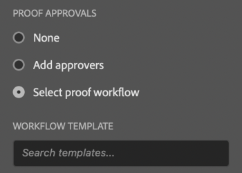
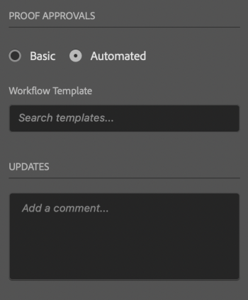

# Upload proofs from Adobe Photoshop

You can upload your art boards as proofs directly to *Adobe Workfront* for a thorough review and approval.

## Access requirements

You must have the following access to perform the steps in this article:

<table cellspacing="0"> 
 <col> 
 <col> 
 <tbody> 
  <tr> 
   <td role="rowheader"><em>Adobe Workfront</em> plan*</td> 
   <td> 
Current plan: Pro or Higher
 
or
 
Legacy plan: Premium
 
For more information about proofing access with the different plans, see <a href="../../administration-and-setup/manage-workfront/configure-proofing/access-to-proofing-functionality.md" class="MCXref xref">Access to proofing functionality in Workfront</a>.
 </td> 
  </tr> 
  <tr> 
   <td role="rowheader"><em>Adobe Workfront</em> license*</td> 
   <td> 
Current plan: <em>Work</em> or <em>Proof</em>
 
Legacy plan: Any (You must have proofing enabled for the user)
 </td> 
  </tr> 
  <tr> 
   <td role="rowheader">Product</td> 
   <td>You must have an Adobe Creative Cloud license in addition to a <em>Workfront</em> license.</td> 
  </tr> 
  <tr> 
   <td role="rowheader"><em>Proof Permission Profile</em> </td> 
   <td>Manager or higher</td> 
  </tr> 
  <tr> 
   <td role="rowheader">Object permissions</td> 
   <td> 
Edit access to Documents
 
For information on requesting additional access, see <a href="../../workfront-basics/grant-and-request-access-to-objects/request-access.md" class="MCXref xref">Request access to objects in Adobe Workfront</a>.
 </td> 
  </tr> 
 </tbody> 
</table>

&#42;To find out what plan, role, or *Proof Permission Profile* you have, contact your *Workfront* or *Workfront Proof administrator*.

## Prerequisites

* You must install the *Workfront* for Adobe Photoshop plugin before you can upload *proofs* from Adobe Photoshop.

  For instructions, see [Install Workfront for Adobe Photoshop](../../workfront-integrations-and-apps/adobe-workfront-for-creative-cloud/wf-cc-install.md).

## Upload a *Proof*

<ol> 
 <li value="1"> 
Click the Menu icon in the top-right corner, then select Work List. You can also use the menu to navigate to parent objects.
 
    
 </li> 
 <li value="2">Go to the work item where you want to upload a proof.</li> 
 <li value="3">Click the Document icon  in the navigation bar. </li> 
 <li value="4">Click New File near the bottom of the plugin.</li> 
 <li value="5">Choose the Asset Type from the drop-down menu. </li> 
 <li value="6"> 
In the <b>Proof Approvals</b> section, choose one of the following:&nbsp;
 
  <table cellspacing="0"> 
   <col> 
   <col> 
   <col> 
   <tbody> 
    <tr> 
     <td role="rowheader">Add Approvers </td> 
     <td>Type the names of the users you want to tag for approval from the Approvers drop-down menu that appears.</td> 
     <td>  </td> 
    </tr> 
    <tr> 
     <td role="rowheader">Select proof workflow </td> 
     <td>Select the workflow from the Workflow Template drop-down menu that appears.</td> 
     <td>  </td> 
    </tr> 
   </tbody> 
  </table> </li> 
 <li value="7"> 
(Optional) Type a comment in the Updates area.
 </li> 
 <li value="8"> 
Click Upload. The document appears in the Documents area in the plugin and the desktop app.
 </li> 
</ol>

<!--
<h2 data-mc-conditions="QuicksilverOrClassic.Draft mode">Upload a Basic <em>Proof</em></h2>
-->

## Upload a Basic *Proof*

<ol> 
 <li value="1"> 
Click the Menu icon in the top-right corner, then select Work List. You can also use the menu to navigate to parent objects.
 
    
 </li> 
 <li value="2"> <draft-comment>
   
Go to the work item where you want to upload a proof.

  </draft-comment>
Go to the work item where you want to upload a proof.
 </li> 
 <li value="3"> <draft-comment>
   
Click the Document icon  in the navigation bar. 

  </draft-comment>
Click the Document icon  in the navigation bar. 
 </li> 
 <li value="4"> <draft-comment>
   
Click New File near the bottom of the plugin.

  </draft-comment>
Click New File near the bottom of the plugin.
 </li> 
 <li value="5"> <draft-comment>
   
Enable the Create a proof toggle.

  </draft-comment>
Enable the Create a proof toggle.
 </li> 
 <li value="6"> <draft-comment>
   
Choose the Asset Type from the drop-down menu.

  </draft-comment>
Choose the Asset Type from the drop-down menu.
 <draft-comment>
   
    

  </draft-comment>
    
 </li> 
 <li value="7"> <draft-comment>
   
In the <b>Proof Approvals</b> section, select Basic.

  </draft-comment>
In the <b>Proof Approvals</b> section, select Basic.
 </li> 
 <li value="8"> <draft-comment>
   
(Optional) Add approvers.

  </draft-comment>
(Optional) Add approvers.
 </li> 
 <li value="9"> <draft-comment>
   
(Optional) Type a comment in the Updates area.

  </draft-comment>
(Optional) Type a comment in the Updates area.
 <draft-comment>
   
  

  </draft-comment>
  
 </li> 
 <li value="10"> <draft-comment>
   
(Optional) Type a name for the proof in the <em>Proof</em> Name text box.

  </draft-comment>
(Optional) Type a name for the proof in the <em>Proof</em> Name text box.
 </li> <draft-comment>
  <li value="11" data-mc-conditions="QuicksilverOrClassic.Draft mode"> 
(Optional) Select Add outside file to add a file from your computer.
 </li>
 </draft-comment>
 <li value="11" data-mc-conditions="QuicksilverOrClassic.Draft mode"> 
(Optional) Select Add outside file to add a file from your computer.
 </li> 
 <li value="12"> <draft-comment>
   
Click Upload.

  </draft-comment>
Click Upload.
 <draft-comment>
   
   The document appears in the Documents area in the plugin and the desktop app.

  </draft-comment>
   The document appears in the Documents area in the plugin and the desktop app.
 </li> 
</ol>

<!--
<h2 data-mc-conditions="QuicksilverOrClassic.Draft mode">Upload an Automated <em>Proof</em></h2>
-->

## Upload an Automated *Proof*

<!--
<ol data-mc-conditions="QuicksilverOrClassic.Draft mode">
<li value="1"> 
Click the Menu icon in the top-right corner, then select Work List. You can also use the menu to navigate to parent objects.
 
    
 </li>
<li value="2">Go to the work item where you want to upload a proof.</li>
<li value="3">Click the Document icon  in the navigation bar. </li>
<li value="4">Click New File near the bottom of the plugin.</li>
<li value="5"> 
Enable the Create a proof toggle, then choose the Asset Type from the drop-down menu.
 
  
 </li>
<li value="6"> 
In the <b>Proof Approvals</b> section, select Automated.
 </li>
<li value="7"> 
(Optional) In the Workfrlow Template box, type the name of a proof workflow template.
 </li>
<li value="8"> 
(Optional) Type a comment in the Updates area.
 
  
 </li>
<li value="9"> 
(Optional) Type a name for the proof in the <em>Proof</em> Name text box.
 </li>
<li value="10"> 
(Optional) Select Add outside file to add a file from your computer.
 </li>
<li value="11"> <draft-comment>

Click Upload.

</draft-comment>
Click Upload.
 <draft-comment>

   The document appears in the Documents area in the plugin and the desktop app.

</draft-comment>
   The document appears in the Documents area in the plugin and the desktop app.
 </li>
</ol>
-->

<ol data-mc-conditions="QuicksilverOrClassic.Draft mode"> 
 <li value="1"> 
Click the Menu icon in the top-right corner, then select Work List. You can also use the menu to navigate to parent objects.
 
    
 </li> 
 <li value="2">Go to the work item where you want to upload a proof.</li> 
 <li value="3">Click the Document icon  in the navigation bar. </li> 
 <li value="4">Click New File near the bottom of the plugin.</li> 
 <li value="5"> 
Enable the Create a proof toggle, then choose the Asset Type from the drop-down menu.
 
  
 </li> 
 <li value="6"> 
In the <b>Proof Approvals</b> section, select Automated.
 </li> 
 <li value="7"> 
(Optional) In the Workfrlow Template box, type the name of a proof workflow template.
 </li> 
 <li value="8"> 
(Optional) Type a comment in the Updates area.
 
  
 </li> 
 <li value="9"> 
(Optional) Type a name for the proof in the <em>Proof</em> Name text box.
 </li> 
 <li value="10"> 
(Optional) Select Add outside file to add a file from your computer.
 </li> 
 <li value="11"> 
Click Upload.
 
   The document appears in the Documents area in the plugin and the desktop app.
 </li> 
</ol>

## Upload a new proof version

You can upload a new version of a proof. The plugin remembers the proofing workflow set on the previous version, but you can change this if you wish.

<ol> 
 <li value="1"> 
Click the Menu icon in the top-right corner, then select Work List. You can also use the menu to navigate to parent objects.
 
    
 </li> 
 <li value="2">Go to the work item you need to upload a document to.</li> 
 <li value="3">Click the Document icon in the navigation bar. </li> 
 <li value="4">Click New Version near the bottom of the plugin.</li> 
 <li value="5">Choose the Asset Type from the drop-down menu. </li> 
 <li value="6"> 
In the <b>Proof Approvals</b> section, choose one of the following:&nbsp;
 
  <table cellspacing="0"> 
   <col> 
   <col> 
   <col> 
   <tbody> 
    <tr> 
     <td role="rowheader">Add Approvers </td> 
     <td>Type the names of the users you want to tag for approval from the Approvers drop-down menu that appears.</td> 
     <td>  </td> 
    </tr> 
    <tr> 
     <td role="rowheader">Select proof workflow </td> 
     <td>Select the workflow from the Workflow Template drop-down menu that appears.</td> 
     <td>  </td> 
    </tr> 
   </tbody> 
  </table> </li> 
 <li value="7"> 
(Optional) Type a comment in the Updates area.
 </li> 
 <li value="8">Click Upload. The document appears in the Documents area in the plugin and the desktop app.</li> 
</ol>

