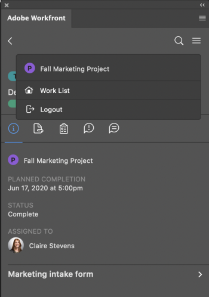

# Upload proofs from Adobe Photoshop {#upload-proofs-from-adobe-photoshop}

You can upload your art boards as proofs directly to *`Adobe Workfront`* for a thorough review and approval.

## Access requirements {#access-requirements}

You must have the following access to perform the steps in this article:

<table style="width: 100%;margin-left: 0;margin-right: auto;mc-table-style: url('../../Resources/TableStyles/TableStyle-List-options-in-steps.css');" class="TableStyle-TableStyle-List-options-in-steps" cellspacing="0"> 
 <col class="TableStyle-TableStyle-List-options-in-steps-Column-Column1"> 
 <col class="TableStyle-TableStyle-List-options-in-steps-Column-Column2"> 
 <tbody> 
  <tr class="TableStyle-TableStyle-List-options-in-steps-Body-LightGray"> 
   <td class="TableStyle-TableStyle-List-options-in-steps-BodyE-Column1-LightGray" role="rowheader">Adobe Workfront plan*</td> 
   <td class="TableStyle-TableStyle-List-options-in-steps-BodyD-Column2-LightGray"> 
Current plan: Pro or Higher
 
or
 
Legacy plan: Premium
 
For more information about proofing access with the different plans, see <a href="access-to-proofing-functionality.md" class="MCXref xref">Access to proofing functionality in Workfront</a>.
 </td> 
  </tr> 
  <tr class="TableStyle-TableStyle-List-options-in-steps-Body-MediumGray"> 
   <td class="TableStyle-TableStyle-List-options-in-steps-BodyE-Column1-MediumGray" role="rowheader">Adobe Workfront license*</td> 
   <td class="TableStyle-TableStyle-List-options-in-steps-BodyD-Column2-MediumGray"> 
Current plan: Work or Proof
 
Legacy plan: Any (You must have proofing enabled for the user)
 </td> 
  </tr> 
  <tr class="TableStyle-TableStyle-List-options-in-steps-Body-LightGray"> 
   <td class="TableStyle-TableStyle-List-options-in-steps-BodyE-Column1-LightGray" role="rowheader">Product</td> 
   <td class="TableStyle-TableStyle-List-options-in-steps-BodyD-Column2-LightGray">You must have an Adobe Creative Cloud license in addition to a Workfront license.</td> 
  </tr> 
  <tr class="TableStyle-TableStyle-List-options-in-steps-Body-MediumGray"> 
   <td class="TableStyle-TableStyle-List-options-in-steps-BodyE-Column1-MediumGray" role="rowheader">Proof Permission Profile </td> 
   <td class="TableStyle-TableStyle-List-options-in-steps-BodyD-Column2-MediumGray">Manager or higher</td> 
  </tr> 
  <tr class="TableStyle-TableStyle-List-options-in-steps-Body-LightGray"> 
   <td class="TableStyle-TableStyle-List-options-in-steps-BodyB-Column1-LightGray" role="rowheader">Object permissions</td> 
   <td class="TableStyle-TableStyle-List-options-in-steps-BodyA-Column2-LightGray"> 
Edit access to Documents
 
For information on requesting additional access, see <a href="request-access.md" class="MCXref xref">Request access to objects in Adobe Workfront</a>.
 </td> 
  </tr> 
 </tbody> 
</table>

&#42;To find out what plan, role, or *`Proof Permission Profile`* you have, contact your *`Workfront`* or *`Workfront Proof administrator`*.

## Prerequisites {#prerequisites}

*  You must install the *`Workfront`* for Adobe Photoshop plugin before you can upload *`proofs`* from Adobe Photoshop.

  For instructions, see [Install Workfront for Adobe Photoshop](wf-cc-install.md).

## Upload a *`Proof`* {#upload-a-proof}

1.  Click the `Menu` icon in the top-right corner, then select `Work List`. You can also use the menu to navigate to parent objects.

      

1. Go to the work item where you want to upload a proof.
1. Click the `Document` icon  in the navigation bar. 

1. Click `New File` near the bottom of the plugin.
1. Choose the `Asset Type` from the drop-down menu.  

1. In the **Proof Approvals** section, click `Add Approvers`, then type the names of the users you want to tag for approval from the `Approvers` drop-down menu that appears.  
   Or  
   Click `Select Proof workflow`, then select the workflow from the `Workflow Template` drop-down menu that appears.

1.  (Optional) Type a comment in the `Updates` area.
1.  Click `Upload`.  
   The document appears in the Documents area in the plugin and the desktop app.

## Upload a new proof version {#upload-a-new-proof-version}

You can upload a new version of a proof. The plugin remembers the proofing workflow set on the previous version, but you can change this if you wish. 

1.  Click the `Menu` icon in the top-right corner, then select `Work List`. You can also use the menu to navigate to parent objects.

      

1. Go to the work item you need to upload a document to.
1. Click the `Document` icon in the navigation bar. 

1. Click `New Version` near the bottom of the plugin.
1. Choose the `Asset Type` from the drop-down menu.  

1. In the `Proof Approvals` section, click `Add Approvers`, then select the users you want to tag for approval from the `Approvers` drop-down menu that appears.  
   Or  
   Click `Select Proof workflow`, then select the workflow from the `Workflow Template` drop-down menu that appears.

1.  (Optional) Type a comment in the `Updates` area.
1. Click `Upload`.  
   The document appears in the Documents area in the plugin and the desktop app.

