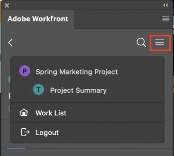

# View work item information in Adobe Photoshop

You can see information about projects, tasks, issues, and documents from Adobe Photoshop.

## Access requirements

You must have the following access to perform the steps in this article:

<table cellspacing="0"> 
 <col> 
 </col> 
 <col> 
 </col> 
 <tbody> 
  <tr> 
   <td role="rowheader">Adobe Workfront plan*</td> 
   <td> 
Pro or higher
 </td> 
  </tr> Adobe Workfront license* Work or Plan 
  <tr> 
   <td role="rowheader">Product</td> 
   <td>You must have an Adobe Creative Cloud license in addition to a Workfront license.</td> 
  </tr> 
  <tr> 
   <td role="rowheader">Access level configurations*</td> 
   <td> 
View access to Projects, Tasks, or Issues
 
Note: If you still don't have access, ask your Workfront administrator if they set additional restrictions in your access level. For information on how a Workfront administrator can modify your access level, see <a href="../../administration-and-setup/add-users/configure-and-grant-access/create-modify-access-levels.md" class="MCXref xref">Create or modify custom access levels</a>.
 </td> 
  </tr> 
  <tr> 
   <td role="rowheader">Object permissions</td> 
   <td> 
View access to the object you want to view. 
 
For information on requesting additional access, see <a href="../../workfront-basics/grant-and-request-access-to-objects/request-access.md" class="MCXref xref">Request access to objects in Adobe Workfront</a>.
 </td> 
  </tr> 
 </tbody> 
</table>

&#42;To find out what plan, license type, or access you have, contact your Workfront administrator.

## Prerequisites

* You must install the Workfront for Adobe Photoshop plugin before you can mark work items complete in Adobe Photoshop.

  For instructions, see [Install Workfront for Adobe Photoshop](../../workfront-integrations-and-apps/adobe-workfront-for-creative-cloud/wf-cc-install.md).

## View details and custom form data

<ol> 
 <li value="1"> 
Click the Menu icon in the top-right corner, then select Work List. You can also use the menu to navigate to parent objects.
 
    
 </li> 
 <li value="2"> 
Select the work item you want to view.
 <note type="tip">
   Use the 
   Menu icon to go to the parent objects of the work item.
    
  </note> </li> 
 <li value="3">Click the Details icon  in the navigation bar to view: 
  <ul>
   <li>Description</li>
   <li>Planned Completion Date</li>
   <li>Status </li>
   <li>Assigned to</li>
   <li>Project Owner (Projects only)</li>
   <li>Custom form data</li>
  </ul></li> 
</ol>

## View Document Details

<ol> 
 <li value="1"> 
Click the Menu icon in the top-right corner, then select Work List. You can also use the menu to navigate to parent objects.
 
    
 </li> 
 <li value="2"> 
Select the work item you want to view.
 <note type="tip">
   Use the 
   Menu icon to go to the parent objects of the work item.
    
  </note> </li> 
 <li value="3">Click the Document icon  in the navigation bar, then double-click on a document to view: 
  <ul>
   <li>Description</li>
   <li>File Type</li>
   <li>Proof Status (only available for proofs)</li>
   <li>Version</li>
   <li>Size</li>
   <li>Custom Form data</li>
  </ul></li> 
</ol>

## View subtasks and issues

<ol> 
 <li value="1"> 
Click the Menu icon in the top-right corner, then select Work List. You can also use the menu to navigate to parent objects.
 
    
 </li> 
 <li value="2"> 
 
Select the work item you want to view.
 <note type="tip">
    Use the 
    Menu icon to go to the parent objects of the work item.
     
   </note> 
 </li> 
 <li value="3">Click the Issue icon  or Subtask icon . </li> 
 <li value="4">Select the task or issue, then click the Details icon  in the navigation bar to view:
  <ul>
   <li>Planned Completion Date</li>
   <li>Status </li>
   <li>Assigned to</li>
   <li>Custom Form data</li>
  </ul></li> 
</ol>

