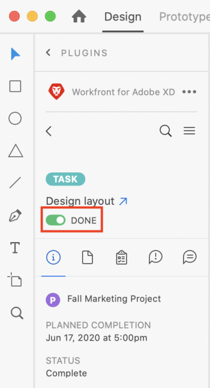

# Mark work items complete in Adobe XD

You can stay in Adobe XD and seamlessly complete your work in `Adobe Workfront`.

## Access requirements

You must have the following access to perform the steps in this article:

<table cellspacing="0"> 
 <col> 
 <col> 
 <tbody> 
  <tr> 
   <td role="rowheader">Adobe Workfront plan*</td> 
   <td> 
Pro or higher
 </td> 
  </tr> Adobe Workfront license* Work or higher 
  <tr> 
   <td role="rowheader">Product</td> 
   <td>You must have an Adobe Creative Cloud license in addition to a Workfront license.</td> 
  </tr> 
  <tr> 
   <td role="rowheader">Object permissions</td> 
   <td> 
Edit access to the object you want to complete.
 
For information on requesting additional access, see <a href="../../workfront-basics/grant-and-request-access-to-objects/request-access.md" class="MCXref xref">Request access to objects in Adobe Workfront</a>.
 </td> 
  </tr> 
 </tbody> 
</table>

&#42;To find out what plan, license type, or access you have, contact your `Workfront administrator`.

## Prerequisites

* You must install the `Workfront` for Adobe XD plugin before you can mark work items complete in Adobe XD.

  For instructions, see [Install Workfront for Adobe XD](../../workfront-integrations-and-apps/adobe-workfront-for-xd/wf-adobe-xd-install.md).

To complete a work item:

<ol> 
 <li value="1"> 
Click the Menu icon in the top-right corner, then select Work List. You can also use the menu to navigate to parent objects. 
 
    
 </li> 
 <li value="2">From the Work List, select the task or issue you wish to mark complete. </li> 
 <li value="3">Click Done. This marks the item complete in Workfront. </li> 
</ol>

