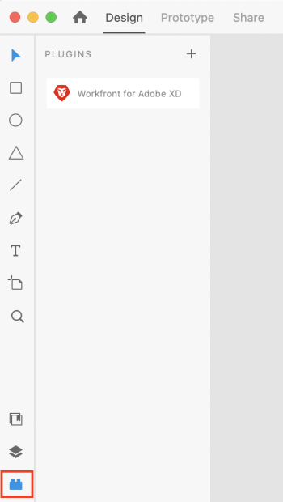

# Install *`Workfront`* for Adobe XD {#install-workfront-for-adobe-xd}

You can install the *`Workfront`* for Adobe XD plugin from the Adobe Marketplace.

## Access requirements {#access-requirements}

You must have the following access to perform the steps in this article:

<table style="width: 100%;margin-left: 0;margin-right: auto;mc-table-style: url('../../Resources/TableStyles/TableStyle-List-options-in-steps.css');" class="TableStyle-TableStyle-List-options-in-steps" cellspacing="0"> 
 <col class="TableStyle-TableStyle-List-options-in-steps-Column-Column1"> 
 </col> 
 <col class="TableStyle-TableStyle-List-options-in-steps-Column-Column2"> 
 </col> 
 <tbody> 
  <tr class="TableStyle-TableStyle-List-options-in-steps-Body-LightGray"> 
   <td class="TableStyle-TableStyle-List-options-in-steps-BodyE-Column1-LightGray" role="rowheader">Adobe Workfront plan*</td> 
   <td class="TableStyle-TableStyle-List-options-in-steps-BodyD-Column2-LightGray"> 
Pro or higher
 </td> 
  </tr> 
  <tr class="TableStyle-TableStyle-List-options-in-steps-Body-MediumGray" data-mc-conditions=""> 
   <td class="TableStyle-TableStyle-List-options-in-steps-BodyE-Column1-MediumGray" role="rowheader">Adobe Workfront license*</td> 
   <td class="TableStyle-TableStyle-List-options-in-steps-BodyD-Column2-MediumGray"> 
Work or Plan
 </td> 
  </tr> 
  <tr class="TableStyle-TableStyle-List-options-in-steps-Body-LightGray"> 
   <td class="TableStyle-TableStyle-List-options-in-steps-BodyB-Column1-LightGray" role="rowheader">Product</td> 
   <td class="TableStyle-TableStyle-List-options-in-steps-BodyA-Column2-LightGray">You must have an Adobe Creative Cloud license in addition to a Workfront license.</td> 
  </tr> 
 </tbody> 
</table>

&#42;To find out what plan, license type, or access you have, contact your *`Workfront administrator`*.

## Prerequisites {#prerequisites}

*  You must install the Adobe XD app before installing the *`Workfront`* plugin.

To install the *`Workfront`* for Adobe XD plugin:

1.  Open the Adobe Creative Cloud app.
1.  Click the `Marketplace`tab near the top of the window.
1.  In the `Search All Plugins` box, type *Workfront*, then press `Enter`.

   

1.  When *`Workfront`* for Adobe XD plugin appears in the search results, click `Get`.
1.  Read the information in the dialog box, then click `OK`.
1.  Once the plugin in installed, open Adobe XD and locate the *`Workfront`* plugin in the plugin window.

   

1.  Continue to the following section for information on how to log in to the plugin.

## Log In to Workfront for Adobe XD {#log-in-to-workfront-for-adobe-xd}

1. Ensure the Plugin panel is open, then click ` *`Workfront`* for Adobe XD`.
1.  Enter your domain, then click `Log in`. A browser page opens.

   >[!TIP] {type="tip"}
   >
   >To find your domain, open a browser, navigate to your *`Workfront`* instance, and copy the first part of the URL:  
   >   >
   >

1.  In the browser, enter your *`Workfront`* credentials, then click `Log in`. If your company uses a single sign-on (SSO), you'll be directed to your SSO provider's page to log in. 

   >[!NOTE]
   >
   >You may not be prompted to enter your *`Workfront`* credentials if you logged in recently.

1. Click `Allow Access` to finish logging in, and go back to Adobe XD to see your work.

&nbsp; 