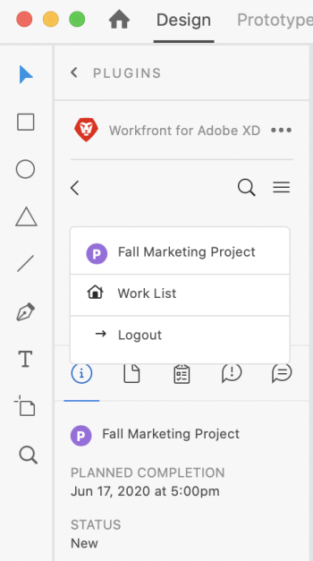
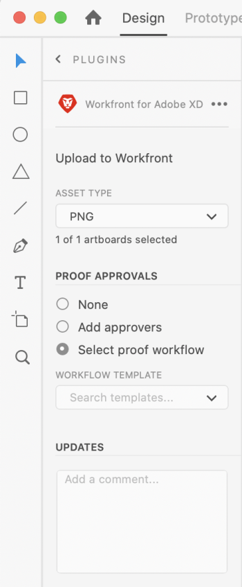
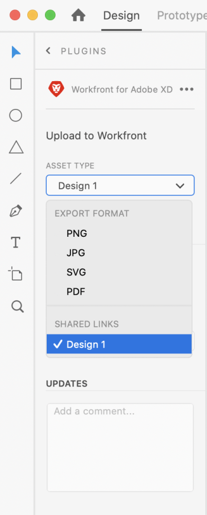

# Upload XD art boards as proofs to Workfront

You can upload your art boards as proofs directly to Adobe Workfront for a thorough review and approval.

## Access requirements

You must have the following access to perform the steps in this article:

<table cellspacing="0"> 
 <col> 
 <col> 
 <tbody> 
  <tr> 
   <td role="rowheader">Adobe Workfront plan*</td> 
   <td> 
Current plan: Pro or Higher
 
or
 
Legacy plan: Premium
 
For more information about proofing access with the different plans, see <a href="../../administration-and-setup/manage-workfront/configure-proofing/access-to-proofing-functionality.md" class="MCXref xref">Access to proofing functionality in Workfront</a>.
 </td> 
  </tr> 
  <tr> 
   <td role="rowheader">Adobe Workfront license*</td> 
   <td> 
Current plan: Work or Proof
 
Legacy plan: Any (You must have proofing enabled for the user)
 </td> 
  </tr> 
  <tr> 
   <td role="rowheader">Product</td> 
   <td>You must have an Adobe Creative Cloud license in addition to a Workfront license.</td> 
  </tr> 
  <tr> 
   <td role="rowheader">Proof Permission Profile </td> 
   <td>Manager or higher</td> 
  </tr> 
  <tr> 
   <td role="rowheader">Object permissions</td> 
   <td> 
Edit access to Documents
 
For information on requesting additional access, see <a href="../../workfront-basics/grant-and-request-access-to-objects/request-access.md" class="MCXref xref">Request access to objects in Adobe Workfront</a>.
 </td> 
  </tr> 
 </tbody> 
</table>

&#42;To find out what plan, role, or Proof Permission Profile you have, contact your Workfront or Workfront Proof administrator.

## Prerequisites

* You must install the Workfront for Adobe XD plugin before you can upload proofs in Adobe XD.

  For instructions, see [Install Workfront for Adobe XD](../../workfront-integrations-and-apps/adobe-workfront-for-xd/wf-adobe-xd-install.md).

## Upload a static Proof

1. Click the `Menu` icon in the top-right corner, then select `Work List`. You can also use the menu to navigate to parent objects.

   

1. Go to the work item where you want to upload a static proof.
1. Click the `Document` icon  in the navigation bar. 

1. Click `New File` near the bottom of the plugin.
1. Select the art boards you wish to upload.

   >[!TIP]
   >
   >To select more than one art board, click and drag the mouse over the art boards you want.

1. Choose the `Asset Type` from the drop-down menu.  

   <table cellspacing="0">
    <col>
    <col>
    <tbody>
     <tr>
      <td colspan="2" role="rowheader">Export Format</td>
     </tr>
     <tr>
      <td role="rowheader">.png</td>
      <td>The art board upoads as a .png to the work item's Documents tab in WorkfrontWork. </td>
     </tr>
     <tr>
      <td role="rowheader">.jpg</td>
      <td>The art board uploads as a .jpg to the work item's Documents tab in Workfront.  </td>
     </tr>
     <tr>
      <td role="rowheader">.svg</td>
      <td>The art board uploads as a .svg to the work item's Documents tab in Workfront. </td>
     </tr>
     <tr>
      <td role="rowheader">.pdf</td>
      <td>The art board uploads as a .pdf to the work item's Documents tab in Workfront.</td>
     </tr>
    </tbody>
   </table>

1. In the **Proof Approvals** section, click `Add Approvers`, then type the names of the users you want to tag for approval from the `Approvers` drop-down menu that appears.  
   Or  
   Click `Select Proof workflow`, then select the workflow from the `Workflow Template` drop-down menu that appears.

1. (Optional) Type a comment in the `Updates` area.

   

1. Click `Upload`.  
   The document appears in the Documents area in the plugin and the desktop app.

## Upload an interactive proof

You can create an interactive proof for your art boards with the Workfront for Adobe plugin. It is a 2-step process. First you need to create an interactive link, then you need to upload the proof to a work item.

### Create an interactive link for your art board

1. Open your art board, then click `Share` in the top-left area of the screen.
1. Specify the link settings:

  1. Name the link.
  1. Choose a view setting.
  1. In the `Link Access` section, ensure `Anyone with this link` is selected.

     You must enable this type of access in order to generate an interactive proof. 
  
  1. Click `Create Link`.

1. Click back to `Design` in the top-left area of the screen. Continue to the [Upload an interactive proof](#upload) section below.

   >[!NOTE]
   >
   >You may need to reopen the plugin panel in the bottom-left corner of the screen.

### Upload an interactive proof

1. Click the `Menu` icon in the top-right corner, then select `Work List`. You can also use the menu to navigate to parent objects.

   

1. Go to the work item where you want to upload an interactive proof.
1. Click the `Document` icon  in the navigation bar. 

1. Click `New File` near the bottom of the plugin.
1. In the `Asset Type`drop-down menu, choose the link you just created under the `Shared links`.  
   

1. In the `Proof Approvals` section, click `Add Approvers`, then select the users you want to tag for approval from the `Approvers` drop-down menu that appears.  
   Or  
   Click `Select Proof workflow`, then select the workflow from the `Workflow Template` drop-down menu that appears.

1. (Optional) Type a comment in the `Updates` area.
1. Click `Upload`.

   The document appears in the Documents area in the plugin and the desktop app.

   >[!IMPORTANT]
   >
   >Users must have access to the Desktop Proofing Viewer to review and approve interactive proofs. For more information, see [Install the Desktop Proofing Viewer with Automatic Updates](../../review-and-approve-work/proofing/use-the-desktop-proofing-viewer/installing-desktop-proofing-viewer.md).

## Upload a new proof version

You can upload a new version of a proof. The plugin remembers the proofing workflow set on the previous version, but you can change this if you wish.

1. Click the `Menu` icon in the top-right corner, then select `Work List`. You can also use the menu to navigate to parent objects.

   

1. Go to the work item you need to upload a document to.
1. Click the `Document` icon in the navigation bar. 

1. Click `New Version` near the bottom of the plugin.
1. Select the art boards you wish to upload.

   >[!NOTE]
   >
   >If you want to upload a new version of an .svg, .png, or .jpg, you can upload only one art board.

1. Choose the `Asset Type` from the drop-down menu.  

   | Export Format |
   |---|
   | .png |The art board uploads as a .png to the work item's Documents tab in Workfront.  |
   | .jpg |The art board uploads as a .jpg to the work item's Documents tab in Workfront.  |
   | .svg |The art board uploads as a .svg to the work item's Documents tab in Workfront.  |
   | .pdf |The art board uploads as a .pdf to the work item's Documents tab in Workfront.  |
   | Shared links |Proofs with shared links uploaded to Workfront don't technically need to have a new version uploaded. Because they are interactive, the link is always up to date with the most recent changes. However, you can still upload a new version if you want to capture that it is a new iteration of the asset ready for another round of review and approval. |

1. In the `Proof Approvals` section, click `Add Approvers`, then select the users you want to tag for approval from the `Approvers` drop-down menu that appears.  
   Or  
   Click `Select Proof workflow`, then select the workflow from the `Workflow Template` drop-down menu that appears.

1. (Optional) Type a comment in the `Updates` area.

   

1. Click `Upload`.  
   The document appears in the Documents area in the plugin and the desktop app.

