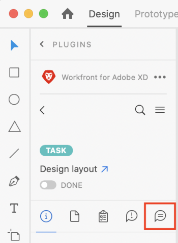

# Update your work in Adobe XD

You can update your work in the following areas:

<table> 
 <col> 
 <col> 
 <tbody> 
  <tr> 
   <td> 
    <ul> 
     <li>Projects</li> 
     <li>Tasks</li> 
     <li>Subtasks</li> 
    </ul> </td> 
   <td> 
    <ul> 
     <li>Issues</li> 
     <li>Documents</li> 
    </ul> </td> 
  </tr> 
 </tbody> 
</table>

## Access requirements

You must have the following access to perform the steps in this article:

<table cellspacing="0"> 
 <col> 
 </col> 
 <col> 
 </col> 
 <tbody> 
  <tr> 
   <td role="rowheader">Adobe Workfront plan*</td> 
   <td> 
Pro or higher
 </td> 
  </tr> Adobe Workfront license* Work or Plan 
  <tr> 
   <td role="rowheader">Product</td> 
   <td>You must have an Adobe Creative Cloud license in addition to a Workfront license.</td> 
  </tr> 
  <tr> 
   <td role="rowheader">Object permissions</td> 
   <td> 
View access to the object you want to update. 
 
For information on requesting additional access, see <a href="../../workfront-basics/grant-and-request-access-to-objects/request-access.md" class="MCXref xref">Request access to objects in Adobe Workfront</a>.
 </td> 
  </tr> 
 </tbody> 
</table>

&#42;To find out what plan, license type, or access you have, contact your Workfront administrator.

## Prerequisites

* You must install the Workfront for Adobe XD plugin before you can update your work in Adobe XD.

  For instructions, see [Install Workfront for Adobe XD](../../workfront-integrations-and-apps/adobe-workfront-for-xd/wf-adobe-xd-install.md).

## Post an update

<ol> 
 <li value="1"> 
Click the Menu icon in the top-right corner, then select Work List. You can also use the menu to navigate to parent objects. 
 
    
 </li> 
 <li value="2">From the Work List, select the work item you need to post an update to.</li> 
 <li value="3">Click the Update icon in the navigation bar.  </li> 
 <li value="4">Click New Update.</li> 
 <li value="5">Type your update.</li> 
 <li value="6">(Optional) To tag a user, type the @ symbol and the user's name, then choose their name from the drop-down menu.</li> 
 <li value="7">Click Submit. Updates are synced with the Adobe Workfront web application in real time.</li> 
</ol>

