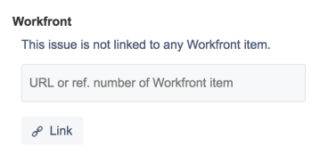
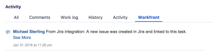
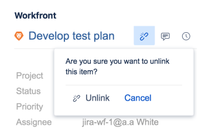

# Link items between *Adobe Workfront* and Jira

You can link Jira issues to *Adobe Workfront* tasks or issues either automatically or manually.&nbsp;

Only one item in *Workfront* can be linked to one item in Jira. You can never link one *Workfront* item to multiple Jira issues, nor one Jira issue to multiple *Workfront* items.

## Access requirements

You must have the following:

<table cellspacing="0"> 
 <col> 
 <col> 
 <tbody> 
  <tr> 
   <td role="rowheader"><a href="https://www.workfront.com/plans" target="_blank"><em>Adobe Workfront</em> plan</a>*</td> 
   <td> 
Pro or higher
 </td> 
  </tr> 
  <tr> 
   <td role="rowheader"><a href="../../administration-and-setup/add-users/access-levels-and-object-permissions/wf-licenses.md" class="MCXref xref">Adobe Workfront licenses overview</a>*</td> 
   <td> 
Plan
 </td> 
  </tr> 
  <tr> 
   <td role="rowheader">Jira access</td> 
   <td> 
System administrator access
 
Important:  We recommend that you create separate system administrator accounts in Jira and <em>Workfront</em> to dedicate to this integration, rather than using existing ones that might be attached to users.
 </td> 
  </tr> 
  <tr> 
   <td role="rowheader">Access level configurations*</td> 
   <td> 
You must be a <em>Workfront administrator</em>. For information on <em>Workfront administrators</em>, see <a href="../../administration-and-setup/add-users/configure-and-grant-access/grant-a-user-full-administrative-access.md" class="MCXref xref">Grant a user full administrative access</a>.
 
Note: If you still don't have access, ask your <em>Workfront administrator</em> if they set additional restrictions in your access level. For information on how a <em>Workfront administrator</em> can modify your access level, see <a href="../../administration-and-setup/add-users/configure-and-grant-access/create-modify-access-levels.md" class="MCXref xref">Create or modify custom access levels</a>.
 </td> 
  </tr> 
 </tbody> 
</table>

&#42;To find out what plan, license type, or access you have, contact your *Workfront administrator*.

## Prerequisites

Before you can link items between *Workfront* and Jira, you must

* Install *Workfront* for Jira

  For instructions on installing *Workfront* for Jira, see [Install Adobe Workfront for Jira](../../workfront-integrations-and-apps/use-workfront-with-jira/install-workfront-for-jira.md).

* Configure *Workfront* for Jira

  For instructions on configuring *Workfront* for Jira, see [Configure Adobe Workfront for Jira](../../workfront-integrations-and-apps/use-workfront-with-jira/configure-workfront-for-jira.md).

## Automatically link *Workfront* items to Jira issues

As a *Workfront administrator*, you can define triggers that can automatically create an issue in Jira every time certain conditions are met on a task or an issue in *Workfront*. The *Workfront* and Jira items become linked.

After you have completed the configuration of *Workfront* for Jira, when an item is either created or updated in *Workfront* to match your triggers, a new item is automatically created in Jira.   
*Workfront* users that create and update *Workfront* items do not need a Jira license to trigger the creation of items in Jira.

For more information about defining triggers for creating Jira issues automatically, see&nbsp; [Configure Adobe Workfront for Jira](../../workfront-integrations-and-apps/use-workfront-with-jira/configure-workfront-for-jira.md).

>[!NOTE]
>
>You can create Jira items automatically by attaching a template to a project. If the template contains tasks with assignments&nbsp;that meet the Jira triggers, the new tasks generate new Jira issues.&nbsp;

Automatically linking a *Workfront* issue to a Jira issue is identical to automatically linking a *Workfront* task to a Jira issue.

To automatically link a *Workfront* task to a Jira issue:

<ol> 
 <li value="1"> 
Ensure that your Jira system administrator has configured triggers for automatically creating Jira issues when <em>Workfront</em> items are assigned, then log in to <em>Workfront</em> with an access level that allows you to create a task. 
 
For more information about access to tasks, see <a href="../../administration-and-setup/add-users/configure-and-grant-access/grant-access-tasks.md" class="MCXref xref">Grant access to tasks</a>.
 </li> 
 <li value="2">Go to a project and select <draft-comment>
   <MadCap:conditionalText data-mc-conditions="QuicksilverOrClassic.Quicksilver">
    Tasks 
     in the left panel
   </MadCap:conditionalText>
  </draft-comment><MadCap:conditionalText data-mc-conditions="QuicksilverOrClassic.Quicksilver">
   Tasks 
    in the left panel
  </MadCap:conditionalText>. </li> 
 <li value="3"> 
Click New Task
 
Or
 
Select an existing task, then click Edit.&nbsp;
 </li> 
 <li value="4">Specify or update any of the fields available for the task.&nbsp;</li> 
 <li value="5">Click Assignments and assign the task to a user, role, or team which is specified as a trigger in the Jira integration. </li> 
 <li value="6"> 
Click Save Changes. 
 
A new task is created in <em>Workfront</em>.  
 
In the Updates <draft-comment>
    <MadCap:conditionalText data-mc-conditions="QuicksilverOrClassic.Quicksilver">
     area
    </MadCap:conditionalText>
   </draft-comment><MadCap:conditionalText data-mc-conditions="QuicksilverOrClassic.Quicksilver">
    area
   </MadCap:conditionalText> of the new task, there is a comment to indicate that a new issue has also been created in Jira. 
 
    
 </li> 
 <li value="7"> 
(Optional) Click the link to the Jira issue to open it in Jira.
 
Or
 
In the Integrations area on the Details panel of the task, click the Go to Jira link to open the Jira issue.
 
Any Jira user can immediately start working on items automatically created from <em>Workfront</em> and their updates will transfer to <em>Workfront</em> without needing a license for <em>Workfront</em> to do so.
 
Only the fields that you as a <em>Workfront administrator</em> configured during the setup of the <em>Workfront</em> add-on are updated.
 
For more information about synchronizing fields between <em>Workfront</em> and Jira, see the&nbsp;<a href="../../workfront-integrations-and-apps/use-workfront-with-jira/configure-workfront-for-jira.md#configuring-the-add-on-for-jira" class="MCXref xref">Configure Workfront for Jira</a>&nbsp;section in&nbsp;<a href="../../workfront-integrations-and-apps/use-workfront-with-jira/configure-workfront-for-jira.md" class="MCXref xref">Configure Adobe Workfront for Jira</a>.
 <note type="note">
   The Jira issue is not assigned to anyone in Jira when it is automatically created from 
   <em>Workfront</em>.
    
  </note> </li> 
</ol>

## Manually link Jira issues to *Workfront* items

After items have been created in Jira and *Workfront*, independent of each other, you can manually link a Jira issue to an existing *Workfront* task or issue.  
You cannot manually link a *Workfront* item from *Workfront* to an existing Jira item.&nbsp;

>[!NOTE]
>
>If the Jira issue is not on a project which is not identified as a trigger in the *Workfront* Integration you cannot manually link it to a *Workfront* item when using the integration with Jira On-Premise.&nbsp;&nbsp;  
>For more information about setting up triggers for the *Workfront* to Jira workflow, see [Automatically link Workfront items to Jira issues](#automatically-linking).

When *Workfront* and Jira items are linked, certain fields from one item can be automatically updated on the other.  
For more information about updating linked items, see [Update linked items between Jira and Adobe Workfront](../../workfront-integrations-and-apps/use-workfront-with-jira/update-linked-items-between-jira-wf.md).

To manually link Jira issues to *Workfront* items:

<ol> 
 <li value="1">(Conditional) Log in to <em>Workfront</em> and find an issue or a task that you want to link to Jira issue.&nbsp;</li> 
 <li value="2">(Conditional) From the address bar of the item, copy the URL of the item in <em>Workfront</em>. Or</li> 
 <li value="3"> 
From the Details <draft-comment>
    <MadCap:conditionalText data-mc-conditions="QuicksilverOrClassic.Quicksilver">
     area 
     
    </MadCap:conditionalText>
   </draft-comment><MadCap:conditionalText data-mc-conditions="QuicksilverOrClassic.Quicksilver">
    area 
    
   </MadCap:conditionalText>, copy the Reference Number of the item in <em>Workfront</em>.&nbsp;
 <note type="note">
    You must have a 
   <em>Workfront</em> license to log in to 
   <em>Workfront</em>. Otherwise, a 
   <em>Workfront</em> user must supply this information to you.&nbsp;
  </note> </li> 
 <li value="4">In Jira, navigate to an issue that you want to manually link to the <em>Workfront</em> item.</li> 
 <li value="5">In the <em>Workfront</em> right panel, paste the URL or the Reference Number of the <em>Workfront</em> item which you want to link to it. </li> 
 <li value="6"> 
Click Link.
 
The two items become linked and the <em>Workfront</em> right panel is populated with information from the <em>Workfront</em> item.
 
The following <em>Workfront</em> fields are visible in Jira, by default, in the <em>Workfront</em> right panel:
 
  <ul> 
   <li>The Name of the item: You can access the <em>Workfront</em> item by clicking the name in the panel.&nbsp;</li> 
   <li>Project Name </li> 
   <li>The Status of the item</li> 
   <li>The Priority of the item</li> 
   <li>The date on which it was created in <em>Workfront</em></li> 
   <li>The Planned Hours of the item</li> 
   <li>The Reference Number: You can access the <em>Workfront</em> item by clicking the Reference Number in the panel.</li> 
  </ul> </li> 
</ol>

For more information about enabling additional fields to display in the right panel, see [Configure field synchronization between Jira and Workfront Items](../../workfront-integrations-and-apps/use-workfront-with-jira/configure-workfront-for-jira.md#setting-up-field-synchronization) section in [Configure Adobe Workfront for Jira](../../workfront-integrations-and-apps/use-workfront-with-jira/configure-workfront-for-jira.md). A comment from the *Workfront administrator* associated with the integration is posted in the `*Workfront*` tab of the Jira issue to confirm that a new Jira item has been created. The comment contains a link to the Jira issue.

## Unlink items between Jira and *Workfront*

Linked items between Jira and *Workfront* can be manually unlinked from Jira.  
You cannot unlink a *Workfront* item from their Jira counterpart in *Workfront*.&nbsp;

You need the following access to unlink manually linked item:

* You are the user who manually linked the items
* You are the Jira system administrator

Only a *Workfront administrator* can unlink items that were automatically linked.&nbsp;

To unlink a Jira issue from a *Workfront* item:

<ol> 
 <li value="1">In Jira, navigate to an issue which is linked to a <em>Workfront</em> task or issue.</li> 
 <li value="2">Go to the <em>Workfront</em> right panel, and click the Unlink icon, then click Unlink.  The previously linked Jira and <em>Workfront</em> items are now unlinked. Any fields, comments, or documents that might be updated on them individually in the future are not updated on their previous counterpart in the other application.&nbsp;</li> 
</ol>

