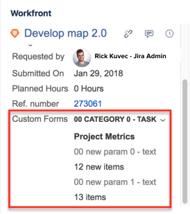
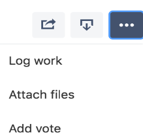

# Update linked items between Jira and *Adobe Workfront*

When you link Jira issues to *Adobe Workfront* tasks or issues, your users can update items in one application and the counterpart of that item also updates for the users working in the second application.&nbsp;

For more information about linking items between *Workfront* and Jira, see [Link items between Adobe Workfront and Jira](../../workfront-integrations-and-apps/use-workfront-with-jira/link-items-between-wf-jira.md).

As you are setting up *Workfront* for Jira, as a Jira system administrator, you can configure certain fields from one application to synchronize with fields from linked items in the other application.

For more information about synchronizing fields between linked Jira and *Workfront* items, see [Configure Adobe Workfront for Jira](../../workfront-integrations-and-apps/use-workfront-with-jira/configure-workfront-for-jira.md).

## Access requirements

You must have the following:

<table cellspacing="0"> 
 <col> 
 </col> 
 <col> 
 </col> 
 <tbody> 
  <tr> 
   <td role="rowheader"><a href="https://www.workfront.com/plans" target="_blank"><em>Adobe Workfront</em> plan</a>*</td> 
   <td> 
Pro or higher
 </td> 
  </tr> 
  <tr> 
   <td role="rowheader"><a href="../../administration-and-setup/add-users/access-levels-and-object-permissions/wf-licenses.md" class="MCXref xref">Adobe Workfront licenses overview</a>*</td> 
   <td> 
Plan
 </td> 
  </tr> 
  <tr> 
   <td role="rowheader">Jira access</td> 
   <td> 
System administrator access
 
Important:  We recommend that you create separate system administrator accounts in Jira and <em>Workfront</em> to dedicate to this integration, rather than using existing ones that might be attached to users.
 </td> 
  </tr> 
  <tr> 
   <td role="rowheader">Access level configurations*</td> 
   <td> 
You must be a <em>Workfront administrator</em>. For information on <em>Workfront administrators</em>, see <a href="../../administration-and-setup/add-users/configure-and-grant-access/grant-a-user-full-administrative-access.md" class="MCXref xref">Grant a user full administrative access</a>.
 
Note: If you still don't have access, ask your <em>Workfront administrator</em> if they set additional restrictions in your access level. For information on how a <em>Workfront administrator</em> can modify your access level, see <a href="../../administration-and-setup/add-users/configure-and-grant-access/create-modify-access-levels.md" class="MCXref xref">Create or modify custom access levels</a>.
 </td> 
  </tr> 
 </tbody> 
</table>

&#42;To find out what plan, license type, or access you have, contact your *Workfront administrator*.

## Prerequisites

Before you can link items between *Workfront* and Jira, you must

* Install *Workfront* for Jira.

  For instructions on installing *Workfront* for Jira, see [Install Adobe Workfront for Jira](../../workfront-integrations-and-apps/use-workfront-with-jira/install-workfront-for-jira.md).

* Configure *Workfront* for Jira.

  For instructions on configuring *Workfront* for Jira, see [Configure Adobe Workfront for Jira](../../workfront-integrations-and-apps/use-workfront-with-jira/configure-workfront-for-jira.md).

* Link items between Workfront and Jira.

  For instructions, see [Link items between Adobe Workfront and Jira](../../workfront-integrations-and-apps/use-workfront-with-jira/link-items-between-wf-jira.md).

## Update linked items in *Workfront*

If you work primarily in *Workfront*, you can update your work items in *Workfront* and their counterparts in Jira also update. This update happens through the integration of *Workfront* for Jira which does not require you to have a Jira license.&nbsp;

As long as your *Workfront administrator* has configured *Workfront* for Jira to synchronize the fields between linked items, certain fields that you update in *Workfront* also update for the linked Jira issue. For more information about updating items in *Workfront*, see [Edit issues](../../manage-work/issues/manage-issues/edit-issues.md) and [Edit tasks](../../manage-work/tasks/manage-tasks/edit-tasks.md).

The following list shows which *Workfront* fields synchronize with Jira fields on linked items:&nbsp;

<table cellspacing="15"> 
 <col> 
 <col> 
 <thead> 
  <tr> 
   <th>Updated <em>Workfront</em> field&nbsp; </th> 
   <th>Synchronized Jira field/ update </th> 
  </tr> 
 </thead> 
 <tbody> 
  <tr> 
   <td>Issue or Task name</td> 
   <td> 
Issue name
 
A comment about the Name change is added to the <em>Workfront</em> tab of the Jira issue.&nbsp;
 </td> 
  </tr> 
  <tr> 
   <td>Issue or Task Description</td> 
   <td> 
 Issue Description
 
A comment about the updated Description is added to the <em>Workfront</em> tab of the Jira issue. 
 </td> 
  </tr> 
  <tr> 
   <td> 
 Uploaded Documents
 
Note: Documents which are linked to <em>Workfront</em> items from an external server are not transferred&nbsp;to Jira issues. Only documents uploaded directly to <em>Workfront</em> items are also updated to the linked Jira issues.&nbsp;
 </td> 
   <td> 
 Attachments
 
A comment about the uploaded attachments is added to the <em>Workfront</em> tab of the Jira issue. 
 </td> 
  </tr> 
  <tr> 
   <td>Planned Completion Date</td> 
   <td> 
Due Date
 
A comment about the Due Date having changed is added to the <em>Workfront</em> tab of the Jira issue.&nbsp;
 
Note: You must enable Due Date for your Jira issues to be able to see this field updated in Jira.&nbsp;
 </td> 
  </tr> 
  <tr> 
   <td>Custom Forms and Custom Fields</td> 
   <td> 
 Display in the <em>Workfront</em> right panel of the Jira issue.  Only the Custom Fields that have an actual value display in the panel. 
 
Note: Custom Form sections are displayed with the access level of the <em>Workfront administrator</em>. 
 </td> 
  </tr> 
  <tr> 
   <td>Issue or Task Priority</td> 
   <td>Displays in the <em>Workfront</em> right panel of the Jira issue.  It does not update the issue Priority field in Jira.&nbsp;</td> 
  </tr> 
  <tr> 
   <td>Log time&nbsp;</td> 
   <td> 
A comment about the logged time is added in the <em>Workfront</em> tab of the Jira issue. This includes the name of the user who logs the time, as well as the user for whom the time is logged, in case they are different. No time is logged in the Work log tab in Jira. 
 </td> 
  </tr> 
  <tr> 
   <td>Comments</td> 
   <td> 
The comment is added to the <em>Workfront</em> tab of the Jira issue. It is not added to the Comments tab of the Jira issue
 
Note: When you link two existing items manually, the comments that were added to the <em>Workfront</em> item before linking it to Jira do not synchronize to the Jira issue.&nbsp;
 </td> 
  </tr> 
 </tbody> 
</table>

## Update linked items in Jira

If you work primarily in Jira, you can update your work items in Jira and their counterparts in *Workfront* also update. You do not have to have a *Workfront* license for the *Workfront* items linked to your Jira issues to receive the updates you are making in Jira.&nbsp;

On condition that your *Workfront administrator* has configured *Workfront* for Jira to synchronize the fields between linked items, certain fields which you update in Jira also update for the linked *Workfront* item.&nbsp;

The following list shows which Jira fields synchronize with *Workfront* fields on linked items:&nbsp;

<table cellspacing="15"> 
 <col> 
 <col> 
 <thead> 
  <tr> 
   <th>Updated Jira Field&nbsp; </th> 
   <th>Synchronized <em>Workfront</em> Field/ Update </th> 
  </tr> 
 </thead> 
 <tbody> 
  <tr> 
   <td>Issue Status</td> 
   <td> 
 Issue or Task Status
 
Issue status in Jira syncs with the following statuses, or statuses that equate with the following statuses, in Workfront:
 
    <ul> 
     <li> 
New (NEW)
 </li> 
     <li> 
In Progress (INP)
 </li> 
     <li> 
Closed/Complete (CLS/CPL)
 </li> 
    </ul> 
Note: The Jira status syncs with the first Workfront status that equates with the appropriate status.
 
For more information about statuses of items in <em>Workfront</em>, see <a href="../../administration-and-setup/customize-workfront/creating-custom-status-and-priority-labels/create-or-edit-a-status.md" class="MCXref xref">Create or edit a status</a>.
 </td> 
  </tr> 
  <tr> 
   <td>Issue Assignee</td> 
   <td> 
 Issue or Task Assignee
 
Important: When you assign an item in Jira to a user who does not have a <em>Workfront</em> account, the integration creates a new active user in <em>Workfront</em> only when the Automatically create a user in <em>Workfront</em> if the Jira user does not have a <em>Workfront</em> account is set to Always. This user does not occupy a <em>Workfront</em> license. Active users can be assigned to work items in <em>Workfront</em>, but cannot be included in updates. For more information about configuring the automatic creation of <em>Workfront</em> users from Jira, see <a href="../../workfront-integrations-and-apps/use-workfront-with-jira/configure-workfront-for-jira.md">Configuring <em>Workfront</em> for Jira</a>.
 </td> 
  </tr> 
  <tr> 
   <td>Issue Attachments</td> 
   <td> Issue or Task Documents A comment about uploading a new document in Jira is added to the Updates tab of the <em>Workfront</em> issue or task.&nbsp; </td> 
  </tr> 
  <tr> 
   <td>Due Date</td> 
   <td> 
 A comment about the change of the Due Date in Jira is added to the Updates tab of the <em>Workfront</em> issue or task.&nbsp;
 
Note: No dates change on the <em>Workfront</em> issue or task.&nbsp;
 </td> 
  </tr> 
  <tr> 
   <td> Log time in the <em>Workfront</em> right panel or from the More menu on the Jira issue </td> 
   <td> 
Hours In addition to adding the hours logged in Jira to the linked <em>Workfront</em> item, a comment about logging time is added to the Updates tab of the <em>Workfront</em> item.
 
For more information about logging time on linked Jira issues, including updating the Jira user who is logging the time in <em>Workfront</em>, see <a href="#logging-time-for-linked-jira-and-workfront-items" class="MCXref xref">Log time for Linked Jira and Workfront items</a>.
 </td> 
  </tr> 
  <tr> 
   <td> Comments&nbsp;  </td> 
   <td> 
Comments are added to the Updates tab of the <em>Workfront</em> issue or task if the Comments setting in the SYNCHRONIZE FROM JIRA TO WORKFRONT section of the Setup tab to Always.
 
For information about configuring <em>Workfront</em> settings in Jira, see <a href="../../workfront-integrations-and-apps/use-workfront-with-jira/configure-workfront-for-jira.md">Configuring <em>Workfront</em> for Jira</a>.
 
For information about commenting on items from linked Jira issues, see <a href="#commenting-from-linked-jira-issues" class="MCXref xref">Comment from a linked Jira issue</a>.
 </td> 
  </tr> 
 </tbody> 
</table>

## Log time from linked Jira issues

The time that you record for a Jira item in Jira will also transfer to the linked *Workfront*&nbsp;item, regardless of where in Jira you log the time.  
When you log time in Jira in the *Workfront* panel, the time is recorded only in *Workfront*.  
The time you record in *Workfront* does not affect the time of the linked issue in Jira.&nbsp;

>[!NOTE]
>
>If the time is added to a Jira item linked to a *Workfront* task, the Hour Type for the time in *Workfront* is Task Time. If the time is added to a Jira item linked to a *Workfront* issue, the Hour Type for the time in *Workfront* is Issue Time.

A comment is added to the `*Workfront*` tab in Jira and to the `Updates` tab of the item in *Workfront* to record logging the time.  
The time is also displayed in the `Hours` tab of the *Workfront* item.&nbsp;

* [Log time for Linked Jira and Workfront items](#logging-time-for-linked-jira-and-workfront-items)&nbsp;
* [Log time from Jira to a Workfront item](#logging-time-for-workfront-items-only)

### Log time for Linked Jira and *Workfront* items

You can log time from a Jira issue linked to a *Workfront* item, and the time is recorded both on the Jira issue as well as the *Workfront* item.&nbsp;

>[!IMPORTANT]
>
>If the user logging the time in Jira does not exist in *Workfront*, the integration creates a new active user in *Workfront* if the `Automatically create a user in`*Workfront* `if the Jira user does not have a`*Workfront* `account` is set to `Always`. This user does not occupy a *Workfront* license. You can assign active users to work items in *Workfront*, but you cannot include them in updates. For information about configuring the automatic creation of *Workfront* users from Jira, see [Configuring *Workfront* for Jira](../../workfront-integrations-and-apps/use-workfront-with-jira/configure-workfront-for-jira.md).

To log time for an item in Jira and have it recorded both in Jira and *Workfront*:

<ol> 
 <li value="1">Log into Jira.</li> 
 <li value="2">Go to the Jira issue which is linked to the <em>Workfront</em> item.</li> 
 <li value="3">Expand the More menu and click Log work.  </li> 
 <li value="4"> In the Time Spent field, specify the amount of time spent working on this issue. You must specify the time using the following time periods: 
  <ul>
   <li>Weeks (w)</li>
   <li>Days (d)</li>
   <li>Hours (h)</li>
  </ul></li> 
 <li value="5">Continue adding information to your time entry, including a Work Description, then click Log. The time is added to the Work log tab of the Jira item, as well as to the <em>Workfront</em> item linked to it. The work description of the time entry is recorded as a note on the hour entry in <em>Workfront</em>.&nbsp;</li> 
</ol>

### Log time from Jira to a *Workfront* item

You can log time just to the linked *Workfront* item from the Jira issue without recording this time to the Jira issue.&nbsp;

<ol> 
 <li value="1">Log into Jira.</li> 
 <li value="2"> 
Navigate to a Jira issue which is linked to a <em>Workfront</em> item. 
 
The details of the <em>Workfront</em> item should display in the <em>Workfront</em> right panel of the issue.
 </li> 
 <li value="3"> 
Click the Log Time icon. 
 
  
 </li> 
 <li value="4">Specify the amount of Hours and Minutes you want to log for the issue.</li> 
 <li value="5"> 
Click Log Time. 
 
The time is added to the <em>Workfront</em> item.
 
This time is not added to the Work Log tab of the Jira issue.&nbsp;
 </li> 
</ol>

## Comment from a linked Jira issue

When you comment on a Jira item from the *Workfront* right panel in Jira, the comment is also added to the Updates tab of the linked item in *Workfront*.&nbsp;

To comment from Jira to a *Workfront* item:

<ol> 
 <li value="1">Log into Jira.</li> 
 <li value="2"> 
Navigate to a Jira issue which is linked to a <em>Workfront</em> item. 
 
The details of the <em>Workfront</em> item should display in the <em>Workfront</em> right panel of the issue.
 </li> 
 <li value="3"> Click the Comments icon in the <em>Workfront</em> panel or n the Comments tab.  </li> 
 <li value="4"> 
Start typing a comment, then click Send.
 
The comment is added to the following:
 
  <ul> 
   <li>The <em>Workfront</em> tab of the Jira issue.</li> 
   <li>The Comments tab of the Jira issue.</li> 
   <li>The Updates tab of the linked item in <em>Workfront</em>.</li> 
  </ul> </li> 
</ol>

