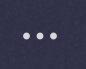
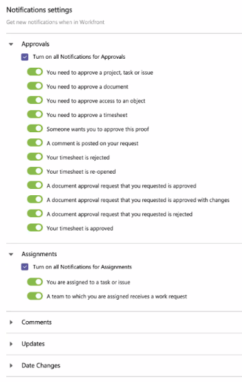

# Manage `Adobe Workfront` notifications in Microsoft Teams

You can receive notifications from `Adobe Workfront` about items you need to approve, assignments you've been given, or comments and changes to items you're associated with.

These notifications contain Workfront actions that you can take within Microsoft Teams without navigating away from Microsoft Teams to accomplish them.&nbsp;

>[!NOTE]
>
>Microsoft Teams no longer supports Internet Explorer. To use the `Adobe Workfront` for Microsoft Teams integration, you must use a web browser other than Internet Explorer.

## Access requirements

You must have the following access to perform the steps in this article:

<table cellspacing="0"> 
 <col> 
 <col> 
 <tbody> 
  <tr> 
   <td role="rowheader">Adobe Workfront plan*</td> 
   <td> 
Any
 </td> 
  </tr> 
  <tr> 
   <td role="rowheader">Adobe Workfront license*</td> 
   <td> 
Work, Plan
 </td> 
  </tr> <!--
   Access level configurations* [Insert any access level configurations needed] Example: Edit access to Documents Note: If you still don't have access, ask your Workfront administrator if they set additional restrictions in your access level. For information on how a Workfront administrator can modify your access level, see Create or modify custom access levels. You must be a Workfront administrator. For information on Workfront administrators, see Grant a user full administrative access. You must be a group administrator. For more information on group administrators, see Group administrators.
  --> <!--
   Object permissions [Insert permissions needed and specify the object] Example: View access or higher on Documents For information on requesting additional access, see Request access to objects in Adobe Workfront.
  --> 
 </tbody> 
</table>

&#42;To find out what plan, license type, or access you have, contact your `Workfront administrator`.

## Prerequisites for Receiving `Workfront` Notifications in Microsoft Teams

You can receive `Workfront` notifications in Microsoft Teams if the following conditions are met:

* A team owner has installed and configured `Workfront` for Microsoft Teams for your team.
* You are logged into `Workfront` from Microsoft Teams.
* You have enabled instant notifications in Workfront. For information on enabling instant notifications, see [Activate or deactivate your own event notifications](../../workfront-basics/using-notifications/activate-or-deactivate-your-own-event-notifications.md).

For information about installing `Workfront` for Microsoft Teams and logging in to `Workfront` from Microsoft Teams, see [Install Adobe Workfront for Microsoft Teams](../../workfront-integrations-and-apps/using-workfront-with-microsoft-teams/install-workfront-ms-teams.md).

## Managing `Workfront` Notifications in Microsoft Teams

When the `Workfront` for Microsoft Teams app is installed, a `Workfront` chat channel is created in Microsoft Teams for every member of that team. When an certain action is performed in `Workfront`, you can configure the settings for `Workfront` for Microsoft Teams to receive notifications about that action in the `Workfront` chat channel of Microsoft Teams.

Consider the following when working with `Workfront` notifications from Microsoft Teams:

* You cannot receive all, but only a select number of `Workfront` notifications in Microsoft Teams.
* All notifications you receive from `Workfront` appear in the `Workfront` bot chat channel.

  For information on installing the `Workfront` bot channel, see the [Logging in to `Workfront` from Microsoft Teams](../../workfront-integrations-and-apps/using-workfront-with-microsoft-teams/install-workfront-ms-teams.md#logging-in-to-workfront) section in [Installing `Workfront` for Microsoft Teams](../../workfront-integrations-and-apps/using-workfront-with-microsoft-teams/install-workfront-ms-teams.md) article.

* There can be up to a 5 minute delay between the time when an update is made in `Workfront` and when you receive the notification about it in Microsoft Teams.
* For each Microsoft Teams notification, you also receive an email notification.

To manage the `Workfront` notifications that you can receive in Microsoft Teams:

<ol> 
 <li value="1"> 
Click the More added apps icon on the left navigation bar in Microsoft Teams.
 
  
 </li> 
 <li value="2">Click Workfront in the list that appears.</li> 
 <li value="3"> 
Select the Settingstab.
 
  
 </li> 
 <li value="4">Disable any of the notifications that you do not want to receive. You can enable or disable groups of notifications, such as information or approval notifications, or you can manage notifications individually.
All notifications are enabled by default.

The notifications settings for Workfront for Microsoft Teams are saved automatically.
<note type="note">
   You cannot add more notifications to the ones that are available by default.
  </note></li> 
</ol>

## Responding to `Workfront` Notifications and Approval Requests in Microsoft Teams

1. Log in to `Workfront` from Microsoft Teams.  
   For information about logging in to `Workfront`, see [Install Adobe Workfront for Microsoft Teams](../../workfront-integrations-and-apps/using-workfront-with-microsoft-teams/install-workfront-ms-teams.md).  

1. Go to the `Chat` area and click the  ` `Workfront``bot&nbsp;channel.  
   This channel is for your personal chat with the `Workfront` bot. All `Workfront` notifications display here.&nbsp;
1. Depending on what type of notification you receive, proceed&nbsp;to the relevant section:

  * [Approval notifications](#approval) 
  * [Assignment notifications](#assignme) 
  * [Comment notifications](#comment) 
  * [Update notifications](#update) 
  * [Date Change notifications](#date)

### Approval notifications

You receive approval notifications when you are asked to approve an object, such as a task, timesheet, or proof. You can still comment on the notification, however.From the approval notification, you can perform the following actions:

* `Approve`: Click to approve the item.
* `Change`: Click to approve the item with changes. 
* `Reject`: Click to reject the item.&nbsp;
* `Comment`: Click to make a comment. Your comment also appears in `Workfront` as an update to the object that the notification is about. 

* `Go to Proof`: Click to open the proof. You can then make a decision directly in the proof. For more information, see [Make a decision on a proof in the proofing viewer](../../review-and-approve-work/proofing/reviewing-proofs-within-workfront/make-a-decision-on-a-proof/make-decisions-on-proof.md).

>[!NOTE]
>
>Once you have made an approval decision, you can not change it from the notification.

#### Actions available on specific approval notifications:

<table cellspacing="0"> 
 <col> 
 <col> 
 <col> 
 <col> 
 <col> 
 <col> 
 <thead> 
  <tr> 
   <th>Notification</th> 
   <th>Approve</th> 
   <th>Reject</th> 
   <th> 
Change
 </th> 
   <th> 
Go to Proof 
 </th> 
   <th>Comment</th> 
  </tr> 
 </thead> 
 <tbody> 
  <tr> 
   <td role="rowheader">You need to approve a project</td> 
   <td>✓</td> 
   <td>✓</td> 
   <td>&nbsp;</td> 
   <td>&nbsp;</td> 
   <td>✓</td> 
  </tr> 
  <tr> 
   <td role="rowheader">You need to approve a task</td> 
   <td>✓</td> 
   <td>✓</td> 
   <td>&nbsp;</td> 
   <td>&nbsp;</td> 
   <td>✓</td> 
  </tr> 
  <tr> 
   <td role="rowheader">You need to approve an issue</td> 
   <td>✓</td> 
   <td>✓</td> 
   <td>&nbsp;</td> 
   <td>&nbsp;</td> 
   <td>✓</td> 
  </tr> 
  <tr> 
   <td role="rowheader">You need to approve a document</td> 
   <td>✓</td> 
   <td>✓</td> 
   <td>✓</td> 
   <td>&nbsp;</td> 
   <td>✓</td> 
  </tr> 
  <tr> 
   <td role="rowheader">You need to approve access to an object</td> 
   <td>✓</td> 
   <td>✓</td> 
   <td>&nbsp;</td> 
   <td>&nbsp;</td> 
   <td>✓</td> 
  </tr> 
  <tr> 
   <td role="rowheader">You need to approve a timesheet</td> 
   <td>✓</td> 
   <td>✓</td> 
   <td>&nbsp;</td> 
   <td>&nbsp;</td> 
   <td>&nbsp;</td> 
  </tr> 
  <tr> 
   <td role="rowheader">Someone wants you to approve this proof</td> 
   <td>&nbsp;</td> 
   <td>&nbsp;</td> 
   <td>&nbsp;</td> 
   <td>✓</td> 
   <td>✓</td> 
  </tr> 
  <tr> 
   <td role="rowheader">Your timesheet is rejected</td> 
   <td>&nbsp;</td> 
   <td>&nbsp;</td> 
   <td>&nbsp;</td> 
   <td>&nbsp;</td> 
   <td>&nbsp;</td> 
  </tr> 
  <tr> 
   <td role="rowheader">Your timesheet is re-opened</td> 
   <td>&nbsp;</td> 
   <td>&nbsp;</td> 
   <td>&nbsp;</td> 
   <td>&nbsp;</td> 
   <td>&nbsp;</td> 
  </tr> 
  <tr> 
   <td role="rowheader">A document approval request that you requested is approved</td> 
   <td>&nbsp;</td> 
   <td>&nbsp;</td> 
   <td>&nbsp;</td> 
   <td>&nbsp;</td> 
   <td>✓</td> 
  </tr> 
  <tr> 
   <td role="rowheader">A document approval request that you requested is approved with changes</td> 
   <td>&nbsp;</td> 
   <td>&nbsp;</td> 
   <td>&nbsp;</td> 
   <td>&nbsp;</td> 
   <td>✓</td> 
  </tr> 
  <tr> 
   <td role="rowheader">A document approval request that you requested is rejected</td> 
   <td>&nbsp;</td> 
   <td>&nbsp;</td> 
   <td>&nbsp;</td> 
   <td>&nbsp;</td> 
   <td>✓</td> 
  </tr> 
  <tr> 
   <td role="rowheader">Your timesheet is approved</td> 
   <td>&nbsp;</td> 
   <td>&nbsp;</td> 
   <td>&nbsp;</td> 
   <td>&nbsp;</td> 
   <td>&nbsp;</td> 
  </tr> 
 </tbody> 
</table>

### Assignment notifications

You receive assignment notifications when you, or a team you are on, are assigned to a task or issue in `Workfront`. From the assignment notification, you can perform the following actions:

* `Work on it`: Select to commit to work on the item. A notification displays briefly to confirm that a new item was added to your work list.
* `View in Workfront`: Select to view the assigned issue or task in Workfront, which opens a new tab.
* `Start`: Click to start work on the item. A&nbsp;notification displays briefly to confirm that a new item was added to your work list.&nbsp;
* `Comment`: Click to make a comment on the item. Your comment also appears in the item's update stream in `Workfront`.
* `Status`: Click, then select the new status for the work item from the drop-down menu.

#### Actions available on specific assignment notifications:

<table cellspacing="0"> 
 <col> 
 <col> 
 <col> 
 <col> 
 <thead> 
  <tr> 
   <th>Notification</th> 
   <th>Start</th> 
   <th>Comment</th> 
   <th> 
Status
 </th> 
  </tr> 
 </thead> 
 <tbody> 
  <tr> 
   <td role="rowheader">You are assigned to a task</td> 
   <td>✓</td> 
   <td>✓</td> 
   <td>✓</td> 
  </tr> 
  <tr> 
   <td role="rowheader">You are assigned to an issue</td> 
   <td>✓</td> 
   <td>✓</td> 
   <td>✓</td> 
  </tr> 
  <tr> 
   <td role="rowheader">A team to which you are assigned receives a work request for a task</td> 
   <td>✓</td> 
   <td>✓</td> 
   <td>✓</td> 
  </tr> 
  <tr> 
   <td role="rowheader">A team to which you are assigned receives a work request for an issue</td> 
   <td>✓</td> 
   <td>✓</td> 
   <td>✓</td> 
  </tr> 
 </tbody> 
</table>

### Comment notifications

You receive a communication notification when someone comments on an item you are associated with, or includes you in an update. From the communication notification, you can perform the following actions:

* `Reply`: Click to reply to the comment or update. Your reply also appears in the update stream where the comment appears in `Workfront`.
* `View in Workfront`: Select to view the comment and the item in Workfront, which is opened in a new tab.
* `Status`: Click, then select a new status for the work item that the comment or update is about.

#### Actions available on specific communication notifications:

<table cellspacing="0"> 
 <col> 
 <col> 
 <col> 
 <thead> 
  <tr> 
   <th>Notification</th> 
   <th>Reply</th> 
   <th> 
Status
 </th> 
  </tr> 
 </thead> 
 <tbody> 
  <tr> 
   <td role="rowheader">A comment is posted on your request</td> 
   <td>✓</td> 
   <td>✓</td> 
  </tr> 
  <tr> 
   <td role="rowheader">A reply is posted on your work request</td> 
   <td>✓</td> 
   <td>✓</td> 
  </tr> 
  <tr> 
   <td role="rowheader">Someone comments on a thread you are in</td> 
   <td>✓</td> 
   <td>✓</td> 
  </tr> 
  <tr> 
   <td role="rowheader">Someone comments on one of your work items</td> 
   <td>✓</td> 
   <td>✓</td> 
  </tr> 
  <tr> 
   <td role="rowheader">Someone comments on a timesheet you approve</td> 
   <td>✓</td> 
   <td>&nbsp;</td> 
  </tr> 
  <tr> 
   <td role="rowheader">A comment is added on your user profile page or by bulk editing multiple users</td> 
   <td>✓</td> 
   <td>&nbsp;</td> 
  </tr> 
  <tr> 
   <td role="rowheader">A comment is added on one of your updates</td> 
   <td>✓</td> 
   <td>&nbsp;</td> 
  </tr> 
  <tr> 
   <td role="rowheader">A comment is added on your timesheet</td> 
   <td>✓</td> 
   <td>&nbsp;</td> 
  </tr> 
 </tbody> 
</table>

### Update notifications

You receive an information notification when there is an update to an item you are associated with, but you do not need to take any action on the item. From the information notification, you can perform the following actions:

* `Reply`: Click to reply to the update. Your reply also appears in the item's update stream in `Workfront`.

* `View in Workfront`: Select to view the comment and the item in Workfront, which is opened in a new tab.
* `Status`: Click, then select the new status for the item from the drop-down menu.

#### Actions available on specific information notifications:

<table cellspacing="0"> 
 <col> 
 <col> 
 <col> 
 <thead> 
  <tr> 
   <th>Notification</th> 
   <th>Reply</th> 
   <th> 
Status
 </th> 
  </tr> 
 </thead> 
 <tbody> 
  <tr> 
   <td role="rowheader">An update is made to a task, issue or project you are subscribed to</td> 
   <td>✓</td> 
   <td>✓</td> 
  </tr> 
  <tr> 
   <td role="rowheader">Someone includes you on a directed update</td> 
   <td>✓</td> 
   <td>✓</td> 
  </tr> 
  <tr> 
   <td role="rowheader">Someone includes your team on a directed update</td> 
   <td>✓</td> 
   <td>✓</td> 
  </tr> 
 </tbody> 
</table>

### Date Change notifications

You receive a date change notification when the date changes on a work item you are assigned to. From the date change notification, you can perform the following actions.

* `Comment`: Click to make a comment on the item. Your comment also appears in the item's update stream in `Workfront`.

* `Status`: Click, then select the new status for the work item from the drop-down menu.

<table cellspacing="0"> 
 <col> 
 <col> 
 <col> 
 <thead> 
  <tr> 
   <th>Notification</th> 
   <th> 
Comment
 </th> 
   <th> 
Status
 </th> 
  </tr> 
 </thead> 
 <tbody> 
  <tr> 
   <td role="rowheader">The due date changes on a task you are assigned to</td> 
   <td>✓</td> 
   <td>✓</td> 
  </tr> 
 </tbody> 
</table>

