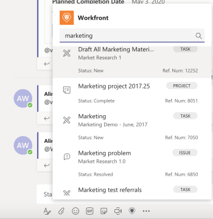

# Search for and share *Adobe Workfront* items in Microsoft Teams

You can search for *Workfront* items in any *Adobe Workfront**Workfront* channel in Microsoft Teams and share these items with members of your teams.&nbsp;

* [Prerequisites for sharing Workfront items in Microsoft Teams](#prerequisites) 
* [Search for and share Workfront items in Microsoft Teams](#searching-for-and-sharing-workfront-items)

## Access requirements

You must have the following access to perform the steps in this article:

<table cellspacing="0"> 
 <col> 
 <col> 
 <tbody> 
  <tr> 
   <td role="rowheader"><em>Adobe Workfront</em> plan*</td> 
   <td> 
Any
 </td> 
  </tr> 
  <tr> 
   <td role="rowheader"><em>Adobe Workfront</em> license*</td> 
   <td> 
Work, Plan
 </td> 
  </tr> <draft-comment>
   <tr data-mc-conditions="QuicksilverOrClassic.Draft mode"> 
    <td role="rowheader">Access level configurations*</td> 
    <td> 
[Insert any access level configurations needed] <draft-comment>
       <MadCap:conditionalText data-mc-conditions="QuicksilverOrClassic.Draft mode">
        Example: Edit access to Documents
       </MadCap:conditionalText>
      </draft-comment><MadCap:conditionalText data-mc-conditions="QuicksilverOrClassic.Draft mode">
       Example: Edit access to Documents
      </MadCap:conditionalText>
 
Note: If you still don't have access, ask your <em>Workfront administrator</em> if they set additional restrictions in your access level. For information on how a <em>Workfront administrator</em> can modify your access level, see <a href="../../administration-and-setup/add-users/configure-and-grant-access/create-modify-access-levels.md" class="MCXref xref">Create or modify custom access levels</a>.
 <draft-comment>
      
You must be a <em>Workfront administrator</em>. For information on <em>Workfront administrators</em>, see <a href="../../administration-and-setup/add-users/configure-and-grant-access/grant-a-user-full-administrative-access.md" class="MCXref xref">Grant a user full administrative access</a>.

     </draft-comment>
You must be a <em>Workfront administrator</em>. For information on <em>Workfront administrators</em>, see <a href="../../administration-and-setup/add-users/configure-and-grant-access/grant-a-user-full-administrative-access.md" class="MCXref xref">Grant a user full administrative access</a>.
 <draft-comment>
      
You must be a <em>group administrator</em>. For more information on <em>group administrators</em>, see <a href="../../administration-and-setup/manage-groups/group-roles/group-administrators.md" class="MCXref xref">Group administrators</a>.

     </draft-comment>
You must be a <em>group administrator</em>. For more information on <em>group administrators</em>, see <a href="../../administration-and-setup/manage-groups/group-roles/group-administrators.md" class="MCXref xref">Group administrators</a>.
 </td> 
   </tr>
  </draft-comment>
  <tr data-mc-conditions="QuicksilverOrClassic.Draft mode"> 
   <td role="rowheader">Access level configurations*</td> 
   <td> 
[Insert any access level configurations needed] <MadCap:conditionalText data-mc-conditions="QuicksilverOrClassic.Draft mode">
      Example: Edit access to Documents
     </MadCap:conditionalText>
 
Note: If you still don't have access, ask your <em>Workfront administrator</em> if they set additional restrictions in your access level. For information on how a <em>Workfront administrator</em> can modify your access level, see <a href="../../administration-and-setup/add-users/configure-and-grant-access/create-modify-access-levels.md" class="MCXref xref">Create or modify custom access levels</a>.
 
You must be a <em>Workfront administrator</em>. For information on <em>Workfront administrators</em>, see <a href="../../administration-and-setup/add-users/configure-and-grant-access/grant-a-user-full-administrative-access.md" class="MCXref xref">Grant a user full administrative access</a>.
 
You must be a <em>group administrator</em>. For more information on <em>group administrators</em>, see <a href="../../administration-and-setup/manage-groups/group-roles/group-administrators.md" class="MCXref xref">Group administrators</a>.
 </td> 
  </tr> <draft-comment>
   <tr data-mc-conditions="QuicksilverOrClassic.Draft mode"> 
    <td role="rowheader">Object permissions</td> 
    <td> 
[Insert permissions needed and specify the object] <draft-comment>
       <MadCap:conditionalText data-mc-conditions="QuicksilverOrClassic.Draft mode">
        Example: View access or higher on Documents
       </MadCap:conditionalText>
      </draft-comment><MadCap:conditionalText data-mc-conditions="QuicksilverOrClassic.Draft mode">
       Example: View access or higher on Documents
      </MadCap:conditionalText>
 
For information on requesting additional access, see <a href="../../workfront-basics/grant-and-request-access-to-objects/request-access.md" class="MCXref xref">Request access to objects in Adobe Workfront</a>.
 </td> 
   </tr>
  </draft-comment>
  <tr data-mc-conditions="QuicksilverOrClassic.Draft mode"> 
   <td role="rowheader">Object permissions</td> 
   <td> 
[Insert permissions needed and specify the object] <MadCap:conditionalText data-mc-conditions="QuicksilverOrClassic.Draft mode">
      Example: View access or higher on Documents
     </MadCap:conditionalText>
 
For information on requesting additional access, see <a href="../../workfront-basics/grant-and-request-access-to-objects/request-access.md" class="MCXref xref">Request access to objects in Adobe Workfront</a>.
 </td> 
  </tr> 
 </tbody> 
</table>

&#42;To find out what plan, license type, or access you have, contact your *Workfront administrator*.

## Prerequisites for sharing *Workfront* items in Microsoft Teams

You can search for and share *Workfront* items in Microsoft Teams if the following conditions are met:

* A team owner has installed and configured *Workfront* for Microsoft Teams for your team.
* You are logged into *Workfront* from Microsoft Teams.

For information about installing *Workfront* for Microsoft Teams and logging in to *Workfront* from Microsoft Teams, see [Install Adobe Workfront for Microsoft Teams](../../workfront-integrations-and-apps/using-workfront-with-microsoft-teams/install-workfront-ms-teams.md).

>[!NOTE]
>
>Microsoft Teams no longer supports Internet Explorer. To use the *Adobe Workfront* for Microsoft Teams integration, you must use a web browser other than Internet Explorer.

## Search for and share *Workfront* items in Microsoft Teams

You can search for the following *Workfront* items from a Microsoft Teams channel:

<ul> 
 <li>Projects</li> 
 <li>Tasks <note type="note">
    You cannot search for personal tasks.&nbsp;
  </note></li> 
 <li>Issues</li> 
</ul>

After you have found the items you searched for you can share them with other users in Microsoft Teams.&nbsp;

To search for a *Workfront* item from Microsoft Teams and share it with others:

<ol> 
 <li value="1">In Microsoft Teams, go to any chat channel and click&nbsp;the <em>Workfront</em> icon.</li> 
 <li value="2"> Search for the <em>Workfront</em> item by doing one of the following: 
  <ul>
   <li>Click the <em>Workfront</em> icon under the conversation field.  Depending on your settings, this icon might display under the More icon instead.  The Search box appears by default.</li>
   <li>Type <em>@<em>Workfront</em></em>&nbsp;from any channel, select <em>Workfront</em> and then select Search.  </li>
  </ul></li> 
 <li value="3">In the search box provided, start typing the name or reference number of a project, task, or issue and click it when it appears in the list.  This adds a card with the <em>Workfront</em> item in the chat field. Some information about the item is included on the card, including the name of the item, the parent object, status, priority, percent complete. </li> 
 <li value="4">(Optional) Add a comment underneath the <em>Workfront</em> card, then click&nbsp;Send&nbsp;or press Enter. This sends the message including the <em>Workfront</em> item to your channel. All members of the channel can see this message, including the information on the <em>Workfront</em> card.</li> 
 <li value="5">Click View in <em>Workfront</em> to view the item in <em>Workfront</em>.  Only users who have a <em>Workfront</em> license can view an item in <em>Workfront</em>.&nbsp;</li> 
</ol>

