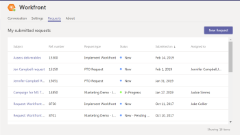

#  Submit `Adobe Workfront` requests from Microsoft Teams

After your team owner installs `Adobe Workfront` for Microsoft Teams, you can submit `Workfront` requests from your Microsoft Teams account. To do so, you must have a `Workfront` account with access to submit requests. For information about installing `Workfront` for Microsoft Teams, see [Installing `Workfront` for Microsoft Teams](../../workfront-integrations-and-apps/using-workfront-with-microsoft-teams/install-workfront-ms-teams.md).

>[!NOTE]
>
>Microsoft Teams no longer supports Internet Explorer. To use the `Adobe Workfront` for Microsoft Teams integration, you must use a web browser other than Internet Explorer.

## Access requirements

You must have the following access to perform the steps in this article:

<table cellspacing="0"> 
 <col> 
 <col> 
 <tbody> 
  <tr> 
   <td role="rowheader">Adobe Workfront plan*</td> 
   <td> 
Any
 </td> 
  </tr> 
  <tr> 
   <td role="rowheader">Adobe Workfront license*</td> 
   <td> 
Work, Plan, Review, Request
 </td> 
  </tr> <!--
   Access level configurations* [Insert any access level configurations needed] Example: Edit access to Documents Note: If you still don't have access, ask your Workfront administrator if they set additional restrictions in your access level. For information on how a Workfront administrator can modify your access level, see Create or modify custom access levels. You must be a Workfront administrator. For information on Workfront administrators, see Grant a user full administrative access. You must be a group administrator. For more information on group administrators, see Group administrators.
  --> <!--
   Object permissions [Insert permissions needed and specify the object] Example: View access or higher on Documents For information on requesting additional access, see Request access to objects in Adobe Workfront.
  --> 
 </tbody> 
</table>

&#42;To find out what plan, license type, or access you have, contact your `Workfront administrator`.

## Prerequisites

Your Microsoft Teams team owner must install `Workfront` for Microsoft Teams before you can use it.

## Submit `Workfront` requests from Microsoft Teams

<ol> 
 <li value="1"> 
Click the More added apps icon on the left navigation bar in Microsoft Teams.
 
  
 </li> 
 <li value="2">Click Workfront in the list that appears.</li> 
 <li value="3">Click the Requests tab.</li> 
 <li value="4">Click New Request.</li> 
 <li value="5">In the Select a Request Type box, select the request queue where you want to submit the request.</li> 
 <li value="6">(Optional) Select a Topic Group or a Queue Topic, if they are available on the request queue.</li> 
 <li value="7"> 
Specify the following information:
 
(Depending on how the request queue was set up, the options and boxes you see might vary. For a complete list and description of possible fields, see <a href="../../manage-work/requests/create-requests/create-submit-requests.md" class="MCXref xref">Create and submit Adobe Workfront requests</a>.)
 
  <table cellspacing="0"> 
   <col> 
   <col> 
   <tbody> 
    <tr> 
     <td role="rowheader">Subject</td> 
     <td>Type a subject name for the request.</td> 
    </tr> 
    <tr> 
     <td role="rowheader">Description</td> 
     <td>Type a description for the request.</td> 
    </tr> 
    <tr> 
     <td role="rowheader">&nbsp;</td> 
     <td> 
Attach any documents that you want to include in the request. You can attach documents via drag and drop, or by clicking Select file and browsing to and selecting the document in your file system.
 </td> 
    </tr> 
   </tbody> 
  </table> </li> 
 <li value="8">(Optional) If the Workfront administrator attached custom forms to the request queue, provide the information in the fields available on the custom forms.</li> 
 <li value="9">The custom forms display at the bottom of the new request.</li> 
 <li value="10"> 
Click Submit.
 
The Request appears in Workfront, in the specified request queue. You receive a confirmation that the request was submitted successfully.
 </li> 
</ol>

## View `Workfront` requests you submitted in Microsoft Teams

<ol> 
 <li value="1"> 
Click the More added apps icon on the left navigation bar in Microsoft Teams.
 
  
 </li> 
 <li value="2">Click Workfront in the list that appears.</li> 
 <li value="3"> 
Click the Requests tab.
 
  
 
Requests you submitted are listed in the My submitted requests area of the Requests tab. You cannot configure the information displayed in this tab about the requests you submitted.
 
You can view the following information about your submitted requests in the My submitted requests area of the Requests tab:
 
  <table cellspacing="0"> 
   <col> 
   <col> 
   <tbody> 
    <tr> 
     <td role="rowheader">Subject</td> 
     <td>The name of the request</td> 
    </tr> 
    <tr> 
     <td role="rowheader">Reference number</td> 
     <td>&nbsp;</td> 
    </tr> 
    <tr> 
     <td role="rowheader">Request type</td> 
     <td>The name of the request queue where you submitted the request</td> 
    </tr> 
    <tr> 
     <td role="rowheader">Status</td> 
     <td>&nbsp;</td> 
    </tr> 
    <tr> 
     <td role="rowheader">Submitted on</td> 
     <td>The date when you submitted the request</td> 
    </tr> 
    <tr> 
     <td role="rowheader">Assigned to</td> 
     <td>&nbsp;</td> 
    </tr> 
   </tbody> 
  </table> </li> 
 <li value="4">(Optional) Click the header of any of the columns in the list to sort the list by that column. By default, Workfront sorts the list by the Submitted on date, starting with the most recently submitted request.</li> 
</ol>

