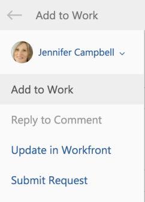

# Add an Outlook email as a task to your work list

You can convert Outlook emails to *Adobe Workfront* tasks. After an email is converted, the task is&nbsp;available in your Work List in the Home area.

## Access requirements

You must have the following access to perform the steps in this article:

<table cellspacing="0"> 
 <col> 
 <col> 
 <tbody> 
  <tr> 
   <td role="rowheader"><em>Adobe Workfront</em> plan*</td> 
   <td> 
Any
 </td> 
  </tr> 
  <tr> 
   <td role="rowheader"><em>Adobe Workfront</em> license*</td> 
   <td> 
Work, Plan
 </td> 
  </tr> <draft-comment>
   <tr data-mc-conditions="QuicksilverOrClassic.Draft mode"> 
    <td role="rowheader">Access level configurations*</td> 
    <td> 
[Insert any access level configurations needed] <draft-comment>
       <MadCap:conditionalText data-mc-conditions="QuicksilverOrClassic.Draft mode">
        Example: Edit access to Documents
       </MadCap:conditionalText>
      </draft-comment><MadCap:conditionalText data-mc-conditions="QuicksilverOrClassic.Draft mode">
       Example: Edit access to Documents
      </MadCap:conditionalText>
 
Note: If you still don't have access, ask your <em>Workfront administrator</em> if they set additional restrictions in your access level. For information on how a <em>Workfront administrator</em> can modify your access level, see <a href="../../administration-and-setup/add-users/configure-and-grant-access/create-modify-access-levels.md" class="MCXref xref">Create or modify custom access levels</a>.
 <draft-comment>
      
You must be a <em>Workfront administrator</em>. For information on <em>Workfront administrators</em>, see <a href="../../administration-and-setup/add-users/configure-and-grant-access/grant-a-user-full-administrative-access.md" class="MCXref xref">Grant a user full administrative access</a>.

     </draft-comment>
You must be a <em>Workfront administrator</em>. For information on <em>Workfront administrators</em>, see <a href="../../administration-and-setup/add-users/configure-and-grant-access/grant-a-user-full-administrative-access.md" class="MCXref xref">Grant a user full administrative access</a>.
 <draft-comment>
      
You must be a <em>group administrator</em>. For more information on <em>group administrators</em>, see <a href="../../administration-and-setup/manage-groups/group-roles/group-administrators.md" class="MCXref xref">Group administrators</a>.

     </draft-comment>
You must be a <em>group administrator</em>. For more information on <em>group administrators</em>, see <a href="../../administration-and-setup/manage-groups/group-roles/group-administrators.md" class="MCXref xref">Group administrators</a>.
 </td> 
   </tr>
  </draft-comment>
  <tr data-mc-conditions="QuicksilverOrClassic.Draft mode"> 
   <td role="rowheader">Access level configurations*</td> 
   <td> 
[Insert any access level configurations needed] <MadCap:conditionalText data-mc-conditions="QuicksilverOrClassic.Draft mode">
      Example: Edit access to Documents
     </MadCap:conditionalText>
 
Note: If you still don't have access, ask your <em>Workfront administrator</em> if they set additional restrictions in your access level. For information on how a <em>Workfront administrator</em> can modify your access level, see <a href="../../administration-and-setup/add-users/configure-and-grant-access/create-modify-access-levels.md" class="MCXref xref">Create or modify custom access levels</a>.
 
You must be a <em>Workfront administrator</em>. For information on <em>Workfront administrators</em>, see <a href="../../administration-and-setup/add-users/configure-and-grant-access/grant-a-user-full-administrative-access.md" class="MCXref xref">Grant a user full administrative access</a>.
 
You must be a <em>group administrator</em>. For more information on <em>group administrators</em>, see <a href="../../administration-and-setup/manage-groups/group-roles/group-administrators.md" class="MCXref xref">Group administrators</a>.
 </td> 
  </tr> <draft-comment>
   <tr data-mc-conditions="QuicksilverOrClassic.Draft mode"> 
    <td role="rowheader">Object permissions</td> 
    <td> 
[Insert permissions needed and specify the object] <draft-comment>
       <MadCap:conditionalText data-mc-conditions="QuicksilverOrClassic.Draft mode">
        Example: View access or higher on Documents
       </MadCap:conditionalText>
      </draft-comment><MadCap:conditionalText data-mc-conditions="QuicksilverOrClassic.Draft mode">
       Example: View access or higher on Documents
      </MadCap:conditionalText>
 
For information on requesting additional access, see <a href="../../workfront-basics/grant-and-request-access-to-objects/request-access.md" class="MCXref xref">Request access to objects in Adobe Workfront</a>.
 </td> 
   </tr>
  </draft-comment>
  <tr data-mc-conditions="QuicksilverOrClassic.Draft mode"> 
   <td role="rowheader">Object permissions</td> 
   <td> 
[Insert permissions needed and specify the object] <MadCap:conditionalText data-mc-conditions="QuicksilverOrClassic.Draft mode">
      Example: View access or higher on Documents
     </MadCap:conditionalText>
 
For information on requesting additional access, see <a href="../../workfront-basics/grant-and-request-access-to-objects/request-access.md" class="MCXref xref">Request access to objects in Adobe Workfront</a>.
 </td> 
  </tr> 
 </tbody> 
</table>

&#42;To find out what plan, license type, or access you have, contact your *Workfront administrator*.

## Prerequisites

Your *Workfront administrator* must enable Outlook for Office with *Workfront* before you can use this integration.

## Add an Outlook email as a task to your work list

<ol> 
 <li value="1">Select the email within Outlook that you want to convert to a task.</li> 
 <li value="2">Click the&nbsp;<em>Workfront</em>&nbsp;icon in the upper-right corner of the email message to display the <em>Workfront</em> add-in. You might need to click the down-pointing arrow in the upper right of your email to access the <em>Workfront</em> icon.</li> 
 <li value="3">Click the Menu icon to display the list of available <em>Workfront</em> options. </li> 
 <li value="4">Click Add to Work. </li> 
 <li value="5">Deselect the Add to Project field.&nbsp;</li> 
 <li value="6">(Optional) You can update the following information from the email before it is saved as a task: 
  <ul>
   <li>Task Name: By default, the task name is the same as the email Subject. You can modify the task name as desired.</li>
   <li>Description: By default, the description is the same as the email Body. You can modify the description&nbsp;as desired.</li>
   <li>Attachments: Any email attachments are saved to the Documents area of the task. You can delete any attachments before saving&nbsp;the email as a task.</li>
  </ul></li> 
 <li value="7">Click Add. The task is added to the Work List in your Home area with no commit date.</li> 
 <li value="8"> 
(Optional) Click View in <em>Workfront</em>&nbsp;to display the task within the&nbsp;<em>Workfront</em> application in a new tab. 
 </li> 
 <li value="9">(Optional) Navigate back to Outlook, and select the original email. At the top of the <em>Workfront</em> add-in panel, notice the confirmation with a link that the email was added to <em>Workfront</em> as a task. The link includes the date on which it was converted.  </li> 
</ol>

