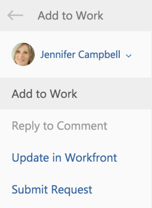

# Add an Outlook email to a project as a task or an issue

You can convert emails to `Adobe Workfront` tasks or issues. After an email is converted, the task or issue appears on the project that is selected as you are converting it.&nbsp;

## Access requirements

You must have the following access to perform the steps in this article:

<table cellspacing="0"> 
 <col> 
 <col> 
 <tbody> 
  <tr> 
   <td role="rowheader">Adobe Workfront plan*</td> 
   <td> 
Any
 </td> 
  </tr> 
  <tr> 
   <td role="rowheader">Adobe Workfront license*</td> 
   <td> 
Work, Plan
 </td> 
  </tr> <!--
   Access level configurations* [Insert any access level configurations needed] Example: Edit access to Documents Note: If you still don't have access, ask your Workfront administrator if they set additional restrictions in your access level. For information on how a Workfront administrator can modify your access level, see Create or modify custom access levels. You must be a Workfront administrator. For information on Workfront administrators, see Grant a user full administrative access. You must be a group administrator. For more information on group administrators, see Group administrators.
  --> <!--
   Object permissions [Insert permissions needed and specify the object] Example: View access or higher on Documents For information on requesting additional access, see Request access to objects in Adobe Workfront.
  --> 
 </tbody> 
</table>

&#42;To find out what plan, license type, or access you have, contact your `Workfront administrator`.

## Prerequisites

Your `Workfront administrator` must enable Outlook for Office with `Workfront` before you can use this integration.

## Add an Outlook email to a project as a task or issue

<ol> 
 <li value="1">Select the email within Outlook that you want to convert to a task or an issue.</li> 
 <li value="2"> 
Click the&nbsp;Workfront&nbsp;icon in the upper-right corner of the email message to display the Workfront add-in. 
 
You might need to click the down-pointing arrow in the upper right of your email to access the Workfront icon. 
 </li> 
 <li value="3"> 
 Click the Menu icon to display the list of available Workfront options. 
 
  
 </li> 
 <li value="4"> 
Click Add to Work. 
 
  
 </li> 
 <li value="5">Select the Add to Project field.</li> 
 <li value="6">Start typing the name of a project in the Project field, then select it when it appears in the list.&nbsp;</li> 
 <li value="7"> 
Select the Task radio button if you want to add a task to the selected project. 
 
Or 
 
Select the Issue radio button if you want to add an issue to the selected project.
 </li> 
 <li value="8">(Optional) Specify who this task or issue is assigned to in the Assign this to field.&nbsp;</li> 
 <li value="9">(Optional) Specify the Due by date. This becomes the Planned Completion Date of the task or issue.</li> 
 <li value="10"> 
(Optional) Update the following information from the email before it is saved as a task or issue ( required fields are preceded by an asterisk).
 
  <table cellspacing="0"> 
   <col> 
   <col> 
   <tbody> 
    <tr> 
     <td role="rowheader">Task or Issue Name</td> 
     <td>By default, the task name is the same as the email Subject. You can modify the task name as desired.</td> 
    </tr> 
    <tr> 
     <td role="rowheader">Description</td> 
     <td>By default, the description is the same as the email Body. You can modify the description&nbsp;as desired.</td> 
    </tr> 
    <tr> 
     <td role="rowheader">Attachments</td> 
     <td>Any email attachments are saved to the Documents area of the task or issue. You can delete any attachments before saving&nbsp;the email as a task or issue.</td> 
    </tr> 
   </tbody> 
  </table> </li> 
 <li value="11"> 
Click Add. 
 
The task or issue is added to the specified project
 </li> 
 <li value="12"> 
(Optional) Click View in Workfront&nbsp;to display the task within the&nbsp;Workfront application in a new tab. 
 </li> 
 <li value="13"> 
(Optional) Go back to Outlook, and select the converted email. 
 
At the top of the Workfront add-in panel, notice the confirmation with a link that the email was added to Workfront as a task or an issue. The link includes the date on which it was converted. 
 
  
 </li> 
</ol>

