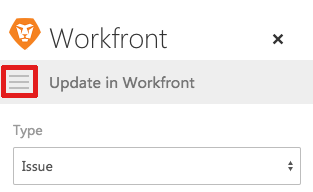

# Create an *Adobe Workfront* request from an Outlook email

You can create a *Adobe Workfront* request from an email in Outlook.

When you create a *Workfront* request based on an email, the&nbsp;content of the email (including the subject and body) are included in the request by default.

>[!NOTE]
>
>You can not create a Workfront request from a shared Outlook mailbox.

## Access requirements

You must have the following access to perform the steps in this article:

<table cellspacing="0"> 
 <col> 
 <col> 
 <tbody> 
  <tr> 
   <td role="rowheader"><em>Adobe Workfront</em> plan*</td> 
   <td> 
Any
 </td> 
  </tr> 
  <tr> 
   <td role="rowheader"><em>Adobe Workfront</em> license*</td> 
   <td> 
Work, Plan
 </td> 
  </tr> <draft-comment>
   <tr data-mc-conditions="QuicksilverOrClassic.Draft mode"> 
    <td role="rowheader">Access level configurations*</td> 
    <td> 
[Insert any access level configurations needed] <draft-comment>
       <MadCap:conditionalText data-mc-conditions="QuicksilverOrClassic.Draft mode">
        Example: Edit access to Documents
       </MadCap:conditionalText>
      </draft-comment><MadCap:conditionalText data-mc-conditions="QuicksilverOrClassic.Draft mode">
       Example: Edit access to Documents
      </MadCap:conditionalText>
 
Note: If you still don't have access, ask your <em>Workfront administrator</em> if they set additional restrictions in your access level. For information on how a <em>Workfront administrator</em> can modify your access level, see <a href="../../administration-and-setup/add-users/configure-and-grant-access/create-modify-access-levels.md" class="MCXref xref">Create or modify custom access levels</a>.
 <draft-comment>
      
You must be a <em>Workfront administrator</em>. For information on <em>Workfront administrators</em>, see <a href="../../administration-and-setup/add-users/configure-and-grant-access/grant-a-user-full-administrative-access.md" class="MCXref xref">Grant a user full administrative access</a>.

     </draft-comment>
You must be a <em>Workfront administrator</em>. For information on <em>Workfront administrators</em>, see <a href="../../administration-and-setup/add-users/configure-and-grant-access/grant-a-user-full-administrative-access.md" class="MCXref xref">Grant a user full administrative access</a>.
 <draft-comment>
      
You must be a <em>group administrator</em>. For more information on <em>group administrators</em>, see <a href="../../administration-and-setup/manage-groups/group-roles/group-administrators.md" class="MCXref xref">Group administrators</a>.

     </draft-comment>
You must be a <em>group administrator</em>. For more information on <em>group administrators</em>, see <a href="../../administration-and-setup/manage-groups/group-roles/group-administrators.md" class="MCXref xref">Group administrators</a>.
 </td> 
   </tr>
  </draft-comment>
  <tr data-mc-conditions="QuicksilverOrClassic.Draft mode"> 
   <td role="rowheader">Access level configurations*</td> 
   <td> 
[Insert any access level configurations needed] <MadCap:conditionalText data-mc-conditions="QuicksilverOrClassic.Draft mode">
      Example: Edit access to Documents
     </MadCap:conditionalText>
 
Note: If you still don't have access, ask your <em>Workfront administrator</em> if they set additional restrictions in your access level. For information on how a <em>Workfront administrator</em> can modify your access level, see <a href="../../administration-and-setup/add-users/configure-and-grant-access/create-modify-access-levels.md" class="MCXref xref">Create or modify custom access levels</a>.
 
You must be a <em>Workfront administrator</em>. For information on <em>Workfront administrators</em>, see <a href="../../administration-and-setup/add-users/configure-and-grant-access/grant-a-user-full-administrative-access.md" class="MCXref xref">Grant a user full administrative access</a>.
 
You must be a <em>group administrator</em>. For more information on <em>group administrators</em>, see <a href="../../administration-and-setup/manage-groups/group-roles/group-administrators.md" class="MCXref xref">Group administrators</a>.
 </td> 
  </tr> <draft-comment>
   <tr data-mc-conditions="QuicksilverOrClassic.Draft mode"> 
    <td role="rowheader">Object permissions</td> 
    <td> 
[Insert permissions needed and specify the object] <draft-comment>
       <MadCap:conditionalText data-mc-conditions="QuicksilverOrClassic.Draft mode">
        Example: View access or higher on Documents
       </MadCap:conditionalText>
      </draft-comment><MadCap:conditionalText data-mc-conditions="QuicksilverOrClassic.Draft mode">
       Example: View access or higher on Documents
      </MadCap:conditionalText>
 
For information on requesting additional access, see <a href="../../workfront-basics/grant-and-request-access-to-objects/request-access.md" class="MCXref xref">Request access to objects in Adobe Workfront</a>.
 </td> 
   </tr>
  </draft-comment>
  <tr data-mc-conditions="QuicksilverOrClassic.Draft mode"> 
   <td role="rowheader">Object permissions</td> 
   <td> 
[Insert permissions needed and specify the object] <MadCap:conditionalText data-mc-conditions="QuicksilverOrClassic.Draft mode">
      Example: View access or higher on Documents
     </MadCap:conditionalText>
 
For information on requesting additional access, see <a href="../../workfront-basics/grant-and-request-access-to-objects/request-access.md" class="MCXref xref">Request access to objects in Adobe Workfront</a>.
 </td> 
  </tr> 
 </tbody> 
</table>

&#42;To find out what plan, license type, or access you have, contact your *Workfront administrator*.

## Prerequisites

Your *Workfront administrator* must enable Outlook for Office with *Workfront* before you can use this integration.

## Create a request from an Outlook email

To create a *Workfront* Request from Outlook:

<ol> 
 <li value="1">Select the email that contains the information you want to include in&nbsp;a <em>Workfront</em> request.&nbsp;</li> 
 <li value="2">Click the&nbsp;<em>Workfront</em>&nbsp;icon in the upper-right corner of the email message to display the <em>Workfront</em> add-in. You might need to click the down-pointing arrow in the upper right of your email to access the <em>Workfront</em> icon.</li> 
 <li value="3"> 
Click the Menu icon to display the list of available <em>Workfront</em> options. 
 
    
 </li> 
 <li value="4">Click Submit Request.</li> 
 <li value="5"> 
In the Select a Request Type field, select the request queue where you want to submit the request. 
 
  
 </li> 
 <li value="6">Specify the following information: Depending on how the request queue was set up, available fields might vary. For a complete list and description of possible fields, see <a href="../../manage-work/requests/create-requests/create-submit-requests.md" class="MCXref xref">Create and submit Adobe Workfront requests</a> article.
  <ul>
   <li>Subject: Specify a subject for the request. By default, the email subject is used.</li>
   <li>Description: Specify a description for the request. By default, the email body is used.</li>
   <li>Documents: Attach any documents that you want to include in the request. You can attach documents via drag and drop, or by clicking Select File and browsing to and selecting the document. By default, any documents attached to the email are included in the request.</li>
  </ul></li> 
 <li value="7">Click Submit Request. The Request is submitted to <em>Workfront</em>, in the specified request queue.&nbsp;</li> 
 <li value="8">(Optional) Navigate back to Outlook, and select the original email. At the top of the <em>Workfront</em> add-in panel, notice the confirmation with a link that the email was added to <em>Workfront</em> as a request. The link includes the date on which it was converted. </li> 
</ol>

