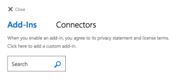

# Set up Adobe Workfront for Outlook

The Adobe Workfront Outlook add-in lets you do the following key&nbsp;Workfront tasks directly from Outlook:

* Update an existing project, task, or issue with information from an email. For more information, see [Update an existing object from an Outlook email](../../workfront-integrations-and-apps/using-workfront-with-outlook/update-an-existing-object-from-an-outlook-email.md).
* Create a Workfront request based on an email within Outlook. For more information, see [Create an Adobe Workfront request from an Outlook email](../../workfront-integrations-and-apps/using-workfront-with-outlook/create-a-wf-request-from-an-outlook-email.md).
* Add an email as a task in your My Work area. For more information, see [Add an Outlook email as a task to your work list](../../workfront-integrations-and-apps/using-workfront-with-outlook/add-outlook-email-as-task-to-your-work-list.md). 
* Reply to comments via the Workfront add-in for Outlook. For information about replying to comments from Workfront for Outlook, see [Reply to a comment from Outlook](../../workfront-integrations-and-apps/using-workfront-with-outlook/reply-to-a-comment-from-outlook.md).
* Create tasks and issues from scratch, or create them from existing emails (using drag-and-drop functionality). For more information , see [Add an Outlook email to a project as a task or an issue](../../workfront-integrations-and-apps/using-workfront-with-outlook/add-outlook-email-to-project-as-task-or-issue.md).

You must add the Workfront add-in to your Outlook account before you can&nbsp;use Workfront for Outlook.

If you are unable to install the Workfront add-in with your Outlook account, contact your Workfront administrator to ensure that Outlook add-ins are enabled for your organization.

For information about how to enable the Outlook integration for your organization, see [Enable Adobe Workfront for Outlook](../../administration-and-setup/configure-integrations/enable-workfront-for-outlook.md).

## Access requirements

You must have the following access to perform the steps in this article:

<table cellspacing="0"> 
 <col> 
 <col> 
 <tbody> 
  <tr> 
   <td role="rowheader">Adobe Workfront plan*</td> 
   <td> 
Any
 </td> 
  </tr> 
  <tr> 
   <td role="rowheader">Adobe Workfront license*</td> 
   <td> 
Work, Plan
 </td> 
  </tr> <!--
   Access level configurations* [Insert any access level configurations needed] Example: Edit access to Documents Note: If you still don't have access, ask your Workfront administrator if they set additional restrictions in your access level. For information on how a Workfront administrator can modify your access level, see Create or modify custom access levels. You must be a Workfront administrator. For information on Workfront administrators, see Grant a user full administrative access. You must be a group administrator. For more information on group administrators, see Group administrators.
  --> <!--
   Object permissions [Insert permissions needed and specify the object] Example: View access or higher on Documents For information on requesting additional access, see Request access to objects in Adobe Workfront.
  --> 
 </tbody> 
</table>

&#42;To find out what plan, license type, or access you have, contact your Workfront administrator.

## Prerequisites

Your Workfront administrator must enable Outlook for Office with Workfront before you can use this integration.

## System requirements

The following applications are available:&nbsp;

* `Outlook on the Web:` The Workfront add-in is available when using Outlook from a&nbsp;web browser either on a desktop or mobile device. This functionality is also available when using the Outlook Web App.
* `Outlook Desktop Application:` The Workfront add-in is available when using the Windows and Mac desktop versions of Outlook included with the Office package.

The Workfront add-in for Outlook is supported in environments that meet the following requirements:

* [Client requirements](#client-requirements) 
* [Mail server requirements](#mail-server-requirements)

### Client requirements

We support the following versions of Outlook:&nbsp;

* Outlook 2013 or later on Windows
* Outlook 2016 or later on Windows
* Outlook on Mac (Microsoft 365)
* Outlook on Windows (Microsoft 365)
* Outlook on the web

You must be connected to an Exchange Server or Office 365 using a direct connection.

When configuring the client, the user must select one of the following account types:

* Exchange
* Office 365
* Outlook.com `  
  `If the client is configured to connect with POP3 or IMAP, the Workfront add-in does not load.

### Mail server requirements

The mail server requirements are met by default when you connect to Office 365 or Outlook.com. However, if you are connected to an on-premise installation of Exchange Server, the following requirements apply:

* We support Exchange 2016 On-Premise&nbsp;
* Exchange Web Services (EWS) must be enabled and must be exposed to the internet.&nbsp;
* The server must have a valid authentication certificate in order for the server to issue valid identity tokens. New installations of Exchange Server include a default authentication certificate.

  For more information, see [Digital certificates and encryption in Exchange 2016](https://technet.microsoft.com/en-us/library/dd351044(v=exchg.160).aspx) and [Set-AuthConfig](https://technet.microsoft.com/en-us/library/jj215766(v=exchg.160).aspx).

* In order to access the Workfront add-in from the [Office Store](https://store.office.com/), your client access servers must be able to communicate with&nbsp; [https://store.office.com](https://store.office.com/).

For more detailed information about supported environments, see the [Microsoft Office 365 home page](https://products.office.com/en-us/office-365-home).

## Install the add-in

For more information about setting up the Workfront add-in for Outlook, see [Workfront - Collaborative Work Management.](https://appsource.microsoft.com/en-us/product/office/WA104380943?tab=Overview)

* [Workfront for Outlook 365](#workfront-for-outlook-365) 
* [Workfront for Outlook on the Web](#workfront-for-outlook-on-the-web) 
* [Workfront for Outlook on Windows or Mac](#workfront-for-windows-or-mac)

### Workfront for Outlook 365

<ol> 
 <li value="1"> 
In Outlook 365, click the Browse Add-ins icon at the top of the Office 365 interface, then click Manage add-ins. 
 </li> 
 <li value="2">In the Search add-ins box, search for Workfront then press Enter.&nbsp;</li> 
 <li value="3">Click Add. </li> 
</ol>

### Workfront for Outlook on the Web

<ol> 
 <li value="1">Open Microsoft Outlook in a web browser.</li> 
 <li value="2"> 
Click the <b>Browse add-ins</b> icon . 
 
To locate the icon, see <a href="https://support.microsoft.com/en-us/office/using-add-ins-in-outlook-on-the-web-8f2ce816-5df4-44a5-958c-f7f9d6dabdce#bkmk_addaddinsicon">Using add-ins in Outlook on the web</a> in the Microsoft documentation.
 </li> 
 <li value="3"> 
Search for Workfront in the Search add-ins field, then press Enter. 
 
    
 </li> 
 <li value="4"> When it appears on the list, click Add. </li> 
</ol>

### Workfront for Outlook on Windows or Mac

<ol> 
 <li value="1">Click Home > Store on the ribbon.</li> 
 <li value="2"> 
Search for Workfront in the Search field, then press Enter. 
 
  
 </li> 
 <li value="3">Click the toggle to enable the Workfront add-in. </li> 
</ol>

## Log in to Workfront from Outlook

<ol> 
 <li value="1">In Outlook, select an email message, then click the Workfront icon in the email header.</li> 
 <li value="2"> 
Follow the prompts to log in to Workfront using Enhanced Authentication, OAuth 2.0, or your Security Assertion Markup Language (SAML) URL.
 
Before users can log in to the Workfront add-in using SAML, a Workfront administrator must first enable Office 365 add-ins to authenticate using a SAML 2.0 solution. For more information, see the section <a href="../../administration-and-setup/add-users/single-sign-on/configure-workfront-saml-2.md#enable-saml-with-office-365" class="MCXref xref">Configure Adobe Workfront with SAML 2.0</a> in the article <a href="../../administration-and-setup/add-users/single-sign-on/configure-workfront-saml-2.md" class="MCXref xref">Configure Adobe Workfront with SAML 2.0</a>.
 <note type="note"> 
   <ul> 
    <li>When you are prompted to enter the domain of your Workfront account, type it using this format: <em>yourCompany'sDomain.my.workfront.com</em>. Your company's domain is usually the name of your company.</li> 
    <li>Enhanced Authentication is not available until a Workfront administrator enables it for this integration. </li> 
   </ul> 
  </note> </li> 
</ol>

