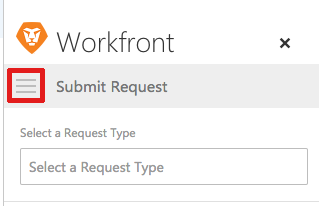
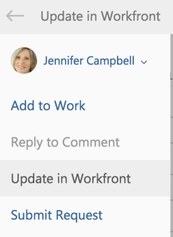

# Update an existing object from an Outlook email {#update-an-existing-object-from-an-outlook-email}

You can update an existing project, task, or issue with information from an Outlook email.

## Access requirements {#access-requirements}

You must have the following access to perform the steps in this article:

<table style="width: 100%;margin-left: 0;margin-right: auto;mc-table-style: url('../../Resources/TableStyles/TableStyle-List-options-in-steps.css');" class="TableStyle-TableStyle-List-options-in-steps" cellspacing="0"> 
 <col class="TableStyle-TableStyle-List-options-in-steps-Column-Column1"> 
 <col class="TableStyle-TableStyle-List-options-in-steps-Column-Column2"> 
 <tbody> 
  <tr class="TableStyle-TableStyle-List-options-in-steps-Body-LightGray"> 
   <td class="TableStyle-TableStyle-List-options-in-steps-BodyE-Column1-LightGray" role="rowheader">Adobe Workfront plan*</td> 
   <td class="TableStyle-TableStyle-List-options-in-steps-BodyD-Column2-LightGray"> 
Any
 </td> 
  </tr> 
  <tr class="TableStyle-TableStyle-List-options-in-steps-Body-MediumGray"> 
   <td class="TableStyle-TableStyle-List-options-in-steps-BodyB-Column1-MediumGray" role="rowheader">Adobe Workfront license*</td> 
   <td class="TableStyle-TableStyle-List-options-in-steps-BodyA-Column2-MediumGray"> 
Work, Plan
 </td> 
  </tr> 
 </tbody> 
</table>

&#42;To find out what plan, license type, or access you have, contact your *`Workfront administrator`*.

## Prerequisites {#prerequisites}

Your *`Workfront administrator`* must enable Outlook for Office with *`Workfront`* before you can use this integration.

## Update an existing object from an Outlook email {#update-an-existing-object-from-an-outlook-email-1}

1. In Outlook, select the email that contains the information that you want to include in an *`Adobe Workfront`*&nbsp;update.&nbsp;
1. Click the  ` *`Workfront`*` icon in the upper-right corner of the email message to ndisplay the *`Workfront`* add-in.  
   You might need to click the down-pointing arrow in the upper right of your email to access the *`Workfront`* icon.

1. Click the `Menu` icon to display the list of available *`Workfront`* options.  
   

1. Click `Update in *`Workfront`*`.  
     
   You can update the following information from the email before it is saved as a task: 
    
    
    * `Type`: Select the type of object you are updating. You can select `Project`, `Task`, or `Issue`. The object you select determines the results that display in the `Name` field below. If you are unsure of the type of object, select `All` to search for projects, tasks, and issues simultaneously.
    
    * `Name`: Begin&nbsp;typing the name of the project, task, or issue that you want to update. Click the name when it appears in the drop-down list.
    * `Update`: By default, the update is the same as the email Body. You can modify the update as desired.  
      This update is displayed as the update status in *`Workfront`*.
    
    * `Attachments`: Any email attachments are saved to the Documents area of the task. You can delete any attachments before submitting the update.
    
    

1.  (Optional) Click  `Include Others`, begin typing the name of users who you want to include in the update, then click the name when it appears in the drop-down list.   
   Repeat this process to include additional users, then click `Done`.  
   By default, the user you are replying to receives a notification regardless of whether you include them.  
     

1.  (Optional) Click the `Lock` icon to restrict this update to users within your company. When the update is locked, users outside your company cannot see the update. 
    
    
    * `Unlocked:` Any user with access to the project, task, or issue where the update resides can view the update.  
      By default, the update is unlocked.  
          
    
    
    * `Locked:` Only users within your company can view the update.  
        
    
    
    

1.  Click `Update`. 
1.  (Optional) Click `View in *`Workfront`*` to view the updated item with the *`Workfront`* integration within Outlook. 

