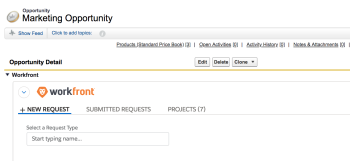

# Configure the *Adobe Workfront* section for Salesforce users

A Pro *Workfront* Plan is required to use this feature. For more information about the various plans available, see [*Workfront* Plans.](https://www.workfront.com/plans)

After you install *Adobe Workfront* for Salesforce as a *Workfront administrator*, you can make it available to your users by adding it in a new section to their Opportunity and Account page layouts in Salesforce.&nbsp;

For information about installing *Workfront* for Salesforce, see [Install Adobe Workfront for Salesforce](../../workfront-integrations-and-apps/using-workfront-with-salesforce/install-workfront-for-salesforce.md).

For users to have *Workfront* available in both the Classic and Lightening Experience frameworks, you must add the WorkfrontOpportunities and the WorkfrontAccounts Visualforce pages to the Opportunity and Accounts page layouts, respectively.

## Access requirements

You must have the following access to use the functionality described in this article:

<table cellspacing="0"> 
 <col> 
 <col> 
 <tbody> 
  <tr> 
   <td role="rowheader"><em>Adobe Workfront</em> plan*</td> 
   <td> 
Pro or higher
 </td> 
  </tr> 
  <tr> 
   <td role="rowheader"><em>Adobe Workfront</em> license*</td> 
   <td> 
Plan
 </td> 
  </tr> <draft-comment>
   <tr data-mc-conditions="QuicksilverOrClassic.Draft mode"> 
    <td role="rowheader">Access level configurations*</td> 
    <td> 
[Insert any access level configurations needed] <draft-comment>
       <MadCap:conditionalText data-mc-conditions="QuicksilverOrClassic.Draft mode">
        Example: Edit access to Documents
       </MadCap:conditionalText>
      </draft-comment><MadCap:conditionalText data-mc-conditions="QuicksilverOrClassic.Draft mode">
       Example: Edit access to Documents
      </MadCap:conditionalText>
 
Note: If you still don't have access, ask your <em>Workfront administrator</em> if they set additional restrictions in your access level. For information on how a <em>Workfront administrator</em> can modify your access level, see <a href="../../administration-and-setup/add-users/configure-and-grant-access/create-modify-access-levels.md" class="MCXref xref">Create or modify custom access levels</a>.
 <draft-comment>
      
You must be a <em>Workfront administrator</em>. For information on <em>Workfront administrators</em>, see <a href="../../administration-and-setup/add-users/configure-and-grant-access/grant-a-user-full-administrative-access.md" class="MCXref xref">Grant a user full administrative access</a>.

     </draft-comment>
You must be a <em>Workfront administrator</em>. For information on <em>Workfront administrators</em>, see <a href="../../administration-and-setup/add-users/configure-and-grant-access/grant-a-user-full-administrative-access.md" class="MCXref xref">Grant a user full administrative access</a>.
 <draft-comment>
      
You must be a <em>group administrator</em>. For more information on <em>group administrators</em>, see <a href="../../administration-and-setup/manage-groups/group-roles/group-administrators.md" class="MCXref xref">Group administrators</a>.

     </draft-comment>
You must be a <em>group administrator</em>. For more information on <em>group administrators</em>, see <a href="../../administration-and-setup/manage-groups/group-roles/group-administrators.md" class="MCXref xref">Group administrators</a>.
 </td> 
   </tr>
  </draft-comment>
  <tr data-mc-conditions="QuicksilverOrClassic.Draft mode"> 
   <td role="rowheader">Access level configurations*</td> 
   <td> 
[Insert any access level configurations needed] <MadCap:conditionalText data-mc-conditions="QuicksilverOrClassic.Draft mode">
      Example: Edit access to Documents
     </MadCap:conditionalText>
 
Note: If you still don't have access, ask your <em>Workfront administrator</em> if they set additional restrictions in your access level. For information on how a <em>Workfront administrator</em> can modify your access level, see <a href="../../administration-and-setup/add-users/configure-and-grant-access/create-modify-access-levels.md" class="MCXref xref">Create or modify custom access levels</a>.
 
You must be a <em>Workfront administrator</em>. For information on <em>Workfront administrators</em>, see <a href="../../administration-and-setup/add-users/configure-and-grant-access/grant-a-user-full-administrative-access.md" class="MCXref xref">Grant a user full administrative access</a>.
 
You must be a <em>group administrator</em>. For more information on <em>group administrators</em>, see <a href="../../administration-and-setup/manage-groups/group-roles/group-administrators.md" class="MCXref xref">Group administrators</a>.
 </td> 
  </tr> <draft-comment>
   <tr data-mc-conditions="QuicksilverOrClassic.Draft mode"> 
    <td role="rowheader">Object permissions</td> 
    <td> 
[Insert permissions needed and specify the object] <draft-comment>
       <MadCap:conditionalText data-mc-conditions="QuicksilverOrClassic.Draft mode">
        Example: View access or higher on Documents
       </MadCap:conditionalText>
      </draft-comment><MadCap:conditionalText data-mc-conditions="QuicksilverOrClassic.Draft mode">
       Example: View access or higher on Documents
      </MadCap:conditionalText>
 
For information on requesting additional access, see <a href="../../workfront-basics/grant-and-request-access-to-objects/request-access.md" class="MCXref xref">Request access to objects in Adobe Workfront</a>.
 </td> 
   </tr>
  </draft-comment>
  <tr data-mc-conditions="QuicksilverOrClassic.Draft mode"> 
   <td role="rowheader">Object permissions</td> 
   <td> 
[Insert permissions needed and specify the object] <MadCap:conditionalText data-mc-conditions="QuicksilverOrClassic.Draft mode">
      Example: View access or higher on Documents
     </MadCap:conditionalText>
 
For information on requesting additional access, see <a href="../../workfront-basics/grant-and-request-access-to-objects/request-access.md" class="MCXref xref">Request access to objects in Adobe Workfront</a>.
 </td> 
  </tr> 
 </tbody> 
</table>

&#42;To find out what plan, license type, or access you have, contact your *Workfront administrator*.

## Prerequisites

* You must have a Salesforce instance with access to a system administrator account.
* You must have a *Workfront* instance with access to a system administrator account.

## Configure the *Workfront* section in the Salesforce Classic framework

<ol> 
 <li value="1"> Log in to Salesforce as a <em>Workfront administrator</em>.</li> 
 <li value="2"> Click Setup.</li> 
 <li value="3">In the Build section, expand Customize.</li> 
 <li value="4"> 
Expand Opportunities, then click Page Layouts&nbsp;to add the <em>Workfront</em> section to an Opportunity. 
 
Or 
 
Expand Accounts, then click Page Layouts&nbsp;to add the <em>Workfront</em> section to an Account.
 </li> 
 <li value="5"> 
Click Edit on an existing layout. 
 
Or 
 
Click New to add a new layout.&nbsp;
 </li> 
 <li value="6">(Optional) Drag the Section component to the layout and drop it in the desired position.  </li> 
 <li value="7"> 
(Optional) Specify a name for the new section. 
 
We recommend that you name this section <em>Workfront</em>.
 </li> 
 <li value="8"> 
(Optional) Specify the desired Layout and Tab-key Order for the new section. 
 
We recommend that you select&nbsp;1-Column layout for the <em>Workfront</em> section.&nbsp;
 </li> 
 <li value="9">Click OK.</li> 
 <li value="10">In the Layout area, click Visualforce Pages.</li> 
 <li value="11"> 
Drag and drop the WorfrontOpportunities component to the new section in the&nbsp;Opportunities&nbsp;Layout. 
 
Or 
 
Drag and drop the WorkfrontAccounts component to the new section in the&nbsp;Account&nbsp;Layout. 
 </li> 
 <li value="12">Click the Properties icon in the upper right of the newly added component.  </li> 
 <li value="13">To achieve an optimal display, specify the following properties for the <em>Workfront</em> Visualforce page: 
  <ul>
   <li>Width (in pixels or %): 100%</li>
   <li>Height (in pixels): 600</li>
   <li>Select Show scrollbars.</li>
  </ul></li> 
 <li value="14">Click OK.&nbsp;</li> 
 <li value="15"> 
Click Save to save your layout.
 
All users who have this layout assigned to them are now able to see the <em>Workfront</em> section on their Opportunities or Accounts objects.
 
 Users see a <em>Workfront</em> login screen on the <em>Workfront</em> section. If they do not have a <em>Workfront</em> account, they can collapse the section, but not remove it from their layout.&nbsp;
 
    
 </li> 
</ol>

## Configure the *Workfront* section in the Salesforce Lightning Experience framework

You can add the *Workfront* section to the layout of a Salesforce Opportunity or Account in the Salesforce Lightning Experience framework either by accessing the Setup area, or from an Account or Opportunity object.&nbsp;

* [Configure the Workfront section at the Setup level](#lightning-setup-level) 
* [Configure the Workfront Section at the Opportunity or Account level](#lighting-account-opportunity-level)

### Configure the *Workfront* section at the Setup level

1. Log into Salesforce as a system administrator.&nbsp; 
1. Click the `Setup` icon, then click `Setup`. 

1. Expand `Object and Fields`, then click `Object Manager`. 

1. Click `Opportunity`to customize the layout of an Opportunity.

   Or

   Click `Account`to customize the layout of an Account. 

1. Click `Page Layouts`. 
1. Click the name of an existing page layout to edit it.

   Or

   Click `New` to create a new page layout. 

1. Continue with [Configure the Workfront Section at the Opportunity or Account level](#lighting-account-opportunity-level) below.

### Configure the *Workfront* Section at the Opportunity or Account level

<ol> 
 <li value="1"> Log in to Salesforce as a system administrator.&nbsp; </li> 
 <li value="2"> Go to an Opportunity or Account. </li> 
 <li value="3"> Click the Setup icon, then click Edit Page.  </li> 
 <li value="4"> Expand the Custom-Managed section. </li> 
 <li value="5"> 
 Drag and drop the <em>Workfront</em> component on your Opportunity or Account page. 
 
We recommend using the full width of the page for the <em>Workfront</em> section instead of one of the columns of the layout.
 
  
 </li> 
 <li value="6"> 
Click Save.
 
All users who have this layout assigned to them are now able to see the <em>Workfront</em> section on their Opportunities or Accounts objects.
 <note type="note">
   Users see a 
   <em>Workfront</em> login screen on the 
   <em>Workfront</em> section. If they do not have a 
   <em>Workfront</em> account, they can collapse the section, but not remove it from their layout. Users can log in using the authentication method you have enabled: Enhanced Authentication or your Security Assertion Markup Language (SAML) URL.
  </note> 
  
 </li> 
</ol>

