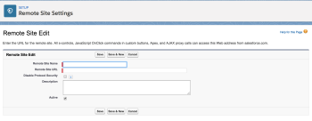

# Install *Adobe Workfront* for Salesforce

To install the app before it becomes available in the Salesforce AppExchange, see [Installing Workfront for Salesforce before It Becomes Available in the AppExchange Marketplace](#install-before-available-in-appexchange).

As a Salesforce and *Adobe Workfront administrator*, you can install *Workfront* for Salesforce to allow your Salesforce users to submit *Workfront* requests and automatically create projects without ever leaving Salesforce.

For a general understanding about what you can expect by installing *Workfront* for Salesforce, see [Adobe Workfront for Salesforce overview](../../workfront-integrations-and-apps/using-workfront-with-salesforce/workfront-for-salesforce-overview.md).

* [Prerequisites for Installing and Using Workfront for Salesforce](#prerequisites) 
* [Installing Workfront for Salesforce](#installing-the-app)

## Access requirements

You must have the following access to use the functionality described in this article:

<table cellspacing="0"> 
 <col> 
 <col> 
 <tbody> 
  <tr> 
   <td role="rowheader"><em>Adobe Workfront</em> plan*</td> 
   <td> 
Pro or higher
 </td> 
  </tr> 
  <tr> 
   <td role="rowheader"><em>Adobe Workfront</em> license*</td> 
   <td> 
Plan
 </td> 
  </tr> <draft-comment>
   <tr data-mc-conditions="QuicksilverOrClassic.Draft mode"> 
    <td role="rowheader">Access level configurations*</td> 
    <td> 
[Insert any access level configurations needed] <draft-comment>
       <MadCap:conditionalText data-mc-conditions="QuicksilverOrClassic.Draft mode">
        Example: Edit access to Documents
       </MadCap:conditionalText>
      </draft-comment><MadCap:conditionalText data-mc-conditions="QuicksilverOrClassic.Draft mode">
       Example: Edit access to Documents
      </MadCap:conditionalText>
 
Note: If you still don't have access, ask your <em>Workfront administrator</em> if they set additional restrictions in your access level. For information on how a <em>Workfront administrator</em> can modify your access level, see <a href="../../administration-and-setup/add-users/configure-and-grant-access/create-modify-access-levels.md" class="MCXref xref">Create or modify custom access levels</a>.
 <draft-comment>
      
You must be a <em>Workfront administrator</em>. For information on <em>Workfront administrators</em>, see <a href="../../administration-and-setup/add-users/configure-and-grant-access/grant-a-user-full-administrative-access.md" class="MCXref xref">Grant a user full administrative access</a>.

     </draft-comment>
You must be a <em>Workfront administrator</em>. For information on <em>Workfront administrators</em>, see <a href="../../administration-and-setup/add-users/configure-and-grant-access/grant-a-user-full-administrative-access.md" class="MCXref xref">Grant a user full administrative access</a>.
 <draft-comment>
      
You must be a <em>group administrator</em>. For more information on <em>group administrators</em>, see <a href="../../administration-and-setup/manage-groups/group-roles/group-administrators.md" class="MCXref xref">Group administrators</a>.

     </draft-comment>
You must be a <em>group administrator</em>. For more information on <em>group administrators</em>, see <a href="../../administration-and-setup/manage-groups/group-roles/group-administrators.md" class="MCXref xref">Group administrators</a>.
 </td> 
   </tr>
  </draft-comment>
  <tr data-mc-conditions="QuicksilverOrClassic.Draft mode"> 
   <td role="rowheader">Access level configurations*</td> 
   <td> 
[Insert any access level configurations needed] <MadCap:conditionalText data-mc-conditions="QuicksilverOrClassic.Draft mode">
      Example: Edit access to Documents
     </MadCap:conditionalText>
 
Note: If you still don't have access, ask your <em>Workfront administrator</em> if they set additional restrictions in your access level. For information on how a <em>Workfront administrator</em> can modify your access level, see <a href="../../administration-and-setup/add-users/configure-and-grant-access/create-modify-access-levels.md" class="MCXref xref">Create or modify custom access levels</a>.
 
You must be a <em>Workfront administrator</em>. For information on <em>Workfront administrators</em>, see <a href="../../administration-and-setup/add-users/configure-and-grant-access/grant-a-user-full-administrative-access.md" class="MCXref xref">Grant a user full administrative access</a>.
 
You must be a <em>group administrator</em>. For more information on <em>group administrators</em>, see <a href="../../administration-and-setup/manage-groups/group-roles/group-administrators.md" class="MCXref xref">Group administrators</a>.
 </td> 
  </tr> <draft-comment>
   <tr data-mc-conditions="QuicksilverOrClassic.Draft mode"> 
    <td role="rowheader">Object permissions</td> 
    <td> 
[Insert permissions needed and specify the object] <draft-comment>
       <MadCap:conditionalText data-mc-conditions="QuicksilverOrClassic.Draft mode">
        Example: View access or higher on Documents
       </MadCap:conditionalText>
      </draft-comment><MadCap:conditionalText data-mc-conditions="QuicksilverOrClassic.Draft mode">
       Example: View access or higher on Documents
      </MadCap:conditionalText>
 
For information on requesting additional access, see <a href="../../workfront-basics/grant-and-request-access-to-objects/request-access.md" class="MCXref xref">Request access to objects in Adobe Workfront</a>.
 </td> 
   </tr>
  </draft-comment>
  <tr data-mc-conditions="QuicksilverOrClassic.Draft mode"> 
   <td role="rowheader">Object permissions</td> 
   <td> 
[Insert permissions needed and specify the object] <MadCap:conditionalText data-mc-conditions="QuicksilverOrClassic.Draft mode">
      Example: View access or higher on Documents
     </MadCap:conditionalText>
 
For information on requesting additional access, see <a href="../../workfront-basics/grant-and-request-access-to-objects/request-access.md" class="MCXref xref">Request access to objects in Adobe Workfront</a>.
 </td> 
  </tr> 
 </tbody> 
</table>

&#42;To find out what plan, license type, or access you have, contact your *Workfront administrator*.

## Prerequisites for Installing and Using *Workfront* for Salesforce

* You must have a Salesforce instance with access to a system administrator account in order to install the app.
* You must have a *Workfront* instance with access to a system administrator account in order to configure the integration.
* Salesforce users must have a *Workfront* account in order to be able to

  * Create *Workfront* requests from Salesforce or
  * View *Workfront* requests or projects in Salesforce.

## Installing *Workfront* for Salesforce

You must be a Salesforce and a *Workfront* system administrator to install and configure *Workfront* for Salesforce.&nbsp;

The following subsections describe how to install *Workfront* for your Salesforce Production environment. You can follow the same steps to install *Workfront* for your Salesforce Sandbox environment.

* [Installing Workfront for Salesforce before It Becomes Available in the AppExchange Marketplace](#install-before-available-in-appexchange) 
* [Installing Workfront for Salesforce in the Salesforce Classic Framework](#installing-the-app-classic) 
* [Installing Workfront for Salesforce in the Salesforce Lightning Experience Framework](#installing-the-app-lightning-experience)

### Installing *Workfront* for Salesforce before It Becomes Available in the AppExchange Marketplace

<!--

This section needs to be removed when our app is accepted by Salesforce and added to their store.

-->

This section needs to be removed when our app is accepted by Salesforce and added to their store.

*Workfront* for Salesforce will be available in the Salesforce AppExchange soon.

To install the app before it's available:

1. In your Production environment, go to

   https://login.salesforce.com/packaging/installPackage.apexp?p0=04t4K000002aUZY

   In your Sandbox environment, go to

   https://test.salesforce.com/packaging/installPackage.apexp?p0=04t4K000002aUZY

<ol data-mc-continue="true"> 
 <li value="2"> 
Check the Yes, grant access to these third-party web sites box. 
 
    
 
 A loading screen displays and the installation might take a while.
 </li> 
 <li value="3">Click Done when the installation completes. </li> 
 <li value="4">Navigate to Setup>Security Controls>Remote Site Settings.</li> 
 <li value="5">(Conditional) If you do not see your <em>Workfront</em> URL listed in the All Remote Sites list, click New Remote Site.</li> 
 <li value="6"> 
Specify the Remote Site Name.  
 
For example, <i><em>Workfront</em></i>.
 </li> 
 <li value="7"> 
Specify the Remote Site URL. 
 
For example, <i>yourDomain.my.workfront.com</i>.
 </li> 
 <li value="8"> 
Click Save. 
 
The <em>Workfront</em> app is now installed on your Salesforce instance and the WorkfrontOpportunities and WorkfrontAccounts Visualforce Pages have been created in your environment. 
 
Salesforce users can use the app once you add the <em>Workfront</em> section to their Opportunity or Account page layouts. For information about configuring the <em>Workfront</em> section for users, see <a href="../../workfront-integrations-and-apps/using-workfront-with-salesforce/configure-wf-section-for-salesforce-users.md" class="MCXref xref">Configure the Adobe Workfront section for Salesforce users</a>.
 </li> 
</ol>

### Installing *Workfront* for Salesforce in the Salesforce Classic Framework

<ol> 
 <li value="1">Log in to Salesforce as a system administrator.</li> 
 <li value="2">Go to Setup. </li> 
 <li value="3">In the Build section, click AppExchange Marketplace.</li> 
 <li value="4"> In the Search AppExchange Apps box, type <em>Workfront</em>. </li> 
 <li value="5"> Click the app when you find it, then click Get It Now. </li> 
 <li value="6"> Click Install in Production to install the <em>Workfront</em> app in your Salesforce Production environment.&nbsp;(recommended) </li> 
 <li value="7"> Select the I have read and agree to the terms and conditions field after you have read and agreed with the terms and conditions. </li> 
 <li value="8"> Click Confirm and Install. </li> 
 <li value="9">Select Install for All Users (recommended), then click Install.&nbsp;</li> 
 <li value="10"> (Conditional) If asked if you want to approve a third party access, you must select&nbsp;Yes, grant access to these third-party web sites, then click Continue.&nbsp; </li> 
 <li value="11"> 
 Click Done when the installation completes.&nbsp; 
 
The <em>Workfront</em> app is listed under Installed Packages.
 
  
 </li> 
 <li value="12">Navigate to Setup>Security Controls>Remote Site Settings.</li> 
 <li value="13">(Conditional) If you do not see your <em>Workfront</em> URL listed in the All Remote Sites list, click New Remote Site. </li> 
 <li value="14">Specify the Remote Site Name.  For example,&nbsp;<i><em>Workfront</em></i>.</li> 
 <li value="15">Specify the Remote Site URL. For example, <i>yourDomain.my.workfront.com</i>.</li> 
 <li value="16">Click Save. The <em>Workfront</em> app is now installed on your Salesforce instance and the WorkfrontOpportunities and WorkfrontAccounts Visualforce Pages have been created in your environment. Salesforce users cannot yet use the app until you add the <em>Workfront</em> section to their Opportunity or Account page layouts. For information about configuring the <em>Workfront</em> section for users, see <a href="../../workfront-integrations-and-apps/using-workfront-with-salesforce/configure-wf-section-for-salesforce-users.md" class="MCXref xref">Configure the Adobe Workfront section for Salesforce users</a>.</li> 
</ol>

### Installing *Workfront* for Salesforce in the Salesforce Lightning Experience Framework

<ol> 
 <li value="1">Log in to Salesforce as a system administrator.</li> 
 <li value="2">Click the&nbsp;Setup icon, then click Setup.</li> 
 <li value="3">In the PLATFORM TOOLS section, expand Apps.</li> 
 <li value="4">Click AppExchange Marketplace.</li> 
 <li value="5"> In the Search AppExchange Apps box, type <em>Workfront</em>. </li> 
 <li value="6"> Click the app when you find it, then click Get It Now. </li> 
 <li value="7"> Click Open Login Screen. You must sign in with your <em>Workfront administrator</em> account for Salesforce. </li> 
 <li value="8"> Click Allow. </li> 
 <li value="9"> In the Install in This Org box, click Install Here&nbsp;to install <em>Workfront</em> in your Salesforce Production environment.&nbsp;(recommended) </li> 
 <li value="10"> Select the I have read and agree to the terms and conditions field after you have read and agreed with the terms and conditions. </li> 
 <li value="11"> Click Confirm and Install. </li> 
 <li value="12">Select Install for All Users (recommended), then click Install.&nbsp;</li> 
 <li value="13"> (Conditional) If asked if you want to approve a third party access, you must select Yes, grant access to these third-party web sites, then click Continue. </li> 
 <li value="14"> 
 Click Done when the installation completes.&nbsp; 
 
The <em>Workfront</em> app is listed under Installed Packages.
 
&nbsp; 
 </li> 
 <li value="15">Navigate to Setup. </li> 
 <li value="16">In the SETTINGS section, expand Security.&nbsp;</li> 
 <li value="17">Click Remote Site Settings.</li> 
 <li value="18"> 
(Conditional) If you do not see your <em>Workfront</em> URL listed in the All Remote Sites list, click New Remote Site.
 
  
 </li> 
 <li value="19"> 
Specify the Remote Site Name.  
 
For example,&nbsp;<em><em>Workfront</em></em>.
 </li> 
 <li value="20"> 
Specify the Remote Site URL. 
 
For example, <em>yourDomain.my.workfront.com</em>.
 </li> 
 <li value="21"> 
Click Save. 
 
The <em>Workfront</em> app is now installed on your Salesforce instance, and the <em>Workfront</em> component is now added to your environment. 
 
Salesforce users can use the <em>Workfront</em> app once you add the <em>Workfront</em> section to their Opportunity or Account page layouts. For information about configuring the <em>Workfront</em> section for users, see <a href="../../workfront-integrations-and-apps/using-workfront-with-salesforce/configure-wf-section-for-salesforce-users.md" class="MCXref xref">Configure the Adobe Workfront section for Salesforce users</a>.&nbsp;
 </li> 
</ol>

