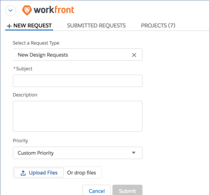

# Submit *Adobe Workfront* requests from Salesforce objects

After installing *Adobe Workfront* for Salesforce, you can submit *Workfront* requests from Salesforce Opportunities and Accounts. This functionality exists in both the Classic and Lightning Experience frameworks.

## Access requirements

You must have the following access to use the functionality described in this article:

<table cellspacing="0"> 
 <col> 
 <col> 
 <tbody> 
  <tr> 
   <td role="rowheader"><em>Adobe Workfront</em> plan*</td> 
   <td> 
Pro or higher
 </td> 
  </tr> 
  <tr> 
   <td role="rowheader"><em>Adobe Workfront</em> license*</td> 
   <td> 
Plan
 </td> 
  </tr> <draft-comment>
   <tr data-mc-conditions="QuicksilverOrClassic.Draft mode"> 
    <td role="rowheader">Access level configurations*</td> 
    <td> 
[Insert any access level configurations needed] <draft-comment>
       <MadCap:conditionalText data-mc-conditions="QuicksilverOrClassic.Draft mode">
        Example: Edit access to Documents
       </MadCap:conditionalText>
      </draft-comment><MadCap:conditionalText data-mc-conditions="QuicksilverOrClassic.Draft mode">
       Example: Edit access to Documents
      </MadCap:conditionalText>
 
Note: If you still don't have access, ask your <em>Workfront administrator</em> if they set additional restrictions in your access level. For information on how a <em>Workfront administrator</em> can modify your access level, see <a href="../../administration-and-setup/add-users/configure-and-grant-access/create-modify-access-levels.md" class="MCXref xref">Create or modify custom access levels</a>.
 <draft-comment>
      
You must be a <em>Workfront administrator</em>. For information on <em>Workfront administrators</em>, see <a href="../../administration-and-setup/add-users/configure-and-grant-access/grant-a-user-full-administrative-access.md" class="MCXref xref">Grant a user full administrative access</a>.

     </draft-comment>
You must be a <em>Workfront administrator</em>. For information on <em>Workfront administrators</em>, see <a href="../../administration-and-setup/add-users/configure-and-grant-access/grant-a-user-full-administrative-access.md" class="MCXref xref">Grant a user full administrative access</a>.
 <draft-comment>
      
You must be a <em>group administrator</em>. For more information on <em>group administrators</em>, see <a href="../../administration-and-setup/manage-groups/group-roles/group-administrators.md" class="MCXref xref">Group administrators</a>.

     </draft-comment>
You must be a <em>group administrator</em>. For more information on <em>group administrators</em>, see <a href="../../administration-and-setup/manage-groups/group-roles/group-administrators.md" class="MCXref xref">Group administrators</a>.
 </td> 
   </tr>
  </draft-comment>
  <tr data-mc-conditions="QuicksilverOrClassic.Draft mode"> 
   <td role="rowheader">Access level configurations*</td> 
   <td> 
[Insert any access level configurations needed] <MadCap:conditionalText data-mc-conditions="QuicksilverOrClassic.Draft mode">
      Example: Edit access to Documents
     </MadCap:conditionalText>
 
Note: If you still don't have access, ask your <em>Workfront administrator</em> if they set additional restrictions in your access level. For information on how a <em>Workfront administrator</em> can modify your access level, see <a href="../../administration-and-setup/add-users/configure-and-grant-access/create-modify-access-levels.md" class="MCXref xref">Create or modify custom access levels</a>.
 
You must be a <em>Workfront administrator</em>. For information on <em>Workfront administrators</em>, see <a href="../../administration-and-setup/add-users/configure-and-grant-access/grant-a-user-full-administrative-access.md" class="MCXref xref">Grant a user full administrative access</a>.
 
You must be a <em>group administrator</em>. For more information on <em>group administrators</em>, see <a href="../../administration-and-setup/manage-groups/group-roles/group-administrators.md" class="MCXref xref">Group administrators</a>.
 </td> 
  </tr> <draft-comment>
   <tr data-mc-conditions="QuicksilverOrClassic.Draft mode"> 
    <td role="rowheader">Object permissions</td> 
    <td> 
[Insert permissions needed and specify the object] <draft-comment>
       <MadCap:conditionalText data-mc-conditions="QuicksilverOrClassic.Draft mode">
        Example: View access or higher on Documents
       </MadCap:conditionalText>
      </draft-comment><MadCap:conditionalText data-mc-conditions="QuicksilverOrClassic.Draft mode">
       Example: View access or higher on Documents
      </MadCap:conditionalText>
 
For information on requesting additional access, see <a href="../../workfront-basics/grant-and-request-access-to-objects/request-access.md" class="MCXref xref">Request access to objects in Adobe Workfront</a>.
 </td> 
   </tr>
  </draft-comment>
  <tr data-mc-conditions="QuicksilverOrClassic.Draft mode"> 
   <td role="rowheader">Object permissions</td> 
   <td> 
[Insert permissions needed and specify the object] <MadCap:conditionalText data-mc-conditions="QuicksilverOrClassic.Draft mode">
      Example: View access or higher on Documents
     </MadCap:conditionalText>
 
For information on requesting additional access, see <a href="../../workfront-basics/grant-and-request-access-to-objects/request-access.md" class="MCXref xref">Request access to objects in Adobe Workfront</a>.
 </td> 
  </tr> 
 </tbody> 
</table>

&#42;To find out what plan, license type, or access you have, contact your *Workfront administrator*.

## Prerequisites

To submit a *Workfront* request from a Salesforce Opportunity or Account ensure that you have the following in your environment:

<ul> 
 <li> Your <em>Workfront administrator</em> has installed <em>Workfront</em> for Salesforce. For more information about installing <em>Workfront</em> for Salesforce, see <a href="../../workfront-integrations-and-apps/using-workfront-with-salesforce/install-workfront-for-salesforce.md" class="MCXref xref">Install Adobe Workfront for Salesforce</a></li> 
 <li> Your <em>Workfront administrator</em> has added the <em>Workfront</em> section to your Opportunity and Account page layouts. For more information about adding the <em>Workfront</em> section to a page layout, see <a href="../../workfront-integrations-and-apps/using-workfront-with-salesforce/configure-wf-section-for-salesforce-users.md" class="MCXref xref">Configure the Adobe Workfront section for Salesforce users</a>.</li> 
 <li> 
You have a <em>Workfront</em> account and you can log in to it from the <em>Workfront</em> section inside your Opportunity or Account.  Once you log in, you can see the New Requests tab where you can start entering requests.
 <draft-comment>
   
&nbsp;

  </draft-comment>
&nbsp;
 </li> 
</ul>

## Submit *Workfront* requests from Salesforce

1. Go to an Opportunity or Account in Salesforce. 
1. Go to the *Workfront* section.
1. In the `New Requests` tab, select a request type in the `Select a Request Type` drop-down menu.

   You can see the same request queues that you have access to see in *Workfront*.&nbsp;

1. Start filling out the available fields for your request.

   Submitting a request from Salesforce is identical to submitting a request in the *Workfront* web application.

   Continue to follow the steps described in [Create and submit Adobe Workfront requests](../../manage-work/requests/create-requests/create-submit-requests.md).

1. Click `Submit`.

## View *Workfront* requests

<ol> 
 <li value="1">Go to an Opportunity or Account in Salesforce.</li> 
 <li value="2"> 
Go to the <em>Workfront</em> section.
 <note type="note">
   Depending on how your 
   <em>Workfront administrator</em> configured this section, it might have a different name.
  </note> </li> 
 <li value="3"> 
Select the Submitted Requests tab. 
 
You can view all the requests that you or others have submitted from this Opportunity or Account in this tab.Requests that are submitted to this request queue in the web application do not display in this list in Salesforce.
 <note type="note">
   Requests that are submitted to this request queue in the web application do not display in this list in Salesforce.
  </note> 
  
 
You can view the following information about the submitted requests:
 
  <ul> 
   <li>Requests Name (in the Subject&nbsp;column)</li> 
   <li>Reference Number</li> 
   <li>Request&nbsp;Type</li> 
   <li>Status</li> 
   <li>Submitted on&nbsp;Date</li> 
   <li>Requested by Name</li> 
   <li>Assigned to Name When this information is updated in <em>Workfront</em>, it is also updated in this list.&nbsp;</li> 
  </ul> </li> 
 <li value="4"> 
(Optional) Click the name of the request to open it in <em>Workfront</em>.&nbsp;
 
On the Summary panel , notice the Integrations indicator that signifies that this issue originated in Salesforce and is currently linked to an item there.&nbsp;
 </li> 
 <li value="5"> 
(Optional) Click Go to Salesforce to access the Opportunity or Account where the issue originated.
 <note type="note">
   The Go to Salesforce link is visible to all 
   <em>Workfront</em> users who can view the issue. You must have a Salesforce account to be able to go to the Salesforce Opportunity or Account where the issue was logged.&nbsp;
  </note> </li> 
</ol>

