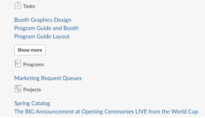
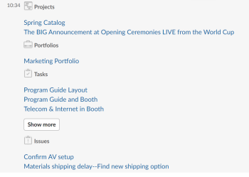

# Access your favorites and recent items from Slack

After you have installed and configured Adobe Workfront for Slack, you can view your Workfront Favorites and Recent Items and access items from either list from Slack.

For more information about configuring Workfront with Slack, see [Configure Adobe Workfront for Slack](../../workfront-integrations-and-apps/using-workfront-with-slack/configure-workfront-for-slack.md).

## Access requirements

You must have the following:

<table cellspacing="0"> 
 <col> 
 <col> 
 <tbody> 
  <tr> 
   <td role="rowheader"><a href="https://www.workfront.com/plans" target="_blank">Adobe Workfront plan</a>*</td> 
   <td> 
Pro or higher
 </td> 
  </tr> <!--
   Adobe Workfront licenses overview* Plan
  --> 
 </tbody> 
</table>

&#42;To find out what plan, license type, or access you have, contact your Workfront administrator.\

## Prerequisites

Before you can access your favorites and recent items from Slack, you must

* Configure Workfront for Slack  
  For instructions on configuring Workfront for Slack, see [Configure Adobe Workfront for Slack](../../workfront-integrations-and-apps/using-workfront-with-slack/configure-workfront-for-slack.md).

## Access your Favorites list from Slack

<ol> 
 <li value="1"> Log in to your Slack instance and log in to Workfront from Slack. For more information about logging in to Workfront from Slack, see the "Logging In to Workfront from Slack" section in <a href="../../workfront-integrations-and-apps/using-workfront-with-slack/access-workfront-from-slack.md" class="MCXref xref">Access Adobe Workfront from Slack</a>.</li> 
 <li value="2"> 
From any channel, start typing the following command in the message field:&nbsp; <code style="font-style: normal;">/workfront favorites</code>
 <note type="note">
   Commands are case sensitive. You can start your command with 
   <code>/wf</code> instead of 
   <code>/workfront</code>.
    
  </note> 
A list of your Favorites displays.
 
<em></em> 
 </li> 
 <li value="3">(Optional) Click Show more to list more Favorites.</li> 
 <li value="4">Click the name of a favorite to open it in Workfront in a new browser tab.</li> 
</ol>

## Access your recent items list from Slack

<ol> 
 <li value="1"> Log in to your Slack instance and log in to Workfront from Slack. For more information about logging in to Workfront from Slack, see the "Logging In to Workfront from Slack" section in <a href="../../workfront-integrations-and-apps/using-workfront-with-slack/access-workfront-from-slack.md" class="MCXref xref">Access Adobe Workfront from Slack</a>.</li> 
 <li value="2"> 
From any channel, start typing the following command in the message field:&nbsp; <code style="font-style: normal;">/workfront recent</code>
 <note type="note">
   Commands are case sensitive. You can start your command with 
   <code>/wf</code> instead of 
   <code>/workfront</code>.
  </note> 
A list of your Recent Items displays, in the order they were accessed last, with the most recent at the top. The items are listed three at a time and are grouped by object type.  
 </li> 
 <li value="3">(Optional) Click Show more to list more Recent Items.</li> 
 <li value="4">(Optional)&nbsp;Click the name of an item you have recently accessed to open it in Workfront in a new browser tab.</li> 
</ol>

